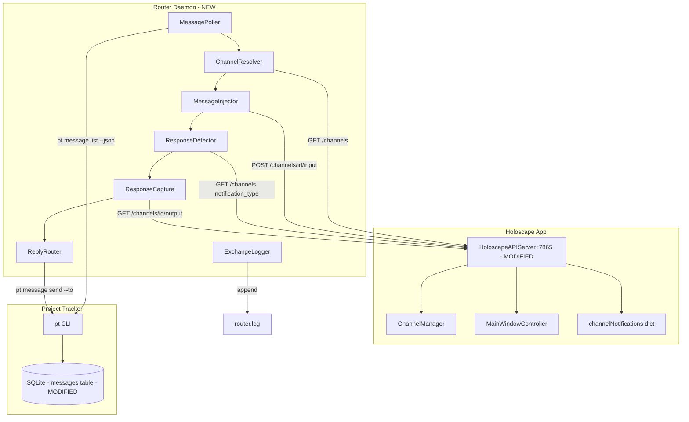

# Design Document: Agent-to-Agent Router Daemon

## Overview

The router daemon is a single-file Python script (`~/projects/holoscape/tools/router/router.py`) that runs a polling loop: query `pt message` for unprocessed directed messages → resolve recipient to a Holoscape channel → inject via the HTTP API → wait for `idle_prompt` → capture response → route reply back. The daemon talks to two backends: project-tracker's SQLite (via the `pt` CLI) and Holoscape's HTTP API on port 7865 (via `urllib.request`). No frameworks, no async, no threads — a synchronous polling loop with a sleep between cycles.

The only Holoscape-side changes are two fields added to the `/channels` GET response: `notification_type` (from the existing `channelNotifications` dict) and `is_active` (from `MainWindowController.activeChannelId`). Both are already computed in memory; this is a two-line change to `handleListChannels()` in `HoloscapeAPIServer.swift`.

## Key Design Decisions

1. **Synchronous polling loop, not async/threaded.** The daemon processes one message at a time, sequentially. No concurrent injection into the same channel, no interleaving. This makes the code simple and the behavior predictable. The polling interval (3–5s) is fast enough for inter-agent communication where sub-second latency doesn't matter. Rejected: asyncio event loop (adds complexity for no latency benefit on a 3s poll), threading (race conditions on shared state for zero gain).

2. **Direct HTTP calls to Holoscape, not MCP stdio.** The daemon is a standalone Python process, not a Claude Code session. It hits the same HTTP endpoints that `HoloscapeClient.swift` calls — `/channels`, `/channels/{id}/input`, `/channels/{id}/output`. No MCP protocol framing, no stdio piping. Rejected: spawning the `HoloscapeMCP` binary (adds a process, adds MCP protocol overhead, binary is designed for Claude Code's MCP host, not standalone callers).

3. **`pt` CLI via subprocess, not direct SQLite access.** The daemon calls `pt message list --json` and `pt message send` as subprocess invocations. This respects project-tracker's schema, migrations, and safety backups without coupling the daemon to its internals. The one exception: the `processed_at` column update is done via a direct SQLite UPDATE (the `pt` CLI doesn't expose a "mark as processed" command). Rejected: importing project-tracker's Python modules (tight coupling, version skew risk).

4. **Mark-before-inject for deduplication.** The daemon writes `processed_at` before injecting the message, not after. If the daemon crashes mid-injection, the message is marked but undelivered. The sender times out and can re-send — a cheap operation. The alternative (mark after inject) risks double-injection on crash, which corrupts the receiving agent's context. Under-delivery is recoverable; double-delivery is not.

5. **`idle_prompt` as the response-complete signal.** Holoscape's notification system (`HoloscapeAPIServer.channelNotifications`) already tracks `idle_prompt` (Claude Code finished, waiting for input) and `permission_prompt` (needs approval) per channel. The daemon polls this via the `/channels` endpoint after injection. No timeout heuristics, no prompt-marker regex, no output-diffing. The signal is authoritative because it comes from Claude Code's own hooks. Fallback: 120-second timeout if `idle_prompt` never arrives (handles edge cases like Claude Code crashing mid-response).

6. **Foreground protection via `is_active` field.** The daemon holds messages for the foreground channel and processes them when the user switches away. This uses the new `is_active` field on `/channels` (derived from `MainWindowController.activeChannelId`). The daemon does not need to know about window focus or mouse events — "is this channel the selected tab" is the only signal that matters.

## Architecture



### Changes from Previous Architecture

- **Modified**: `HoloscapeAPIServer.handleListChannels()` at `Sources/Holoscape/Services/HoloscapeAPIServer.swift:142` gains `notification_type` and `is_active` fields in the JSON response.
- **Modified**: `messages` table in project-tracker's SQLite database gains `processed_at` TEXT column.
- **Modified**: `check_chat.sh` at `~/projects/project-tracker/agent-chat/hooks/check_chat.sh` gains a filter to skip messages where `processed_at` is not null.
- **New**: `~/projects/holoscape/tools/router/router.py` — the daemon script (~200–300 lines).
- **New**: `~/projects/holoscape/tools/router/router.log` — append-only exchange log (created at runtime).
- **New**: `~/projects/holoscape/tools/router/router.lock` — PID lock file (created/removed at runtime).

## Components and Interfaces

### RouterDaemon (Python — main entry point)

```python
class RouterDaemon:
    """Main polling loop. Owns lifecycle, lock file, and watermark."""
    
    POLL_INTERVAL: float = 3.0
    LOCK_PATH: str = "~/projects/holoscape/tools/router/router.lock"
    LOG_PATH: str = "~/projects/holoscape/tools/router/router.log"
    HOLOSCAPE_API: str = "http://localhost:7865"
    
    def __init__(self) -> None: ...
    def run(self) -> None: ...           # Main loop: acquire lock, poll, process, repeat
    def shutdown(self, signum, frame) -> None: ...  # SIGINT/SIGTERM handler: release lock, exit
    
    startup_watermark: str               # ISO-8601 UTC timestamp set on init
    logger: ExchangeLogger
    poller: MessagePoller
    resolver: ChannelResolver
    injector: MessageInjector
    detector: ResponseDetector
    capturer: ResponseCapture
    replier: ReplyRouter
```

### MessagePoller

```python
class MessagePoller:
    """Queries pt message for unprocessed directed messages."""
    
    def poll(self, watermark: str) -> list[dict]:
        """Returns messages where recipient is not null, ts > watermark,
        and processed_at is null. Sorted oldest-first."""
        ...
    
    def mark_processed(self, message_id: int) -> None:
        """Sets processed_at on the message via direct SQLite UPDATE.
        Called BEFORE injection."""
        ...
```

### ChannelResolver

```python
class ChannelResolver:
    """Resolves a recipient name to a Holoscape channel."""
    
    AGENT_ALIASES: dict[str, str] = {"architect": "projects"}
    
    def resolve(self, recipient: str) -> dict | None:
        """Queries GET /channels, returns the matching channel dict
        (with id, label, notification_type, is_active) or None."""
        ...
    
    def is_foreground(self, channel: dict) -> bool:
        """Returns True if channel['is_active'] is True."""
        ...
```

### MessageInjector

```python
class MessageInjector:
    """Wraps and injects a message into a Holoscape channel."""
    
    def inject(self, channel_id: str, sender: str, body: str) -> bool:
        """Wraps body with Agent_Message_Wrapper, appends newline,
        POSTs to /channels/{channel_id}/input. Returns True on success."""
        ...
    
    def wrap(self, sender: str, body: str) -> str:
        """Returns the wrapped message text with prefix and suffix."""
        ...
```

### ResponseDetector

```python
class ResponseDetector:
    """Polls channel notification_type until idle_prompt or timeout."""
    
    POLL_INTERVAL: float = 2.0
    TIMEOUT: float = 120.0
    
    def wait_for_response(self, channel_id: str) -> str:
        """Polls GET /channels, watches notification_type for the target channel.
        Returns 'complete' on idle_prompt, 'permission_blocked' on permission_prompt
        that doesn't resolve, or 'timeout' after TIMEOUT seconds."""
        ...
```

### ResponseCapture

```python
class ResponseCapture:
    """Captures the agent's response text from channel output."""
    
    MAX_RESPONSE_LENGTH: int = 4000
    
    def capture(self, channel_id: str) -> str:
        """Calls GET /channels/{id}/output?lines=100, extracts response text
        after the injected message wrapper, truncates if needed."""
        ...
```

### ReplyRouter

```python
class ReplyRouter:
    """Sends the captured response back to the requesting agent."""
    
    def reply(self, original_sender: str, response_text: str) -> bool:
        """Calls pt message send with --to original_sender.
        Returns True on success."""
        ...
    
    def bounce(self, original_sender: str, recipient: str, reason: str) -> bool:
        """Sends a bounce notification to the sender.
        Returns True on success."""
        ...
```

### ExchangeLogger

```python
class ExchangeLogger:
    """Append-only file logger for all daemon events."""
    
    def __init__(self, log_path: str) -> None: ...
    def exchange(self, sender: str, recipient: str, message: str,
                 response: str, duration_s: float) -> None: ...
    def bounce(self, sender: str, recipient: str, reason: str) -> None: ...
    def hold(self, sender: str, recipient: str, reason: str) -> None: ...
    def error(self, context: str, error: str) -> None: ...
    def startup(self, pid: int, watermark: str, interval: float) -> None: ...
```

### handleListChannels() — Swift modification

```swift
// HoloscapeAPIServer.swift:142 — modified
private func handleListChannels() -> HTTPResponse {
    guard let cm = channelManager else { return .error("Not ready", status: 500) }
    let activeId = windowController?.activeChannelId
    let channels = cm.allChannels().map { channel -> [String: Any] in
        [
            "id": channel.channelId.uuidString,
            "label": channel.displayLabel,
            "type": channel.channelType.rawValue,
            "state": channel.state.rawValue,
            "notification_type": channelNotifications[channel.channelId] as Any,
            "is_active": channel.channelId == activeId
        ]
    }
    return .json(channels)
}
```

## Data Models

### Message (from pt message --json)

```python
@dataclass
class Message:
    id: int
    body: str
    sender: str
    recipient: str | None
    priority: str
    metadata: dict
    reply_to: int | None
    ts: str              # ISO-8601 UTC
    processed_at: str | None  # NEW — set by daemon before injection
```

### Channel (from GET /channels)

```python
@dataclass
class Channel:
    id: str              # UUID string
    label: str
    type: str            # "shell", "agent", etc.
    state: str           # "active", "disconnected", "connecting"
    notification_type: str | None  # NEW — "idle_prompt", "permission_prompt", or null
    is_active: bool      # NEW — True if foreground tab
```

### ExchangeRecord (for router.log)

```python
@dataclass
class ExchangeRecord:
    timestamp: str       # ISO-8601 UTC
    sender: str
    recipient: str
    channel_id: str
    message_preview: str # First 200 chars of injected message
    response_preview: str # First 200 chars of captured response
    duration_s: float
    status: str          # "delivered", "bounced", "timeout", "error"
```

## Correctness Properties

### Property 1: No Double Injection

*For any* message in the Pt_Message database, if the Router processes it in a poll cycle, the message's Processed_At field is set to a non-null value before any HTTP call to the Holoscape injection endpoint occurs.

**Validates: Requirements 5.1, 11.3**

### Property 2: Bounce on Offline Agent

*For any* message whose recipient does not match any running channel label or alias, the Router sends exactly one Message_Bounce to the sender and does not attempt injection.

**Validates: Requirements 3.3, 8.3**

### Property 3: Foreground Protection Holds

*For any* message whose resolved target channel has `is_active == True`, the Router does not call the injection endpoint. The message remains held until `is_active` becomes `False` or the channel goes offline (in which case it bounces).

**Validates: Requirements 4.1, 4.5**

### Property 4: Watermark Monotonicity

*For any* daemon startup, only messages with `ts` strictly greater than the Startup_Watermark are considered for processing. The Startup_Watermark is set once on init and never decremented.

**Validates: Requirements 12.1, 12.2**

### Property 5: Sequential Per-Channel Processing

*For any* channel, at most one injection is in-flight at any time. A second message for the same channel waits until the first exchange completes (idle_prompt, timeout, or error).

**Validates: Requirements 7.6**

### Property 6: Wrapper Integrity

*For any* injected message, the text sent to the Holoscape input endpoint contains exactly the Agent_Message_Wrapper prefix, then the unmodified message body, then the Agent_Message_Wrapper suffix, then a newline. No other transformations are applied to the body.

**Validates: Requirements 6.1, 6.2, 6.3, 6.4, 6.5**

### Property 7: Timeout Fallback

*For any* injection where `idle_prompt` does not appear within 120 seconds, the Router captures whatever output is available, logs a timeout warning, and proceeds to reply routing. The exchange does not block the daemon indefinitely.

**Validates: Requirements 7.4**

### Property 8: Lock File Exclusion

*For any* pair of concurrent daemon start attempts, at most one acquires the lock file and runs. The second exits with an error message.

**Validates: Requirements 1.3, 1.4**

### Property 9: Graceful Degradation on API Failure

*For any* HTTP call to the Holoscape_HTTP_API that fails (connection refused, timeout, non-200 status), the Router logs the error and either retries on the next poll cycle (for polling operations) or bounces the message (for injection operations). The daemon does not crash.

**Validates: Requirements 1.6, 5.5**

### Property 10: Response Truncation Bound

*For any* captured response exceeding 4000 characters, the Router truncates to 4000 characters and appends a truncation notice. The total reply sent via Pt_Message does not exceed 4100 characters.

**Validates: Requirements 8.4**

### Property 11: Log Completeness

*For any* exchange that reaches the injection stage (message is processed, not bounced pre-injection), the Router_Log contains an entry recording sender, recipient, message preview, response preview, duration, and status regardless of whether the exchange succeeded.

**Validates: Requirements 9.3, 9.4, 9.5, 9.6**

### Property 12: check_chat.sh Coordination

*For any* message with a non-null Processed_At value, the `check_chat.sh` hook does not surface it as a notification to the in-session agent. The daemon and the hook use the same Processed_At field as their coordination signal.

**Validates: Requirements 11.4**

## Error Handling

### Holoscape API Connection Failures

- **Connection refused (port 7865 not listening):** Log "Holoscape not reachable on :7865, retrying next cycle." Continue polling. Do not crash. The daemon waits for Holoscape to start. Any messages that arrive while Holoscape is down are held in Pt_Message and processed when the API becomes reachable.
- **HTTP non-200 response:** Log the status code, response body (first 200 chars), and endpoint. For injection failures, bounce the message. For polling failures, retry next cycle.
- **Request timeout (>10s):** Treat as connection failure. Log and retry.

### pt message CLI Failures

- **Subprocess returns non-zero exit code:** Log stderr output. Skip this poll cycle. Do not crash.
- **JSON parse failure on `pt message list --json` output:** Log the raw output (first 500 chars). Skip this poll cycle.
- **SQLite UPDATE for processed_at fails:** Log the error. Do NOT proceed with injection — the deduplication guard is broken. Skip this message and continue to the next.

### Channel State Edge Cases

- **Channel disappears between resolution and injection:** The injection HTTP call returns an error. Bounce the message. Do not retry.
- **Channel goes from `active` to `disconnected` during response detection:** Treat as timeout. Capture whatever output is available. Log as "channel disconnected during response."
- **`permission_prompt` during response detection:** Log a warning. Continue polling — Erik or the session's permission system may resolve it. If it persists past the 120-second timeout, capture available output and proceed.

### Message Content Edge Cases

- **Empty message body:** Inject anyway — the wrapper still provides context. The receiving agent will likely respond "I received an empty message."
- **Message body containing the wrapper text:** No escaping. The wrapper is freeform text, not a parseable protocol. The LLM handles this naturally.
- **Very long message body (>10,000 chars):** Inject the full message. PTY input has no practical length limit. The receiving agent may compactify its context, but that's its problem, not the daemon's.

### Daemon Lifecycle Edge Cases

- **Lock file exists but PID is dead:** On startup, read the PID from the lock file. If `os.kill(pid, 0)` raises `ProcessLookupError`, the previous daemon crashed. Delete the stale lock file, create a new one, and proceed. Log "Stale lock file from PID {pid}, taking over."
- **SIGKILL (uncleanable shutdown):** Lock file persists. Next startup detects the stale lock via the PID check above.
- **Disk full (can't write log or lock):** Log to stderr. Exit with code 1.

## Testing Strategy

### Unit Tests

```
tests/
├── test_message_poller.py     — mock pt CLI output, verify filtering/ordering
├── test_channel_resolver.py   — mock /channels response, verify label matching + aliases
├── test_message_injector.py   — verify wrapper format, verify HTTP call shape
├── test_response_detector.py  — mock /channels responses over time, verify state transitions
├── test_response_capture.py   — mock /channels/id/output, verify extraction + truncation
├── test_reply_router.py       — mock pt message send, verify reply format + bounce format
├── test_exchange_logger.py    — verify log line format + file append behavior
└── test_daemon_lifecycle.py   — verify lock file create/check/cleanup, watermark, signal handling
```

### Property-Based Tests

Using `hypothesis`:

- **Property 1 (No Double Injection):** Generate random message sequences. Assert that `mark_processed` is called before `inject` for every message.
- **Property 3 (Foreground Protection):** Generate random `is_active` sequences for channels. Assert that inject is never called when `is_active == True`.
- **Property 4 (Watermark Monotonicity):** Generate random message timestamps around the watermark boundary. Assert that only messages with `ts > watermark` are processed.
- **Property 6 (Wrapper Integrity):** Generate arbitrary message bodies (including bodies containing wrapper-like text). Assert the output matches the exact wrapper template with unmodified body.
- **Property 10 (Response Truncation):** Generate responses of varying lengths. Assert output length ≤ 4100 characters and truncation notice is present iff input > 4000.

### Integration Test

A single end-to-end test (manual, not automated):
1. Start Holoscape with two shell channels ("test-a", "test-b"), each running Claude Code.
2. Start the router daemon.
3. From test-a's Claude session: `pt message send "What project are you working on?" --to test-b`
4. Observe: daemon polls, resolves test-b, injects the wrapped message, test-b's Claude responds, daemon captures and routes the reply.
5. From test-b's Claude session: check `pt message list` for the reply.
6. Check `router.log` for the complete exchange record.

### Test Organization

```
~/projects/holoscape/tools/router/
├── router.py           # The daemon
├── router.log          # Created at runtime
├── router.lock         # Created at runtime
└── tests/
    ├── test_message_poller.py
    ├── test_channel_resolver.py
    ├── test_message_injector.py
    ├── test_response_detector.py
    ├── test_response_capture.py
    ├── test_reply_router.py
    ├── test_exchange_logger.py
    └── test_daemon_lifecycle.py
```
