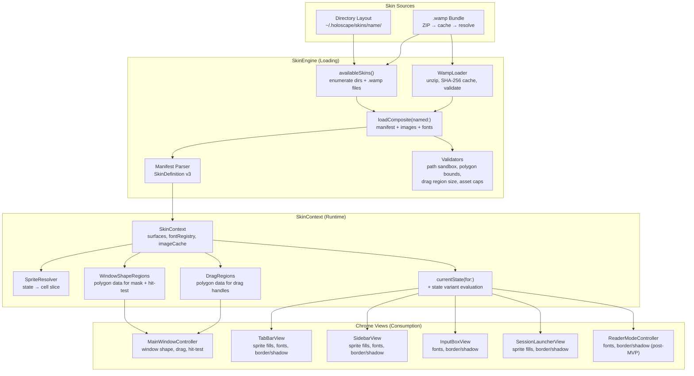
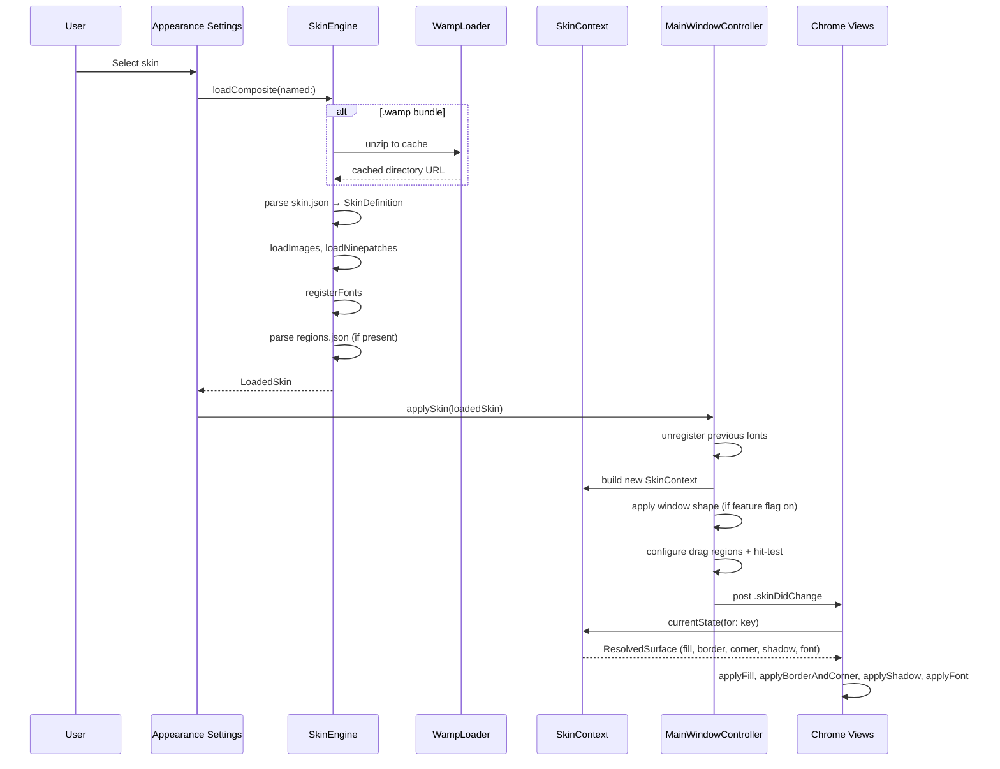

# Design Document: Amplify Skinning

## Overview

Amplify extends Holoscape's chrome-skinning system from themeable chrome (color/gradient/ninepatch fills) to Winamp-class skinning. This design covers six major capabilities layered additively onto the existing `SkinEngine` → `SkinContext` → chrome-view pipeline:

1. **Shaped windows** via polygon regions (CAShapeLayer mask on a borderless NSWindow)
2. **Sprite-sheet image fills** with per-state cell slicing (normal/hover/pressed)
3. **Click-through and drag regions** (point-in-polygon hit testing, `performDrag`)
4. **Chrome typography** from skin-shipped TTF fonts consumed by all chrome views
5. **Border/corner/shadow rendering** wired into every chrome view's `refreshFromSkin()`
6. **`.wamp` bundle format** — ZIP-based distribution with SHA-256 cache keying and hot reload

All new manifest fields are optional with nil defaults, preserving full backward compatibility with existing v1/v2 skins. The existing `HoloscapeSynthwave` reference skin continues to work unchanged.

### Key Design Decisions

- **Additive, not replacement.** Every new capability is an optional extension to the existing model types. No existing code paths are removed or restructured.
- **Polygon-first shapes (MVP).** PNG alpha masks are deferred to post-MVP. Polygon regions are simpler to validate, hit-test, and debug.
- **Feature flag for shapes.** `HOLOSCAPE_AMPLIFY_SHAPED_WINDOWS` environment variable gates shaped-window rendering so shape-related bugs can be isolated without reverting the entire feature.
- **ZIPFoundation for `.wamp`.** Pure-Swift, MIT-licensed, well-maintained. Added as a SwiftPM dependency.
- **SwiftCheck for property tests.** The project already uses SwiftCheck for property-based testing (12 existing test files). All new property tests follow the same patterns.

## Architecture

The Amplify architecture extends three layers of the existing skinning pipeline:



### Data Flow



## Components and Interfaces

### New Model Types

#### WindowShapeDescriptor

```swift
struct WindowShapeDescriptor: Codable, Equatable, Sendable {
    enum Kind: String, Codable, Sendable {
        case polygons
        // case mask — post-MVP (PNG alpha)
    }
    var kind: Kind
    var polygons: [Polygon]?
}

struct Polygon: Codable, Equatable, Sendable {
    var points: [Point]
}

struct Point: Codable, Equatable, Sendable {
    var x: Double
    var y: Double
}
```

#### DragRegionDescriptor

```swift
struct DragRegionDescriptor: Codable, Equatable, Sendable {
    var polygons: [Polygon]
}
```

#### SpriteDescriptor (extends FillDescriptor)

```swift
struct SpriteDescriptor: Codable, Equatable, Sendable {
    var cellWidth: Int
    var cellHeight: Int
    var rows: Int
    var cols: Int
    var stateMap: [String: SpriteCell]
}

struct SpriteCell: Codable, Equatable, Sendable {
    var row: Int
    var col: Int
}
```

#### FillDescriptor Extension

The existing `FillDescriptor.image` case gains an optional `sprite` parameter:

```swift
case image(path: String, tile: TileMode, sprite: SpriteDescriptor?)
```

Backward compatible: existing image fills decode with `sprite: nil`.

#### SkinDefinition v3 Additions

```swift
struct SkinDefinition: Codable, Equatable, Sendable {
    // ... existing v1 + v2 fields ...
    
    // v3 Amplify additions (all optional)
    var windowShape: WindowShapeDescriptor?
    var dragRegions: [DragRegionDescriptor]?
}
```

### SurfaceKey Catalog Expansion

New cases added to the existing 23-case enum:

| Key | Raw Value | Purpose |
|-----|-----------|---------|
| `tabBarTabHover` | `"tabBar.tab.hover"` | Tab hover sprite state |
| `tabBarTabPressed` | `"tabBar.tab.pressed"` | Tab pressed sprite state |
| `sidebarRowPressed` | `"sidebar.row.pressed"` | Sidebar row pressed state |
| `sessionLauncherButtonNormal` | `"sessionLauncher.button.normal"` | Launcher button normal |
| `sessionLauncherButtonHover` | `"sessionLauncher.button.hover"` | Launcher button hover |
| `sessionLauncherButtonPressed` | `"sessionLauncher.button.pressed"` | Launcher button pressed |
| `readerPanelTitleBar` | `"readerPanel.titleBar"` | Reader panel title bar |
| `readerPanelBackground` | `"readerPanel.background"` | Reader panel background |
| `readerPanelCloseButtonNormal` | `"readerPanel.closeButton.normal"` | Reader close button |
| `readerPanelCloseButtonHover` | `"readerPanel.closeButton.hover"` | Reader close hover |
| `readerPanelCloseButtonPressed` | `"readerPanel.closeButton.pressed"` | Reader close pressed |

### WampLoader (New Component)

Encapsulates `.wamp` bundle handling:

```swift
@MainActor
final class WampLoader {
    let cacheDirectory: URL  // ~/Library/Caches/holoscape-skins/
    
    /// Unzip a .wamp to the cache, keyed by SHA-256 hash.
    /// Validates all paths against cache root (no traversal).
    /// Enforces 50 MB per-asset cap.
    func extract(_ wampURL: URL) throws -> URL
    
    /// Compute SHA-256 hash of a file.
    func hash(of fileURL: URL) throws -> String
    
    /// Purge LRU cache entries until total < 50 MB.
    func purgeCacheIfNeeded()
}
```

### SpriteResolver (New Component)

Pure function for sprite cell slicing:

```swift
struct SpriteResolver {
    /// Given a sprite descriptor and a state name, return the CGRect
    /// within the source image that corresponds to the correct cell.
    /// Falls back to "normal", then to (0,0) if "normal" is absent.
    static func cellRect(
        for state: String,
        in sprite: SpriteDescriptor
    ) -> CGRect
}
```

### PolygonHitTester (New Component)

Point-in-polygon evaluation using the ray-casting (Jordan curve theorem) algorithm:

```swift
struct PolygonHitTester {
    /// Test whether a point is inside any of the given polygons.
    /// Uses ray-casting algorithm. O(V) per polygon where V = vertex count.
    static func contains(
        point: CGPoint,
        in polygons: [Polygon]
    ) -> Bool
    
    /// Compute the axis-aligned bounding box of a polygon.
    static func boundingBox(of polygon: Polygon) -> CGRect
}
```

### Modified Components

#### SkinEngine

- `availableSkins()` — extended to enumerate `.wamp` files alongside directories
- `loadComposite(named:)` — gains a `.wamp` branch that delegates to `WampLoader`
- `startWatching(skinName:)` — extended to watch `.wamp` files (not cache dirs)
- New: `validatePolygonBounds(_:contentSize:)` — rejects polygons entirely outside bounds
- New: `warnSmallDragRegions(_:)` — logs warning for drag regions < 44×44 pt

#### SkinContext

- `applyFill(to:from:backingScale:)` — extended to handle sprite-sheet slicing via `SpriteResolver`
- New: `applyShadow(to:from:)` — applies `ResolvedShadow` to CALayer shadow properties
- New: `resolvedFont(for:)` — resolves font from skin font registry with system-font fallback
- `ResolvedFill` gains a new case: `.sprite(NSImage, SpriteDescriptor, NinepatchSidecar?)`

#### MainWindowController

- `applySkin(_:)` — extended to handle window shape, drag regions, hit-test override
- New: `applyWindowShape(_:)` — switches to borderless + CAShapeLayer mask
- New: `configureDragRegions(_:)` — installs NSTrackingAreas for drag handles
- New: `ShapedContentView` — NSView subclass overriding `hitTest(_:)` for click-through

#### Chrome Views (TabBarView, SidebarView, InputBoxView, SessionLauncherView)

- `refreshFromSkin()` — extended to apply font, border/corner, shadow
- New: NSTrackingArea installation for hover/pressed sprite state transitions
- New: `applyFont(_:to:)` helper for font application with fallback

### Density Mode Interaction

| Feature | `.full` | `.minimal` | `.off` |
|---------|---------|------------|--------|
| Window shape | ✅ Applied | ✅ Applied (static) | ❌ Rectangular |
| Sprite sheets | ✅ State-driven | ❌ Color fallback | ❌ Default colors |
| Click-through | ✅ Active | ✅ Active | ❌ Default hit-test |
| Drag regions | ✅ Active | ✅ Active | ❌ System title bar |
| Fonts | ✅ Skin font | ✅ Skin font | ❌ System font |
| Border/corner/shadow | ✅ Applied | ✅ Applied | ❌ Defaults |
| Animations | ✅ Animated | ❌ Instant | ❌ None |
| FSEventStream | ✅ Active | ✅ Active | ❌ Stopped |

## Data Models

### Manifest Schema (v3, backward compatible)

All new fields are optional. A v2 manifest decodes identically to before.

```json
{
  "version": "3.0",
  "name": "Holoscape Classic",
  "author": "Erik",
  "description": "Winamp-evocative shaped terminal skin",
  
  "windowShape": {
    "kind": "polygons",
    "polygons": [
      { "points": [{"x": 0, "y": 0}, {"x": 800, "y": 0}, {"x": 800, "y": 500}, {"x": 0, "y": 500}] }
    ]
  },
  
  "dragRegions": [
    { "polygons": [{ "points": [{"x": 0, "y": 0}, {"x": 800, "y": 0}, {"x": 800, "y": 32}, {"x": 0, "y": 32}] }] }
  ],
  
  "surfaces": {
    "tabBar.tab.normal": {
      "fill": {
        "kind": "image",
        "path": "assets/tab-buttons.png",
        "tile": "stretch",
        "sprite": {
          "cellWidth": 120,
          "cellHeight": 28,
          "rows": 3,
          "cols": 1,
          "stateMap": {
            "normal":  { "row": 0, "col": 0 },
            "hover":   { "row": 1, "col": 0 },
            "pressed": { "row": 2, "col": 0 }
          }
        }
      },
      "font": { "family": "PixelFont", "size": 11, "weight": "medium" },
      "border": { "color": "#333366", "width": 1 },
      "corner": 4,
      "shadow": { "color": "#000000", "opacity": 0.5, "blur": 4, "offsetX": 0, "offsetY": 2 }
    }
  }
}
```

### `.wamp` Bundle Layout

```
HoloscapeClassic.wamp          (ZIP container)
├── skin.json                   (v3 manifest)
├── regions.json                (optional — polygon data if windowShape uses external file)
├── assets/
│   ├── tab-buttons.png         (sprite sheet)
│   ├── sidebar-bg.png          (fill image)
│   ├── sidebar-bg.ninepatch.json  (ninepatch sidecar)
│   └── window-mask.png         (post-MVP: alpha mask)
└── fonts/
    └── PixelFont.ttf           (skin-shipped font)
```

### Cache Directory Structure

```
~/Library/Caches/holoscape-skins/
├── <sha256-hash-1>/            (extracted HoloscapeClassic.wamp)
│   ├── skin.json
│   ├── assets/
│   └── fonts/
└── <sha256-hash-2>/            (extracted AnotherSkin.wamp)
    └── ...
```

Cache is keyed by SHA-256 of the `.wamp` file. Edits produce a new hash → new cache entry. LRU purge at startup keeps total under 50 MB.

### LoadedSkin Extension

```swift
struct LoadedSkin {
    // ... existing fields ...
    
    /// Parsed window shape polygons. Nil for rectangular skins.
    let windowShape: WindowShapeDescriptor?
    
    /// Parsed drag region polygons. Nil when no drag regions declared.
    let dragRegions: [DragRegionDescriptor]?
}
```


## Correctness Properties

*A property is a characteristic or behavior that should hold true across all valid executions of a system — essentially, a formal statement about what the system should do. Properties serve as the bridge between human-readable specifications and machine-verifiable correctness guarantees.*

### Property 1: SkinDefinition v3 Manifest Round-Trip

*For any* valid `SkinDefinition` object containing any combination of v1 fields, v2 `surfaces` dictionary, and v3 Amplify fields (`windowShape` with polygons, `dragRegions`, and `FillDescriptor.image` with `SpriteDescriptor`), encoding to JSON and decoding back SHALL produce an equivalent `SkinDefinition` object.

**Validates: Requirements 9.5, 12.5, 13.5**

### Property 2: Sprite Cell Slicing Correctness

*For any* valid `SpriteDescriptor` (positive cellWidth, cellHeight, rows, cols) and any state name string, the `SpriteResolver.cellRect` function SHALL return a CGRect whose origin and size correspond to the cell identified by the `stateMap` entry for that state. When the state is absent from the `stateMap`, the function SHALL fall back to the `"normal"` entry. When `"normal"` is also absent, the function SHALL return the cell at row 0, column 0.

**Validates: Requirements 2.2, 2.3, 2.4**

### Property 3: Point-in-Polygon Correctness

*For any* convex polygon and any test point, the `PolygonHitTester.contains` function SHALL return true if and only if the point lies inside or on the boundary of the polygon. Specifically: for any convex polygon P and point Q, if Q is the centroid of P, then `contains(Q, [P])` SHALL return true; and for any point Q that is farther from the centroid than the farthest vertex of P (in all directions), `contains(Q, [P])` SHALL return false.

**Validates: Requirements 3.1, 3.3**

### Property 4: Polygon Bounds Validation

*For any* set of polygons whose vertices all lie entirely outside a given content-view bounding rectangle (no vertex inside, no edge intersecting), the `SkinEngine.validatePolygonBounds` function SHALL reject the polygon set. Conversely, for any polygon set where at least one vertex lies inside the bounding rectangle, the function SHALL accept it.

**Validates: Requirements 1.4**

### Property 5: Drag Region Minimum Size Warning

*For any* `DragRegionDescriptor` whose polygon's axis-aligned bounding box has width < 44 points or height < 44 points, the `SkinEngine.warnSmallDragRegions` function SHALL produce a warning. For any drag region whose bounding box is ≥ 44×44 points, no warning SHALL be produced.

**Validates: Requirements 4.6**

### Property 6: Border, Corner, and Shadow Layer Application

*For any* `ResolvedSurface` containing a `ResolvedBorder` (color, width), `ResolvedCorner` (uniform or asymmetric radius), and `ResolvedShadow` (color, opacity, blur, offset), applying `SkinContext.applyBorderAndCorner(to:from:)` and `SkinContext.applyShadow(to:from:)` to a CALayer SHALL set the layer's `borderColor`, `borderWidth`, `cornerRadius`, `shadowColor`, `shadowOpacity`, `shadowRadius`, and `shadowOffset` to values matching the resolved descriptors.

**Validates: Requirements 6.1, 6.2, 6.3**

### Property 7: Skin Enumeration Includes Both Directory and `.wamp` Skins

*For any* skins directory containing a mix of valid directory-layout skins (folders with `skin.json`) and valid `.wamp` files, `SkinEngine.availableSkins()` SHALL return a list containing the names of all valid skins from both sources, with "Default" always first.

**Validates: Requirements 7.1**

### Property 8: ZIP Path Traversal Rejection

*For any* file path extracted from a ZIP archive that contains `..` traversal segments, absolute path prefixes, or `http://`/`https://`/`file://` URL schemes, the `WampLoader.extract` function SHALL reject the path and abort extraction. For any relative path without traversal segments or URL schemes, the path SHALL be accepted.

**Validates: Requirements 7.4**

### Property 9: Default Surface Completeness

*For any* `SurfaceKey` case in `SurfaceKey.allCases` (including all new Amplify cases), `SkinContext.defaultSurface(for:)` SHALL return a valid `ResolvedSurface` with a non-nil fill, a valid text color, and a corner radius ≥ 0.

**Validates: Requirements 14.5**

### Property 10: Malformed Manifest Robustness

*For any* byte sequence passed to `SkinEngine.loadSkin(named:)` as the contents of a `skin.json` file, the function SHALL either return a valid `SkinDefinition` or return nil — it SHALL NOT throw an unhandled exception or crash.

**Validates: Requirements 15.6**

### Property 11: LRU Cache Purge Correctness

*For any* set of cache entries with known sizes and last-access timestamps, when the total size exceeds 50 MB, the `WampLoader.purgeCacheIfNeeded` function SHALL remove entries in least-recently-used order until the total is under 50 MB. The most-recently-used entries SHALL be preserved.

**Validates: Requirements 17.2**

### Property 12: Accessibility Labels Preserved Across Skin Changes

*For any* skin configuration applied to a chrome view (TabBarView, SidebarView, InputBoxView, SessionLauncherView), the view's accessibility identifier, accessibility role, and accessibility title SHALL remain unchanged from their pre-skin values. Skin visuals SHALL NOT override code-provided accessibility metadata.

**Validates: Requirements 16.2**

## Error Handling

### Graceful Degradation Strategy

The core principle is: **a broken skin degrades gracefully, never bricks.** Every error path has a defined fallback that preserves app functionality.

| Error Condition | Fallback Behavior | User Notification |
|----------------|-------------------|-------------------|
| `skin.json` fails to parse | Skin excluded from picker | NSLog with parse error |
| `regions.json` fails to parse | Rectangular window shape | NSLog warning + 5s banner |
| Sprite image missing/corrupt | Default color fill | NSLog warning |
| Font file missing/corrupt | System monospaced font | NSLog warning |
| `.wamp` corrupt/invalid | Skin excluded from picker | NSLog with specific error |
| `.wamp` path traversal | Extraction aborted, skin excluded | NSLog security warning |
| `.wamp` asset > 50 MB | Extraction aborted, skin excluded | NSLog + user notification |
| Polygons outside bounds | Rectangular fallback | NSLog warning |
| Unknown `windowShape.kind` | `windowShape` ignored | NSLog warning |
| Unknown `SurfaceKey` in manifest | Key ignored, others load | NSLog info |
| Mid-unzip `.wamp` modification | Keep previous SkinContext | NSLog warning, retry next event |
| Font PostScript name collision | Last file wins | NSLog warning |

### Error Propagation

- `SkinEngine.loadComposite(named:)` throws `SkinLoadError` (.notFound, .parseFailure) — callers keep their previous `SkinContext` on error.
- `WampLoader.extract(_:)` throws on path traversal, size cap breach, or corrupt archive — `loadComposite` catches and converts to `SkinLoadError.parseFailure`.
- Font registration failures are logged and skipped per-file — one bad font doesn't sink the bundle.
- Image decode failures are logged and skipped per-file — one bad asset doesn't sink the skin.
- No `fatalError`, `preconditionFailure`, or force-unwrap in any skin-loading code path.

### Feature Flag Isolation

The `HOLOSCAPE_AMPLIFY_SHAPED_WINDOWS` environment variable gates only shaped-window rendering:
- `"1"` → shaped windows enabled
- `"0"` or absent → shaped windows disabled, skin loads as rectangular
- Non-shape features (sprites, fonts, borders, `.wamp`) are always active regardless of flag

This allows isolating shape-related rendering bugs without reverting the entire Amplify feature set.

## Testing Strategy

### Dual Testing Approach

Amplify uses both property-based tests (via SwiftCheck) and example-based unit tests for comprehensive coverage.

**Property-based tests** verify universal invariants across generated inputs:
- Minimum 100 iterations per property test (SwiftCheck default)
- Each test references its design document property number
- Tag format: `Feature: amplify-skinning, Property {N}: {title}`
- Reduced iteration count (15–25) for tests involving disk I/O (font registration, ZIP extraction)

**Example-based unit tests** verify specific scenarios, edge cases, and integration points:
- Backward compatibility with existing v2 skins
- Density mode gating behavior
- Feature flag behavior
- UI integration (NSWindow style mask, CALayer properties)
- Error handling fallbacks

### Property Test Plan

| Property | Test File | SwiftCheck Generators | Iterations |
|----------|-----------|----------------------|------------|
| P1: SkinDefinition v3 round-trip | `AmplifyManifestRoundTripPropertyTests.swift` | Random SkinDefinition with all v1/v2/v3 fields | 100 |
| P2: Sprite cell slicing | `SpriteCellSlicingPropertyTests.swift` | Random SpriteDescriptor + state names | 100 |
| P3: Point-in-polygon | `PolygonHitTestPropertyTests.swift` | Random convex polygons + test points | 100 |
| P4: Polygon bounds validation | `PolygonBoundsValidationPropertyTests.swift` | Random polygon sets + bounding rects | 100 |
| P5: Drag region size warning | `DragRegionSizePropertyTests.swift` | Random polygons with varying bounding boxes | 100 |
| P6: Border/corner/shadow application | `BorderCornerShadowPropertyTests.swift` | Random ResolvedBorder/Corner/Shadow values | 100 |
| P7: Skin enumeration | `SkinEnumerationPropertyTests.swift` | Random directory layouts with .wamp + dirs | 25 (disk I/O) |
| P8: ZIP path traversal | `WampPathTraversalPropertyTests.swift` | Random paths with/without traversal | 100 |
| P9: Default surface completeness | `DefaultSurfaceCompletenessPropertyTests.swift` | All SurfaceKey.allCases | 1 (exhaustive) |
| P10: Malformed manifest robustness | `MalformedManifestPropertyTests.swift` | Random byte sequences as skin.json | 100 |
| P11: LRU cache purge | `CachePurgePropertyTests.swift` | Random cache entry sets with sizes/timestamps | 100 |
| P12: Accessibility preservation | `AccessibilityPreservationPropertyTests.swift` | Random skin configurations | 25 (AppKit views) |

### Unit Test Plan

| Area | Test File | Key Scenarios |
|------|-----------|---------------|
| Window shape | `WindowShapeTests.swift` | Borderless transition, frame preservation, Reduce Motion, density gating |
| Sprite rendering | `SpriteRenderingTests.swift` | Hover/pressed state transitions, density minimal fallback, missing image fallback |
| Click-through | `ClickThroughTests.swift` | hitTest nil outside shape, default rectangular hit-test |
| Drag regions | `DragRegionTests.swift` | performDrag on mouseDown, cursor changes, whole-window fallback |
| Font consumption | `FontConsumptionTests.swift` | Font applied to TabBarView/SidebarView/InputBoxView, missing font fallback |
| `.wamp` loading | `WampLoaderTests.swift` | Unzip, cache keying, size cap, corrupt archive, hot reload |
| Backward compat | `BackwardCompatTests.swift` | v1/v2 manifests unchanged, HoloscapeSynthwave regression |
| Feature flag | `FeatureFlagTests.swift` | Flag on/off, non-shape features unaffected |
| Graceful degradation | `GracefulDegradationTests.swift` | All error conditions from the error handling table |

### Integration Tests

- **Mac Mini dogfood** after every PR merge (visual regression via screenshot comparison)
- **HoloscapeSynthwave backward-compat** — load before and after Amplify, compare chrome output
- **Holoscape Classic reference skin** — exercises all Amplify capabilities end-to-end
- **Hot reload** — edit `.wamp` in place, verify chrome updates within 200 ms
