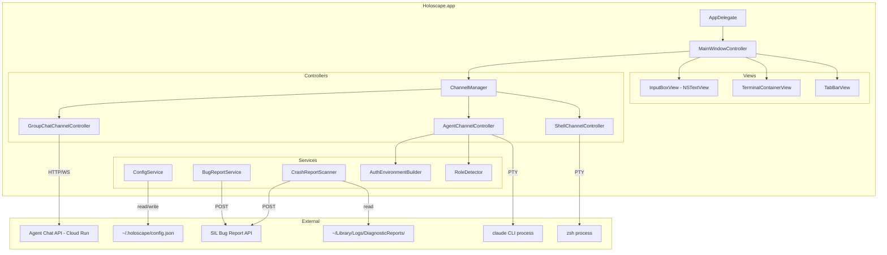

# Design Document: Holoscape Native Terminal

## Overview

Holoscape is a native macOS terminal application built in Swift/AppKit that provides a channel-based interface for managing local shell sessions, AI agent conversations, and group chat connections in a single window. The core abstraction is the **Channel** — a named, typed connection to a backend rendered in a tab bar. The application targets macOS Sequoia 15.0+ and uses SwiftTerm for terminal emulation.

This design covers the V1 MVP: shell channels (local zsh via PTY), agent channels (Claude CLI with auth isolation), group chat channels (Agent Chat API), bug reporting (Cmd+B to SIL API), crash detection, appearance settings, and channel state persistence.

### Key Design Decisions

1. **SwiftTerm for PTY channels, custom NSTextView for group chat**: SwiftTerm's `LocalProcessTerminalView` handles shell and agent channels natively. Group chat uses HTTP/WebSocket — not a PTY — so it renders in a styled `NSTextView` with monospace font to match the terminal aesthetic. This avoids fighting SwiftTerm's PTY-centric delegate model.

2. **Channel creation via Cmd+N type picker**: A modal sheet with four buttons (Shell, Agent Direct, Agent API, Group Chat). Simple, discoverable, keyboard-driven.

3. **CLAUDE.md role detection**: Parse the first `> **You are the {role}**` line from CLAUDE.md in the working directory. Fallback to user-assigned label at creation, then "Agent" default.

4. **Process death → disconnected state**: When a channel's backend process terminates unexpectedly, the tab shows a "disconnected" badge. Erik can retry (respawn) or close. No auto-restart — explicit control.

5. **Auth isolation via clean environment construction**: Each channel process is spawned with a minimal environment built from scratch (PATH, HOME, SHELL, TERM, LANG). OAuth channels explicitly omit ANTHROPIC_API_KEY. API channels inject it. No environment inheritance from Holoscape's own process.

6. **SIL bug report format**: JSON payload with structured fields. Simple flat object, no nested structures.

## Architecture



### Architectural Layers

- **App Layer**: `AppDelegate` handles launch lifecycle, crash scan on startup, config loading.
- **Window Layer**: `MainWindowController` owns the single window, coordinates the tab bar, terminal container, and input box.
- **Channel Layer**: `ChannelManager` is the central registry. It creates, tracks, closes, persists, and restores channels. Each channel type has its own controller conforming to a `ChannelController` protocol.
- **Service Layer**: Stateless or singleton services for config I/O, bug reporting, crash scanning, role detection, and environment construction.

### Process Model

Each PTY-based channel (shell, agent) spawns an independent child process via `forkpty()` / `posix_spawn()`. These processes have their own PIDs and survive Holoscape crashes. Group chat channels are in-process HTTP/WebSocket connections — they do not survive app termination but reconnect on restore.

## Components and Interfaces

### ChannelController Protocol

```swift
protocol ChannelController: AnyObject {
    var channelId: UUID { get }
    var channelType: ChannelType { get }
    var displayLabel: String { get }
    var hasUnread: Bool { get set }
    var state: ChannelState { get }
    
    /// The NSView to display in the terminal container area
    var contentView: NSView { get }
    
    /// Send user input from the InputBox to this channel's backend
    func sendInput(_ text: String)
    
    /// Start or connect the channel's backend process/connection
    func activate()
    
    /// Terminate the backend process/connection
    func deactivate()
    
    /// Attempt to restart a disconnected channel
    func retry()
    
    /// Get the last N lines of output for bug reports
    func lastLines(_ count: Int) -> [String]
    
    /// Per-channel command history
    var commandHistory: CommandHistory { get }
    
    /// Delegate for state change notifications
    var delegate: ChannelControllerDelegate? { get set }
}

protocol ChannelControllerDelegate: AnyObject {
    func channelDidReceiveOutput(_ channel: ChannelController)
    func channelStateDidChange(_ channel: ChannelController, to state: ChannelState)
}
```

### ShellChannelController

Wraps SwiftTerm's `LocalProcessTerminalView`. On `activate()`, spawns `/bin/zsh` via PTY. The `contentView` is the SwiftTerm view itself. Input from the InputBox is written to the PTY file descriptor.

### AgentChannelController

Also wraps SwiftTerm's `LocalProcessTerminalView`. On `activate()`:
1. Calls `AuthEnvironmentBuilder` to construct a clean environment for the channel's auth type.
2. Calls `RoleDetector` to parse CLAUDE.md in the working directory (if present).
3. Spawns `claude` CLI in the constructed environment via PTY.

### GroupChatChannelController

Uses a custom `NSTextView` (read-only, monospace) as `contentView`. On `activate()`:
1. Establishes HTTP polling or WebSocket connection to Agent Chat API.
2. Appends incoming messages formatted as `[HH:MM PM] sender: message body`.
3. `sendInput()` POSTs to the API with `"erik"` as sender.

### ChannelManager

```swift
class ChannelManager {
    private var channels: [UUID: ChannelController] = [:]
    private var channelOrder: [UUID] = []
    private var instanceCounters: [String: Int] = [:]  // role -> next instance number
    
    func createChannel(type: ChannelType, role: String?, workingDirectory: URL?) -> ChannelController
    func closeChannel(id: UUID, force: Bool)
    func channel(for id: UUID) -> ChannelController?
    func allChannels() -> [ChannelController]  // in tab order
    func moveUnreadToFront(id: UUID)
    func saveState(to config: ConfigService)
    func restoreState(from config: ConfigService)
}
```

### AuthEnvironmentBuilder

```swift
struct AuthEnvironmentBuilder {
    /// Build a minimal clean environment for a channel process
    static func buildEnvironment(
        for authType: AgentAuthType,
        workingDirectory: URL
    ) -> [String: String] {
        var env: [String: String] = [
            "PATH": "/usr/local/bin:/usr/bin:/bin:/usr/sbin:/sbin",
            "HOME": NSHomeDirectory(),
            "SHELL": "/bin/zsh",
            "TERM": "xterm-256color",
            "LANG": "en_US.UTF-8"
        ]
        switch authType {
        case .oauth:
            // Explicitly do NOT set ANTHROPIC_API_KEY
            break
        case .apiKey(let key):
            env["ANTHROPIC_API_KEY"] = key
        }
        return env
    }
}
```

### RoleDetector

```swift
struct RoleDetector {
    /// Parse CLAUDE.md to extract role identifier
    /// Looks for pattern: > **You are the {role}**
    static func detectRole(in directory: URL) -> String? {
        let claudeMdURL = directory.appendingPathComponent("CLAUDE.md")
        guard let content = try? String(contentsOf: claudeMdURL, encoding: .utf8) else {
            return nil
        }
        // Match: > **You are the {role} of {project}**
        // or:   > **You are the {role}.**
        let pattern = #"\*\*You are the ([^.*]+?)(?:\s+of\s+[^.*]+)?\.\*\*"#
        guard let regex = try? NSRegularExpression(pattern: pattern),
              let match = regex.firstMatch(in: content, range: NSRange(content.startIndex..., in: content)),
              let roleRange = Range(match.range(at: 1), in: content) else {
            return nil
        }
        return String(content[roleRange]).trimmingCharacters(in: .whitespaces)
    }
    
    /// Convert a detected role string to a short tab label
    static func shortLabel(for role: String) -> String {
        // "floor manager" -> "FM", "architect" -> "AR", "ceo" -> "CEO"
        let words = role.lowercased().split(separator: " ")
        if words.count == 1 {
            return String(words[0].prefix(3)).uppercased()
        }
        return words.map { String($0.prefix(1)).uppercased() }.joined()
    }
}
```

### BugReportService

```swift
struct BugReportService {
    let silAPIEndpoint: URL
    
    func submitBugReport(_ report: BugReport) async throws -> BugReportResponse
    func submitCrashReport(_ report: CrashReport) async throws -> BugReportResponse
}
```

### CrashReportScanner

```swift
struct CrashReportScanner {
    /// Scan DiagnosticReports for Holoscape crashes since the given date
    func scanForCrashes(since lastLaunch: Date) -> [CrashLog]
}
```

### ConfigService

```swift
class ConfigService {
    private let configURL = FileManager.default.homeDirectoryForCurrentUser
        .appendingPathComponent(".holoscape/config.json")
    
    func load() -> HoloscapeConfig
    func save(_ config: HoloscapeConfig)
}
```

### TabBarView

Custom `NSView` that renders channel tabs horizontally. Supports:
- Click to switch channels
- Unread dot indicator
- Active tab highlight
- Horizontal scrolling when tabs overflow
- Drag reordering (future consideration)

### InputBoxView

`NSTextView` subclass with:
- Standard text editing (click-to-position, selection, clipboard)
- Enter key intercept → sends text to active channel, clears input
- Up/Down arrow intercept → per-channel command history navigation
- Shift+Enter for newline (if needed in future)

## Data Models

### ChannelType

```swift
enum ChannelType: String, Codable {
    case shell
    case agentDirect
    case agentAPI
    case groupChat
}
```

### AgentAuthType

```swift
enum AgentAuthType {
    case oauth
    case apiKey(String)
}
```

### ChannelState

```swift
enum ChannelState: String, Codable {
    case active
    case disconnected
    case connecting
}
```

### Channel Metadata (for persistence)

```swift
struct ChannelMetadata: Codable {
    let id: UUID
    let type: ChannelType
    let role: String
    let context: String?          // e.g., project directory name
    let instanceNumber: Int?
    let workingDirectory: String?
}
```

### HoloscapeConfig

```swift
struct HoloscapeConfig: Codable {
    var appearance: AppearanceConfig
    var channels: [ChannelMetadata]
    var lastLaunchTimestamp: Date?
}

struct AppearanceConfig: Codable {
    var backgroundColor: String    // hex color, e.g. "#1a1a2e"
    var transparency: Double       // 0.0 (fully transparent) to 1.0 (opaque)
    var fontFamily: String         // e.g. "SF Mono"
    var fontSize: Double           // e.g. 13.0
    var ansiColors: [String: String]?  // named ANSI color overrides
}
```

### BugReport

```swift
struct BugReport: Codable {
    let channelName: String
    let channelType: ChannelType
    let lastOutputLines: [String]  // last 20 lines
    let timestamp: Date
    let macOSVersion: String
    let description: String
}
```

### CrashReport

```swift
struct CrashReport: Codable {
    let crashTrace: String
    let lastChannelState: [ChannelMetadata]?
    let timestamp: Date
    let macOSVersion: String
}
```

### CommandHistory

```swift
class CommandHistory {
    private var entries: [String] = []
    private var cursor: Int = -1
    private let maxEntries: Int = 100
    
    func add(_ command: String)
    func previous() -> String?
    func next() -> String?
    func reset()
}
```

### GroupChatMessage

```swift
struct GroupChatMessage: Codable {
    let sender: String
    let body: String
    let timestamp: Date
}
```


## Correctness Properties

*A property is a characteristic or behavior that should hold true across all valid executions of a system — essentially, a formal statement about what the system should do. Properties serve as the bridge between human-readable specifications and machine-verifiable correctness guarantees.*

### Property 1: Channel creation increments count and assigns instance number

*For any* channel type and any initial set of open channels, creating a new channel should increase the total channel count by exactly one, and the new channel should have a valid instance number assigned.

**Validates: Requirements 1.2**

### Property 2: Sequential instance numbering for same-role channels

*For any* sequence of N channels created with the same Channel_Role, the assigned Instance_Numbers should be sequential integers from 1 to N with no gaps or duplicates.

**Validates: Requirements 1.4**

### Property 3: Close confirmation iff running process

*For any* channel, the close operation should require confirmation if and only if the channel's state is `active` (has a running process). Channels in `disconnected` or `connecting` state should close without confirmation.

**Validates: Requirements 1.5, 1.6**

### Property 4: Tab label contains role and context

*For any* channel with a non-empty Channel_Role and Channel_Context, the generated display label should contain both the role identifier and the context string.

**Validates: Requirements 2.1**

### Property 5: Unread indicator lifecycle

*For any* channel that is not the currently active channel, receiving new output should set `hasUnread` to true. *For any* channel with `hasUnread` set to true, switching to that channel (making it active) should set `hasUnread` to false.

**Validates: Requirements 2.3, 2.5, 5.6**

### Property 6: Unread tabs reorder to leftmost

*For any* set of open channels where a channel transitions to unread, the tab ordering should place that channel at the leftmost position among all unread tabs, while preserving the relative order of read tabs.

**Validates: Requirements 2.4**

### Property 7: Scrollback buffer respects configured depth

*For any* channel type and any configured scrollback depth N, the channel's scrollback buffer should retain at most N lines, discarding the oldest lines when the buffer is full.

**Validates: Requirements 3.3, 5.5**

### Property 8: OAuth environment omits API key

*For any* Agent_Direct channel, the environment constructed by `AuthEnvironmentBuilder` must not contain the key `ANTHROPIC_API_KEY`.

**Validates: Requirements 4.1, 14.2**

### Property 9: API key environment injects correct key

*For any* Agent_API channel with a given API key string K, the environment constructed by `AuthEnvironmentBuilder` must contain `ANTHROPIC_API_KEY` set to exactly K.

**Validates: Requirements 4.2, 14.3**

### Property 10: Clean environment contains only designated variables

*For any* agent channel (Direct or API), the environment constructed by `AuthEnvironmentBuilder` should contain only the designated minimal set of variables (PATH, HOME, SHELL, TERM, LANG, and optionally ANTHROPIC_API_KEY for API channels). No other environment variables from the parent process should leak through.

**Validates: Requirements 4.3, 14.4**

### Property 11: CLAUDE.md role detection round-trip

*For any* valid role string R, a CLAUDE.md file containing the pattern `> **You are the R of project.**` should cause `RoleDetector.detectRole` to return R. Conversely, for any file content that does not match the pattern, the detector should return nil.

**Validates: Requirements 4.4, 1.3**

### Property 12: Floor manager context shows project directory

*For any* Agent_Channel whose detected role is "floor manager" (case-insensitive), the Channel_Context should equal the last path component of the working directory.

**Validates: Requirements 4.6**

### Property 13: Group chat message formatting

*For any* GroupChatMessage with sender S, body B, and timestamp T, the formatted output string should match the pattern `[HH:MM AM/PM] S: B` where the time components are derived from T.

**Validates: Requirements 5.2**

### Property 14: Group chat outbound sender is always "erik"

*For any* message sent from a Group_Chat_Channel, the sender field in the API request payload should be exactly `"erik"`.

**Validates: Requirements 5.3**

### Property 15: Group chat displays all senders without filtering

*For any* set of messages with arbitrary sender identifiers, the Group_Chat_Channel should render all messages without filtering or excluding any sender.

**Validates: Requirements 5.4**

### Property 16: Enter sends input and clears

*For any* non-empty text content in the Input_Box, pressing Enter should result in the text being dispatched to the active channel's `sendInput` method and the Input_Box content being set to empty string.

**Validates: Requirements 6.6**

### Property 17: Command history navigation round-trip

*For any* CommandHistory with N entries (N > 0), calling `previous()` followed by `next()` should return to the same position in the history. Additionally, calling `previous()` N times from the initial position should traverse all N entries in reverse chronological order.

**Validates: Requirements 6.7, 6.8**

### Property 18: Report payloads contain required fields and no sensitive data

*For any* BugReport, the serialized payload must include channelName, channelType, lastOutputLines (exactly 20 lines), timestamp, macOSVersion, and description. *For any* CrashReport, the payload must include crashTrace, lastChannelState, timestamp, and macOSVersion. *For any* report payload (bug or crash), the serialized JSON string must not contain any string matching API key patterns (e.g., `sk-ant-*`) or the literal key `ANTHROPIC_API_KEY`.

**Validates: Requirements 7.3, 7.4, 8.3, 8.5**

### Property 19: Crash scanner filters by timestamp

*For any* set of crash log files with various creation timestamps and a given last-launch timestamp T, the `CrashReportScanner` should return only those files whose creation timestamp is strictly after T.

**Validates: Requirements 8.1**

### Property 20: Config serialization round-trip

*For any* valid `HoloscapeConfig` value, encoding to JSON and then decoding should produce an equivalent config. Specifically, `decode(encode(config)) == config` for all valid configs.

**Validates: Requirements 9.3**

### Property 21: Malformed config falls back to defaults

*For any* string that is not valid JSON or does not conform to the `HoloscapeConfig` schema, the `ConfigService.load()` method should return the default `HoloscapeConfig` without throwing an error.

**Validates: Requirements 9.5**

### Property 22: Channel state persistence round-trip

*For any* list of `ChannelMetadata` values in a given order, saving them to the config file and then loading should produce the same list in the same order with identical field values.

**Validates: Requirements 10.1, 10.2**

### Property 23: Backend loss transitions to disconnected state

*For any* channel in `active` state, when the backend process terminates unexpectedly or a restore fails to connect, the channel state should transition to `disconnected`.

**Validates: Requirements 10.6, 12.3**

## Error Handling

### Process Failures

- **PTY spawn failure** (zsh or claude not found): Set channel state to `disconnected`, display error message in the content view with the specific failure reason (e.g., "zsh not found at /bin/zsh"). Offer retry button.
- **Process unexpected exit**: Detect via `waitpid` / process termination notification. Transition channel to `disconnected` state. Preserve the last terminal output in the SwiftTerm view so Erik can see what happened. Show "Process exited (code N)" in the tab.
- **Process hang**: No automatic timeout in V1. Erik can close the channel manually (Cmd+W with confirmation).

### Network Failures

- **Agent Chat API connection failure**: Display inline error message in the group chat view: "Connection failed: {reason}". Attempt automatic reconnect with exponential backoff (1s, 2s, 4s, 8s, max 30s). Show "Reconnecting..." in the tab label.
- **Agent Chat API auth failure (401/403)**: Display "Authentication failed. Check API key." No auto-retry — requires user intervention.
- **SIL API bug report failure**: Display error in the bug report overlay. Do not dismiss the overlay so Erik can retry or copy the description.
- **SIL API crash report failure**: Display error in the crash report prompt. Offer "Retry" and "Dismiss" options. Do not lose the crash data.

### Config Failures

- **Config file missing**: Create default config at `~/.holoscape/config.json` with default appearance settings and empty channel list.
- **Config file malformed JSON**: Log warning, use defaults, overwrite the malformed file on next save.
- **Config file permission error**: Log error, use defaults, display a non-blocking alert: "Could not read settings file."
- **Config directory missing**: Create `~/.holoscape/` directory before writing.

### Auth Failures

- **API key not found in secure storage**: Display error during Agent_API channel creation: "No API key configured." Do not create the channel.
- **OAuth token expired/invalid**: This is handled by the `claude` CLI itself — Holoscape just spawns the process. If `claude` fails auth, its error output appears in the SwiftTerm view naturally.

### Input Handling

- **Empty input on Enter**: No-op. Do not send empty strings to any channel.
- **Very long input**: No artificial limit in V1. The NSTextView handles large text natively. PTY channels will receive the full input.

## Testing Strategy

### Unit Tests

Unit tests cover specific examples, edge cases, and integration points. Use XCTest.

Key areas:
- `RoleDetector`: Test with specific CLAUDE.md examples (floor manager, architect, CEO, no role, malformed files)
- `AuthEnvironmentBuilder`: Test OAuth produces no API key, API produces correct key, no extra variables
- `CommandHistory`: Test add/previous/next with empty history, single entry, boundary conditions
- `ConfigService`: Test load/save with missing file, malformed JSON, valid config
- `BugReport` / `CrashReport` construction: Test payload includes all required fields
- `ChannelManager`: Test instance numbering with specific role sequences
- Group chat message formatter: Test with specific timestamps, senders, edge cases (empty body, long messages)
- Tab label generation: Test shell="Shell", agent with role, floor manager with context

### Property-Based Tests

Use [SwiftCheck](https://github.com/typelift/SwiftCheck) for property-based testing in Swift. Each property test runs a minimum of 100 iterations.

Each test must be tagged with a comment referencing the design property:

```swift
// Feature: holoscape-native-terminal, Property 1: Channel creation increments count
```

Properties to implement as property-based tests:

1. **Property 1**: Generate random channel types, verify count increments by 1 each time.
2. **Property 2**: Generate random sequences of same-role channel creations, verify sequential instance numbers.
3. **Property 3**: Generate channels with random states, verify confirmation requirement matches active state.
4. **Property 4**: Generate random role/context pairs, verify label contains both.
5. **Property 5**: Generate random channel sets with random active channel, verify unread set/clear behavior.
6. **Property 6**: Generate random channel orderings with random unread transitions, verify leftmost placement.
7. **Property 7**: Generate random line sequences exceeding buffer depth, verify oldest lines discarded.
8. **Property 8**: Generate random working directories, verify OAuth environment has no ANTHROPIC_API_KEY.
9. **Property 9**: Generate random API key strings, verify environment contains exact key.
10. **Property 10**: Generate random agent channel configs, verify environment contains only designated keys.
11. **Property 11**: Generate random role strings, construct CLAUDE.md content, verify round-trip detection.
12. **Property 12**: Generate random directory paths with floor manager role, verify context is last path component.
13. **Property 13**: Generate random sender/body/timestamp triples, verify formatted output matches pattern.
14. **Property 14**: Generate random message texts, verify outbound payload sender is "erik".
15. **Property 15**: Generate random sender identifiers, verify none are filtered.
16. **Property 16**: Generate random non-empty strings, verify sendInput called and input cleared.
17. **Property 17**: Generate random command histories, verify up/down navigation round-trip.
18. **Property 18**: Generate random report payloads, verify required fields present and no sensitive data.
19. **Property 19**: Generate random file timestamps and launch timestamps, verify correct filtering.
20. **Property 20**: Generate random HoloscapeConfig values, verify encode/decode round-trip.
21. **Property 21**: Generate random invalid JSON strings, verify defaults returned.
22. **Property 22**: Generate random ChannelMetadata lists, verify save/load round-trip preserves order and values.
23. **Property 23**: Generate channels in active state, simulate backend loss, verify transition to disconnected.

### Test Organization

```
Tests/
  HoloscapeTests/
    Unit/
      RoleDetectorTests.swift
      AuthEnvironmentBuilderTests.swift
      CommandHistoryTests.swift
      ConfigServiceTests.swift
      BugReportTests.swift
      ChannelManagerTests.swift
      MessageFormatterTests.swift
      TabLabelTests.swift
      CrashScannerTests.swift
    Property/
      ChannelCreationPropertyTests.swift
      InstanceNumberingPropertyTests.swift
      AuthEnvironmentPropertyTests.swift
      RoleDetectionPropertyTests.swift
      MessageFormattingPropertyTests.swift
      CommandHistoryPropertyTests.swift
      ConfigRoundTripPropertyTests.swift
      ChannelStatePropertyTests.swift
      ReportPayloadPropertyTests.swift
      CrashScannerPropertyTests.swift
      TabBarPropertyTests.swift
      InputBoxPropertyTests.swift
```
