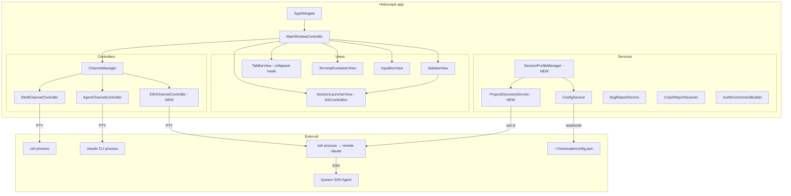

# Design Document: Holoscape V1.5 — Session Launcher and Sidebar

## Overview

Holoscape V1.5 is an incremental update to the V1 native macOS terminal. It adds four major capabilities on top of the existing channel-based architecture:

1. **Profile-driven session launcher** — a combobox dropdown replacing the Cmd+N modal picker, with preconfigured profiles, auto-discovered projects, and recently used sessions.
2. **SSH agent channels** — remote PTY connections to a MacBook via SSH, rendered through SwiftTerm, authenticated via the system SSH agent.
3. **Collapsible left sidebar** — a vertical tab list that replaces the horizontal tab bar when expanded, with toggle to collapse back to V1 behavior.
4. **Right-click context menus** — Close, Rename, Duplicate, Reconnect, Copy Session Info on any tab.

Group Chat and CEO Connection are explicitly out of scope (deferred to V2).

### Key Design Decisions

1. **Process-based SSH via `ssh` command**: Rather than embedding a C library (NMSSH, libssh2), Holoscape spawns the system `ssh` binary as a child process connected to a PTY via SwiftTerm's `LocalProcessTerminalView`. This reuses the exact same PTY→SwiftTerm pipeline that `ShellChannelController` and `AgentChannelController` already use. The system `ssh` binary handles agent forwarding, known hosts, ProxyJump, and all SSH config natively — zero library integration, zero key management, and Erik's `~/.ssh/config` just works. The tradeoff is less programmatic control over the SSH session (no channel multiplexing, no SFTP), but V1.5 doesn't need any of that — it just needs a remote PTY running `claude`.

2. **SessionProfile as the universal launch descriptor**: Every channel creation in V1.5 flows through a `SessionProfile` — a Codable struct that captures label, connection type, host, user, directory, and command. This replaces the ad-hoc `ChannelType` + role + workingDirectory parameters in V1's `createChannel()`. The `ChannelManager` gains a `createChannel(from: SessionProfile)` method that dispatches to the right controller type.

3. **NSSplitView for sidebar layout**: The sidebar uses `NSSplitView` with two panes — sidebar (left) and terminal area (right). Collapsing the sidebar sets its width to 0 and shows the horizontal `TabBarView`. This is the standard AppKit pattern for collapsible panels and handles resize, minimum widths, and animation natively.

4. **NSComboBox for session launcher**: AppKit's `NSComboBox` provides the editable dropdown behavior natively — type to filter, select from list, or enter a new value. The combobox sits at the top of the sidebar panel. When the sidebar is collapsed, the session launcher is accessible via Cmd+N (which now opens the combobox in a popover).

5. **Labels from profiles, not CLAUDE.md**: V1.5 channels get their display label from the `SessionProfile.label` field (or the project directory name for discovered sessions). The V1 `RoleDetector` CLAUDE.md parsing is no longer used for label generation on sessions launched via the Session Launcher. This makes labels predictable and config-driven.

6. **Instance numbering by label string**: V1 numbered by "role" (detected from CLAUDE.md). V1.5 numbers by the `SessionProfile.label` — all channels sharing the same label get sequential instance numbers. The counter tracks the highest-ever-assigned number per label (within an app session) so closing a channel doesn't cause renumbering.

## Architecture



### Changes from V1 Architecture

- **New controller**: `SSHChannelController` — wraps `LocalProcessTerminalView` like Shell/Agent controllers, but spawns `ssh user@host -t "cd dir && command"` instead of a local process.
- **New services**: `ProjectDiscoveryService` (SSH-based remote directory scanning with caching), `SessionProfileManager` (loads profiles from config, merges discovered projects, tracks recently used).
- **New views**: `SidebarView` (vertical tab list + launcher), `SessionLauncherView` (NSComboBox wrapper).
- **Modified**: `MainWindowController` gains `NSSplitView` layout, sidebar toggle, context menu handling. `ChannelManager` gains `createChannel(from: SessionProfile)`. `HoloscapeConfig` gains V1.5 fields.
- **Removed from channel creation path**: `RoleDetector` is no longer called during session launch (labels come from profiles). It remains in the codebase for potential future use.


## Components and Interfaces

### SessionProfile (New Model)

```swift
struct SessionProfile: Codable, Equatable, Sendable {
    var label: String
    var connection: ConnectionType
    var command: String
    var directory: String
    var host: String?       // SSH only
    var user: String?       // SSH only
    
    enum ConnectionType: String, Codable, Sendable {
        case local
        case ssh
    }
}
```

### SSHDefaults (New Model)

```swift
struct SSHDefaults: Codable, Equatable, Sendable {
    var host: String
    var user: String
    
    static let `default` = SSHDefaults(host: "", user: "")
}
```

### ProjectDiscoveryConfig (New Model)

```swift
struct ProjectDiscoveryConfig: Codable, Equatable, Sendable {
    var enabled: Bool
    var root: String
    var connection: String   // "ssh"
    var command: String      // "claude"
    
    static let `default` = ProjectDiscoveryConfig(
        enabled: false, root: "~/projects", connection: "ssh", command: "claude"
    )
}
```

### RecentSession (New Model)

```swift
struct RecentSession: Codable, Equatable, Sendable {
    var label: String
    var timestamp: Date
}
```

### HoloscapeConfig (Extended)

```swift
struct HoloscapeConfig: Codable, Equatable, Sendable {
    // V1 fields (preserved)
    var appearance: AppearanceConfig
    var channels: [ChannelMetadata]
    var lastLaunchTimestamp: Date?
    
    // V1.5 fields (new, optional for backward compat)
    var sessionProfiles: [SessionProfile]?
    var sshDefaults: SSHDefaults?
    var projectDiscovery: ProjectDiscoveryConfig?
    var sidebarExpanded: Bool?
    var recentSessions: [RecentSession]?
}
```

All V1.5 fields are `Optional` so that a V1 config file (missing these keys) decodes without error — `Codable` assigns `nil` to missing optional fields. On save, the full config (V1 + V1.5) is written back. This satisfies backward compatibility (Requirement 9.3).

### ChannelType (Extended)

```swift
enum ChannelType: String, Codable, Sendable {
    case shell
    case agentDirect
    case agentAPI
    case groupChat
    case ssh          // NEW
}
```

### ChannelMetadata (Extended)

```swift
struct ChannelMetadata: Codable, Equatable, Sendable {
    let id: UUID
    let type: ChannelType
    let role: String
    let context: String?
    let instanceNumber: Int?
    let workingDirectory: String?
    
    // V1.5 fields for SSH restoration
    let host: String?
    let user: String?
    let command: String?
}
```

### SSHChannelController (New)

```swift
@MainActor
class SSHChannelController: NSObject, ChannelController, LocalProcessTerminalViewDelegate {
    let channelId: UUID
    let channelType: ChannelType = .ssh
    var hasUnread: Bool = false
    private(set) var state: ChannelState = .disconnected
    let commandHistory = CommandHistory()
    weak var delegate: ChannelControllerDelegate?
    
    private let terminalView: LocalProcessTerminalView
    private let profile: SessionProfile
    private let instanceNumber: Int?
    
    var displayLabel: String {
        if let num = instanceNumber {
            return "\(profile.label) \(num)"
        }
        return profile.label
    }
    
    var contentView: NSView { terminalView }
    
    init(id: UUID, profile: SessionProfile, instanceNumber: Int?) {
        self.channelId = id
        self.profile = profile
        self.instanceNumber = instanceNumber
        self.terminalView = LocalProcessTerminalView(frame: NSRect(x: 0, y: 0, width: 800, height: 600))
        super.init()
        terminalView.processDelegate = self
    }
    
    func activate() {
        state = .connecting
        delegate?.channelStateDidChange(self, to: .connecting)
        
        guard let host = profile.host, let user = profile.user else {
            state = .disconnected
            delegate?.channelStateDidChange(self, to: .disconnected)
            return
        }
        
        // Build ssh command: ssh -t user@host "cd <dir> && <command>"
        let remoteCommand = "cd \(profile.directory) && \(profile.command)"
        let sshArgs = ["-t", "\(user)@\(host)", remoteCommand]
        
        let env = ProcessInfo.processInfo.environment
            .filter { ["PATH", "HOME", "SHELL", "TERM", "LANG", "SSH_AUTH_SOCK"].contains($0.key) }
            .map { "\($0.key)=\($0.value)" }
        
        terminalView.startProcess(
            executable: "/usr/bin/ssh",
            args: sshArgs,
            environment: env,
            execName: "ssh"
        )
        state = .active
        delegate?.channelStateDidChange(self, to: .active)
    }
    
    func sendInput(_ text: String) {
        guard state == .active else { return }
        commandHistory.add(text)
        let bytes = Array((text + "\n").utf8)
        terminalView.send(bytes)
    }
    
    func deactivate() {
        state = .disconnected
        delegate?.channelStateDidChange(self, to: .disconnected)
    }
    
    func retry() { activate() }
    
    func lastLines(_ count: Int) -> [String] { [] }
    
    // MARK: - LocalProcessTerminalViewDelegate
    nonisolated func sizeChanged(source: LocalProcessTerminalView, newCols: Int, newRows: Int) {}
    nonisolated func processTerminated(source: TerminalView, exitCode: Int32?) {
        Task { @MainActor [weak self] in
            guard let self else { return }
            self.state = .disconnected
            self.delegate?.channelStateDidChange(self, to: .disconnected)
        }
    }
    nonisolated func setTerminalTitle(source: LocalProcessTerminalView, title: String) {}
    nonisolated func hostCurrentDirectoryUpdate(source: TerminalView, directory: String?) {}
}
```

The key insight: `SSHChannelController` uses the exact same `LocalProcessTerminalView` + PTY pattern as `ShellChannelController`. The only difference is the executable (`/usr/bin/ssh` instead of `/bin/zsh`) and the arguments. The system `ssh` binary handles agent auth, host key verification, and connection management. SwiftTerm sees a PTY with terminal output — it doesn't know or care that the PTY is connected to a remote machine.

The environment is filtered to pass through `SSH_AUTH_SOCK` (required for the system SSH agent) plus the standard minimal set.

### ProjectDiscoveryService (New)

```swift
@MainActor
class ProjectDiscoveryService {
    private var cachedProjects: [SessionProfile] = []
    private var lastRefresh: Date?
    private let configService: ConfigService
    
    init(configService: ConfigService) {
        self.configService = configService
    }
    
    /// Discover project directories on the remote host.
    /// Runs: ssh user@host "ls -1 <root>"
    /// Returns cached results on SSH failure.
    func discover() async -> [SessionProfile] {
        let config = configService.load()
        guard let discovery = config.projectDiscovery, discovery.enabled,
              let defaults = config.sshDefaults else {
            return cachedProjects
        }
        
        do {
            let dirs = try await listRemoteDirectories(
                host: defaults.host,
                user: defaults.user,
                root: discovery.root
            )
            cachedProjects = dirs.map { dirName in
                SessionProfile(
                    label: dirName,
                    connection: .ssh,
                    command: discovery.command,
                    directory: "\(discovery.root)/\(dirName)",
                    host: defaults.host,
                    user: defaults.user
                )
            }
            lastRefresh = Date()
            return cachedProjects
        } catch {
            NSLog("ProjectDiscovery: SSH failed (\(error)). Using cache.")
            return cachedProjects
        }
    }
    
    /// Force refresh, clearing cache first.
    func refresh() async -> [SessionProfile] {
        cachedProjects = []
        return await discover()
    }
    
    private func listRemoteDirectories(host: String, user: String, root: String) async throws -> [String] {
        let process = Process()
        process.executableURL = URL(fileURLWithPath: "/usr/bin/ssh")
        process.arguments = ["\(user)@\(host)", "ls -1 \(root)"]
        
        let pipe = Pipe()
        process.standardOutput = pipe
        process.standardError = Pipe()
        
        try process.run()
        process.waitUntilExit()
        
        guard process.terminationStatus == 0 else {
            throw DiscoveryError.sshFailed(exitCode: process.terminationStatus)
        }
        
        let data = pipe.fileHandleForReading.readDataToEndOfFile()
        let output = String(data: data, encoding: .utf8) ?? ""
        return output.components(separatedBy: "\n")
            .map { $0.trimmingCharacters(in: .whitespaces) }
            .filter { !$0.isEmpty }
    }
    
    enum DiscoveryError: Error {
        case sshFailed(exitCode: Int32)
    }
}
```

Discovery runs `ssh user@host "ls -1 ~/projects"` as a one-shot `Process` (not a PTY — no terminal emulation needed for a directory listing). Results are cached in memory. The Session Launcher shows cached results immediately and offers a manual refresh button.

### SessionProfileManager (New)

```swift
@MainActor
class SessionProfileManager {
    private let configService: ConfigService
    private let discoveryService: ProjectDiscoveryService
    
    init(configService: ConfigService, discoveryService: ProjectDiscoveryService) {
        self.configService = configService
        self.discoveryService = discoveryService
    }
    
    /// All launchable sessions: preconfigured + discovered + recent.
    func allSessions() async -> (
        preconfigured: [SessionProfile],
        discovered: [SessionProfile],
        recent: [RecentSession]
    ) {
        let config = configService.load()
        let preconfigured = config.sessionProfiles ?? []
        let discovered = await discoveryService.discover()
        let recent = (config.recentSessions ?? [])
            .sorted { $0.timestamp > $1.timestamp }
        return (preconfigured, discovered, recent)
    }
    
    /// Record a session launch in the recently used list.
    func recordRecentSession(label: String) {
        var config = configService.load()
        var recent = config.recentSessions ?? []
        // Remove existing entry with same label, then prepend
        recent.removeAll { $0.label == label }
        recent.insert(RecentSession(label: label, timestamp: Date()), at: 0)
        // Cap at 20 recent entries
        if recent.count > 20 { recent = Array(recent.prefix(20)) }
        config.recentSessions = recent
        configService.save(config)
    }
    
    /// Resolve a label to a SessionProfile.
    /// Checks preconfigured profiles first, then discovered projects.
    /// If no match, creates a new SSH project session using ssh_defaults.
    func resolve(label: String) async -> SessionProfile? {
        let config = configService.load()
        
        // Check preconfigured
        if let match = (config.sessionProfiles ?? []).first(where: { $0.label == label }) {
            return match
        }
        
        // Check discovered
        let discovered = await discoveryService.discover()
        if let match = discovered.first(where: { $0.label == label }) {
            return match
        }
        
        // New project name — create SSH session using defaults
        guard let defaults = config.sshDefaults, !defaults.host.isEmpty else {
            return nil
        }
        let discovery = config.projectDiscovery ?? .default
        return SessionProfile(
            label: label,
            connection: .ssh,
            command: discovery.command,
            directory: "\(discovery.root)/\(label)",
            host: defaults.host,
            user: defaults.user
        )
    }
}
```

### ChannelManager (Modified)

New method added to the existing `ChannelManager`:

```swift
extension ChannelManager {
    /// Create a channel from a SessionProfile (V1.5 path).
    func createChannel(from profile: SessionProfile) -> any ChannelController {
        let id = UUID()
        let instanceNumber = nextInstanceNumber(for: profile.label)
        
        let controller: any ChannelController
        switch profile.connection {
        case .local:
            if profile.command == "/bin/zsh" || profile.command == "zsh" {
                controller = ShellChannelController(id: id, instanceNumber: instanceNumber)
            } else {
                controller = AgentChannelController(
                    id: id,
                    authType: .oauth,
                    workingDirectory: URL(fileURLWithPath: profile.directory),
                    userLabel: profile.label,
                    instanceNumber: instanceNumber
                )
            }
        case .ssh:
            controller = SSHChannelController(
                id: id,
                profile: profile.resolved(with: sshDefaults),
                instanceNumber: instanceNumber
            )
        }
        
        channels[id] = controller
        channelOrder.append(id)
        return controller
    }
}
```

### Instance Numbering (Modified)

The V1 `nextInstanceNumber` logic is updated for V1.5:

```swift
private var highWaterMarks: [String: Int] = [:]  // label -> highest assigned number

private func nextInstanceNumber(for label: String) -> Int? {
    let key = label.lowercased()
    let existingCount = channels.values.filter {
        $0.displayLabel.lowercased().hasPrefix(key)
    }.count
    
    if existingCount == 0 {
        // First channel with this label — no number needed yet
        // But track that we've seen it
        if highWaterMarks[key] == nil {
            highWaterMarks[key] = 0
        }
        return nil
    }
    
    // Assign next number (never reuse within app session)
    let next = (highWaterMarks[key] ?? 0) + 1
    highWaterMarks[key] = next
    return next
}
```

When the first channel with label "mini-claude" is created, no number is shown. When a second "mini-claude" is created, the first retroactively gets " 1" and the new one gets " 2". Closing "mini-claude 1" does not renumber "mini-claude 2". The next creation gets " 3".

### SidebarView (New)

```swift
@MainActor
class SidebarView: NSView {
    weak var delegate: SidebarViewDelegate?
    
    private let scrollView = NSScrollView()
    private let stackView = NSStackView()
    private var tabEntries: [UUID: SidebarTabEntry] = [:]
    
    /// Update the sidebar tab list.
    func updateTabs(channels: [any ChannelController], activeId: UUID?)
    
    /// Handle right-click on a tab entry.
    func showContextMenu(for channelId: UUID, at point: NSPoint)
}

@MainActor
protocol SidebarViewDelegate: AnyObject {
    func sidebarView(_ sidebar: SidebarView, didSelectChannelWithId id: UUID)
    func sidebarView(_ sidebar: SidebarView, didRequestAction action: ContextMenuAction, forChannelId id: UUID)
}

enum ContextMenuAction {
    case close
    case rename
    case duplicate
    case reconnect
    case copySessionInfo
}
```

Each sidebar tab entry is an `NSView` subclass showing: label text (with instance number), unread dot (small colored circle), and connection status icon (green dot = active, red dot = disconnected, spinner = connecting).

### SessionLauncherView (New)

```swift
@MainActor
class SessionLauncherView: NSView, NSComboBoxDelegate, NSComboBoxDataSource {
    weak var delegate: SessionLauncherDelegate?
    
    private let comboBox = NSComboBox()
    private let refreshButton: NSButton
    private var items: [LauncherItem] = []
    
    struct LauncherItem {
        let label: String
        let group: Group
        enum Group: String { case preconfigured, discovered, recent }
    }
    
    /// Populate the dropdown with current sessions.
    func reload(preconfigured: [SessionProfile], discovered: [SessionProfile], recent: [RecentSession])
    
    // NSComboBoxDataSource — provides items grouped by section
    // NSComboBoxDelegate — handles selection and custom text entry
}

@MainActor
protocol SessionLauncherDelegate: AnyObject {
    func sessionLauncher(_ launcher: SessionLauncherView, didSelectLabel label: String)
    func sessionLauncherDidRequestRefresh(_ launcher: SessionLauncherView)
}
```

The `NSComboBox` is configured with `usesDataSource = true`. Items are grouped with section headers (non-selectable) rendered as disabled items with a different font weight. Typing filters the list. Pressing Enter on a non-matching string triggers the "new project" flow.

### MainWindowController (Modified Layout)

```swift
// V1.5 layout changes in MainWindowController

private let splitView = NSSplitView()
private let sidebarView = SidebarView(frame: .zero)
private let launcherView = SessionLauncherView(frame: .zero)
private var isSidebarExpanded: Bool = true

private func setupLayout(inputContainer: NSScrollView) {
    guard let contentView = window.contentView else { return }
    
    // Left pane: sidebar + launcher
    let sidebarContainer = NSView()
    sidebarContainer.addSubview(launcherView)  // top
    sidebarContainer.addSubview(sidebarView)   // below launcher
    
    // Right pane: tab bar (hidden when sidebar expanded) + terminal + input
    let rightPane = NSView()
    rightPane.addSubview(tabBar)
    rightPane.addSubview(terminalContainer)
    rightPane.addSubview(inputContainer)
    
    splitView.isVertical = true
    splitView.addSubview(sidebarContainer)
    splitView.addSubview(rightPane)
    splitView.setHoldingPriority(.defaultLow, forSubviewAt: 0)   // sidebar can collapse
    splitView.setHoldingPriority(.defaultHigh, forSubviewAt: 1)  // terminal keeps space
    
    contentView.addSubview(splitView)
    // ... constraints ...
    
    // Tab bar visibility tied to sidebar state
    tabBar.isHidden = isSidebarExpanded
}

func toggleSidebar() {
    isSidebarExpanded.toggle()
    if isSidebarExpanded {
        splitView.setPosition(220, ofDividerAt: 0)
        tabBar.isHidden = true
    } else {
        splitView.setPosition(0, ofDividerAt: 0)
        tabBar.isHidden = false
    }
    // Persist state
    var config = configService.load()
    config.sidebarExpanded = isSidebarExpanded
    configService.save(config)
}
```

### Context Menu (New)

```swift
extension MainWindowController {
    func buildContextMenu(for channelId: UUID) -> NSMenu {
        let menu = NSMenu()
        let channel = channelManager.channel(for: channelId)
        
        menu.addItem(NSMenuItem(title: "Close", action: #selector(contextClose(_:)), keyEquivalent: ""))
        menu.addItem(NSMenuItem(title: "Rename", action: #selector(contextRename(_:)), keyEquivalent: ""))
        menu.addItem(NSMenuItem(title: "Duplicate", action: #selector(contextDuplicate(_:)), keyEquivalent: ""))
        
        let reconnectItem = NSMenuItem(title: "Reconnect", action: #selector(contextReconnect(_:)), keyEquivalent: "")
        reconnectItem.isEnabled = channel?.state == .disconnected
        menu.addItem(reconnectItem)
        
        menu.addItem(NSMenuItem.separator())
        menu.addItem(NSMenuItem(title: "Copy Session Info", action: #selector(contextCopyInfo(_:)), keyEquivalent: ""))
        
        // Tag all items with channel ID for dispatch
        for item in menu.items {
            item.representedObject = channelId
        }
        return menu
    }
}
```


## Data Models

### SessionProfile

| Field | Type | Required | Description |
|-------|------|----------|-------------|
| label | String | Yes | Display name for the session tab |
| connection | ConnectionType | Yes | "local" or "ssh" |
| command | String | Yes | Executable to run (e.g., "claude", "/bin/zsh") |
| directory | String | Yes | Working directory on target machine |
| host | String? | SSH only | SSH hostname (falls back to ssh_defaults) |
| user | String? | SSH only | SSH username (falls back to ssh_defaults) |

`SessionProfile` has a `resolved(with: SSHDefaults)` method that fills in missing host/user from defaults:

```swift
extension SessionProfile {
    func resolved(with defaults: SSHDefaults?) -> SessionProfile {
        guard connection == .ssh else { return self }
        var resolved = self
        if resolved.host == nil || resolved.host?.isEmpty == true {
            resolved.host = defaults?.host
        }
        if resolved.user == nil || resolved.user?.isEmpty == true {
            resolved.user = defaults?.user
        }
        return resolved
    }
}
```

### SSHDefaults

| Field | Type | Description |
|-------|------|-------------|
| host | String | Default SSH hostname |
| user | String | Default SSH username |

### ProjectDiscoveryConfig

| Field | Type | Description |
|-------|------|-------------|
| enabled | Bool | Whether auto-discovery is active |
| root | String | Remote directory to scan (e.g., "~/projects") |
| connection | String | Connection type for discovered sessions |
| command | String | Command to run in discovered directories |

### RecentSession

| Field | Type | Description |
|-------|------|-------------|
| label | String | Session label that was launched |
| timestamp | Date | When it was last launched |

### HoloscapeConfig (V1.5 Extension)

The V1 config struct gains optional V1.5 fields. All new fields are `Optional` so that a V1 config file decodes without error:

| Field | Type | V1/V1.5 | Default if missing |
|-------|------|---------|-------------------|
| appearance | AppearanceConfig | V1 | .default |
| channels | [ChannelMetadata] | V1 | [] |
| lastLaunchTimestamp | Date? | V1 | nil |
| sessionProfiles | [SessionProfile]? | V1.5 | nil (empty array) |
| sshDefaults | SSHDefaults? | V1.5 | nil |
| projectDiscovery | ProjectDiscoveryConfig? | V1.5 | nil (.default) |
| sidebarExpanded | Bool? | V1.5 | nil (true) |
| recentSessions | [RecentSession]? | V1.5 | nil (empty array) |

### ChannelMetadata (V1.5 Extension)

SSH channels need additional fields for restoration:

| Field | Type | V1/V1.5 | Description |
|-------|------|---------|-------------|
| id | UUID | V1 | Channel identifier |
| type | ChannelType | V1 | Now includes .ssh |
| role | String | V1 | Display label |
| context | String? | V1 | Additional context |
| instanceNumber | Int? | V1 | Instance suffix |
| workingDirectory | String? | V1 | Local working dir |
| host | String? | V1.5 | SSH host for restoration |
| user | String? | V1.5 | SSH user for restoration |
| command | String? | V1.5 | Command for restoration |

### Config File JSON Example (V1.5)

```json
{
  "appearance": {
    "backgroundColor": "#1a1a2e",
    "transparency": 1.0,
    "fontFamily": "SF Mono",
    "fontSize": 13.0
  },
  "channels": [],
  "session_profiles": [
    {"label": "mini-claude", "connection": "local", "command": "claude", "directory": "~"},
    {"label": "architect", "connection": "ssh", "host": "MacBook.local", "user": "erik", "command": "claude", "directory": "~/projects"},
    {"label": "shell", "connection": "local", "command": "/bin/zsh", "directory": "~"}
  ],
  "ssh_defaults": {
    "host": "MacBook.local",
    "user": "erik"
  },
  "project_discovery": {
    "enabled": true,
    "root": "~/projects",
    "connection": "ssh",
    "command": "claude"
  },
  "sidebar_expanded": true,
  "recent_sessions": [
    {"label": "holoscape", "timestamp": "2025-01-15T10:30:00Z"},
    {"label": "mini-claude", "timestamp": "2025-01-15T09:00:00Z"}
  ]
}
```


## Correctness Properties

*A property is a characteristic or behavior that should hold true across all valid executions of a system — essentially, a formal statement about what the system should do. Properties serve as the bridge between human-readable specifications and machine-verifiable correctness guarantees.*

### Property 1: V1.5 Config serialization round-trip

*For any* valid `HoloscapeConfig` containing both V1 fields (appearance, channels, lastLaunchTimestamp) and V1.5 fields (sessionProfiles, sshDefaults, projectDiscovery, sidebarExpanded, recentSessions), encoding to JSON and decoding should produce an equivalent config.

**Validates: Requirements 1.1, 1.3, 1.6, 9.1, 9.2, 9.4**

### Property 2: V1 config backward compatibility

*For any* valid V1-only `HoloscapeConfig` (containing only appearance, channels, lastLaunchTimestamp), encoding to JSON and decoding as a V1.5 config should preserve all V1 fields unchanged and set all V1.5 fields to nil.

**Validates: Requirements 9.3**

### Property 3: SSH defaults resolution

*For any* `SessionProfile` with connection type `.ssh` that has nil or empty host/user fields, and *for any* non-empty `SSHDefaults`, calling `resolved(with:)` should produce a profile where host equals the defaults' host (if originally nil/empty) and user equals the defaults' user (if originally nil/empty), while preserving all other fields unchanged.

**Validates: Requirements 1.4, 2.5**

### Property 4: Discovery produces correct SessionProfiles

*For any* list of directory name strings and *for any* `ProjectDiscoveryConfig` with a root path and command, the generated `SessionProfile` for each directory should have: label equal to the directory name, connection type `.ssh`, command equal to the discovery config's command, and directory equal to `root/directoryName`.

**Validates: Requirements 3.3**

### Property 5: Discovery caching returns consistent results on failure

*For any* previously successful discovery result (cached profiles), when a subsequent discovery attempt fails (SSH error), the returned profile list should equal the cached list exactly.

**Validates: Requirements 3.4, 3.6**

### Property 6: SSH command argument construction

*For any* `SessionProfile` with connection type `.ssh`, non-empty host H, non-empty user U, directory D, and command C, the SSH process arguments should be `["-t", "U@H", "cd D && C"]`.

**Validates: Requirements 4.2**

### Property 7: Channel display label matches profile label

*For any* `SessionProfile` with label L and *for any* instance number N (or nil), the created channel's `displayLabel` should equal `"L N"` when N is non-nil, or `"L"` when N is nil.

**Validates: Requirements 4.5, 6.1, 6.2, 6.3**

### Property 8: Stable instance numbering across creates and closes

*For any* sequence of channel create and close operations where multiple channels share the same label, the following invariants hold: (a) instance numbers are assigned sequentially starting from 1, (b) closing a channel does not change the instance numbers of remaining channels, (c) creating a new channel after a close assigns the next number in the high-water-mark sequence (never reuses a closed channel's number), and (d) a single channel with a given label has no instance number suffix.

**Validates: Requirements 5.1, 5.2, 5.3, 5.4, 5.5**

### Property 9: Launcher items are correctly grouped and sorted

*For any* set of preconfigured `SessionProfile`s, discovered `SessionProfile`s, and `RecentSession`s, the launcher item list should contain all three groups in order (preconfigured first, discovered second, recent third), and the recent group should be sorted by timestamp descending.

**Validates: Requirements 2.2, 2.7**

### Property 10: Combobox filter matches by label substring

*For any* list of launcher items and *for any* non-empty filter string, the filtered results should contain exactly those items whose label contains the filter string (case-insensitive).

**Validates: Requirements 2.4**

### Property 11: Recent session recording preserves order

*For any* sequence of session label recordings, the recent sessions list should contain each unique label at most once, with the most recently recorded label at index 0, and the list should be ordered by recording timestamp descending.

**Validates: Requirements 2.6**

### Property 12: Sidebar and TabBar mutual exclusivity

*For any* sidebar state (expanded or collapsed), the horizontal `TabBarView` should be hidden if and only if the sidebar is expanded, and the sidebar should be visible if and only if it is expanded.

**Validates: Requirements 7.5, 7.6**

### Property 13: Context menu Reconnect enabled state

*For any* channel, the context menu's "Reconnect" item should be enabled if and only if the channel's state is `.disconnected`. For channels in `.active` or `.connecting` state, the item should be disabled.

**Validates: Requirements 8.7**

### Property 14: Copy Session Info contains all connection details

*For any* channel with known connection details (label, connection type, host, directory, command), the "Copy Session Info" output string should contain all of these fields.

**Validates: Requirements 8.8**

### Property 15: SSH channel metadata persistence round-trip

*For any* list of SSH `ChannelMetadata` values (with host, user, command, and workingDirectory fields), saving to config and loading should produce the same list in the same order with identical field values.

**Validates: Requirements 10.1, 10.2**


## Error Handling

### SSH Connection Failures

- **SSH process spawn failure** (ssh binary not found): Set channel state to `.disconnected`, display error in the SwiftTerm view. This should never happen on macOS (ssh is always at `/usr/bin/ssh`), but handle it gracefully.
- **SSH authentication failure** (agent has no key, host key mismatch): The `ssh` process writes the error to stderr, which flows through the PTY to SwiftTerm. Erik sees the SSH error message in the terminal view. Channel transitions to `.disconnected` when the ssh process exits with non-zero status.
- **SSH connection timeout**: The system `ssh` binary handles timeouts per `~/.ssh/config` or defaults. The PTY shows "Connection timed out" and the process exits → `.disconnected` state.
- **SSH connection drop** (network failure mid-session): The ssh process detects the broken connection and exits → `processTerminated` delegate fires → channel transitions to `.disconnected`. Last terminal output is preserved in the SwiftTerm view.
- **SSH host unreachable**: Same as authentication failure — ssh writes the error, process exits, channel goes disconnected.

### Project Discovery Failures

- **SSH connection failure during discovery**: `ProjectDiscoveryService.discover()` catches the error, logs it, returns cached results. If no cache exists, returns empty array. The Session Launcher shows whatever is available (preconfigured + recent) and displays a non-blocking inline error message ("Discovery refresh failed — showing cached results").
- **Remote directory doesn't exist**: `ls` returns non-zero exit code. Treated as SSH failure — falls back to cache.
- **Empty remote directory**: Valid result — zero discovered projects. Cache is updated to empty.

### Config Failures (V1.5 Extension)

- **V1 config missing V1.5 fields**: All V1.5 fields are `Optional` in the Codable struct. Missing keys decode as `nil`. Default values are used at runtime. No error, no warning.
- **Malformed V1.5 fields**: If a V1.5 field is present but has wrong type (e.g., `session_profiles` is a string instead of array), the entire config decode fails. Existing V1 fallback behavior applies: log warning, use defaults, overwrite on next save.
- **Invalid SessionProfile in array**: Profiles with missing required fields (label, connection, command, directory) are filtered out during loading with a logged warning. Valid profiles in the same array are preserved.

### Session Launcher Failures

- **No SSH defaults configured + typed new project name**: The `resolve()` method returns `nil` because it can't construct an SSH profile without host/user. The launcher shows an inline error: "Cannot create SSH session — no ssh_defaults configured."
- **Duplicate session label**: Not an error. Instance numbering handles it — the new channel gets the next instance number.

### Context Menu Edge Cases

- **Duplicate on a channel with no profile**: If the channel was created via V1's Cmd+N picker (no SessionProfile), Duplicate constructs a profile from the channel's metadata (type, working directory, command). If insufficient info, Duplicate is disabled.
- **Reconnect on active channel**: Menu item is disabled (grayed out). No action taken.
- **Rename to empty string**: Rejected — label reverts to previous value.

## Testing Strategy

### Unit Tests (XCTest)

Unit tests cover specific examples, edge cases, and integration points:

- **SessionProfile**: Test specific profile JSON examples (local, SSH with host, SSH without host). Test `resolved(with:)` with specific defaults.
- **HoloscapeConfig V1.5**: Test loading a V1-only JSON file, verify V1.5 fields are nil. Test loading a V1.5 JSON file with all fields.
- **SSHChannelController**: Test `displayLabel` with specific label/instance combinations. Test `activate()` constructs correct ssh arguments for a known profile.
- **ProjectDiscoveryService**: Test with mocked Process output — specific directory listings. Test empty output, single directory, multiple directories.
- **SessionProfileManager**: Test `resolve()` with known preconfigured profile, known discovered project, and unknown label. Test `recordRecentSession` with specific labels.
- **ChannelManager instance numbering**: Test specific sequences — create 2 with same label, close first, create third. Verify numbers are 1, 2, 3 (not 1, 2, 1).
- **Context menu construction**: Test menu items for active channel (Reconnect disabled), disconnected channel (Reconnect enabled).
- **Sidebar toggle**: Test that toggling updates `tabBar.isHidden` and `sidebarExpanded` config value.
- **Config backward compatibility**: Test decoding a specific V1 JSON string as V1.5 config.
- **Invalid profile filtering**: Test that profiles missing label/command/directory are skipped.

### Property-Based Tests (SwiftCheck)

Use [SwiftCheck](https://github.com/typelift/SwiftCheck) (already a dependency). Each property test runs a minimum of 100 iterations. Each test is tagged with a comment referencing the design property.

```swift
// Feature: holoscape-v1-5-session-launcher, Property 1: V1.5 Config serialization round-trip
```

Properties to implement:

1. **Property 1**: Generate random `HoloscapeConfig` with V1+V1.5 fields, verify `decode(encode(config)) == config`.
2. **Property 2**: Generate random V1-only configs, encode, decode as V1.5, verify V1 fields preserved and V1.5 fields nil.
3. **Property 3**: Generate random SSH `SessionProfile` with nil/empty host/user and random `SSHDefaults`, verify `resolved(with:)` fills in defaults correctly.
4. **Property 4**: Generate random directory name lists and `ProjectDiscoveryConfig`, verify generated profiles have correct fields.
5. **Property 5**: Generate random cached profile lists, simulate failure, verify cached results returned unchanged.
6. **Property 6**: Generate random SSH profiles with host/user/directory/command, verify ssh argument array is correct.
7. **Property 7**: Generate random labels and optional instance numbers, verify `displayLabel` format.
8. **Property 8**: Generate random sequences of create/close operations with shared labels, verify instance numbering invariants.
9. **Property 9**: Generate random preconfigured/discovered/recent sets, verify grouping order and recent sorting.
10. **Property 10**: Generate random item lists and filter strings, verify filtered results match case-insensitive substring.
11. **Property 11**: Generate random sequences of label recordings, verify recent list ordering and uniqueness.
12. **Property 12**: Generate random sidebar toggle sequences, verify tabBar/sidebar visibility invariant.
13. **Property 13**: Generate channels with random states, verify Reconnect menu item enabled iff disconnected.
14. **Property 14**: Generate random channel metadata, verify Copy Session Info string contains all fields.
15. **Property 15**: Generate random SSH `ChannelMetadata` lists, verify save/load round-trip.

### Test Organization

```
Tests/
  HoloscapeTests/
    Unit/
      SessionProfileTests.swift
      SSHChannelControllerTests.swift
      ProjectDiscoveryTests.swift
      SessionProfileManagerTests.swift
      InstanceNumberingTests.swift
      ContextMenuTests.swift
      SidebarToggleTests.swift
      ConfigBackwardCompatTests.swift
  HoloscapePropertyTests/
    ConfigV15RoundTripPropertyTests.swift
    ConfigBackwardCompatPropertyTests.swift
    SSHDefaultsResolutionPropertyTests.swift
    DiscoveryProfilePropertyTests.swift
    DiscoveryCachingPropertyTests.swift
    SSHCommandPropertyTests.swift
    DisplayLabelPropertyTests.swift
    InstanceNumberingPropertyTests.swift
    LauncherGroupingPropertyTests.swift
    ComboboxFilterPropertyTests.swift
    RecentSessionPropertyTests.swift
    SidebarVisibilityPropertyTests.swift
    ContextMenuPropertyTests.swift
    CopySessionInfoPropertyTests.swift
    SSHMetadataRoundTripPropertyTests.swift
```
