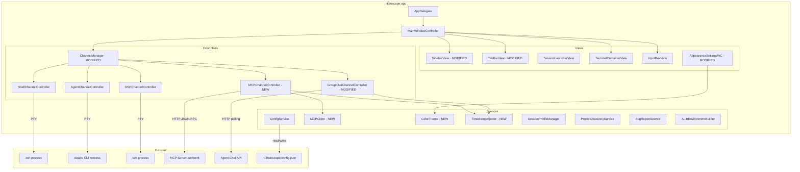

# Design Document: Holoscape V2 Features

## Overview

Holoscape V2 is an incremental update to the V1 + V1.5 native macOS terminal. It adds six capabilities on top of the existing channel-based architecture: CEO connection via MCP bridge, group chat channel via HTTP polling, running process indicators with elapsed time on tabs, toggleable timestamps on terminal output, color theme presets, and Cmd+1-9 keyboard shortcuts for channel switching. V2 also extends the config file and connection type enum to support the new channel types.

This design builds directly on the existing `ChannelController` protocol, `ChannelManager`, `SidebarView`/`TabBarView`, `ConfigService`, and `AppearanceSettingsWindowController`. No existing V1/V1.5 interfaces are broken — V2 adds new controllers, extends existing models, and modifies views to display richer state.

### Key Design Decisions

1. **Minimal HTTP-based MCP client, not a full library**: There is no mature, well-maintained Swift MCP library suitable for embedding. Holoscape implements a minimal MCP client that speaks HTTP+JSON to an MCP server endpoint — `POST /` with JSON-RPC 2.0 messages. This covers the `initialize`, `tools/call`, and message exchange needed for CEO communication. The client lives in a `MCPClient` actor class. If a robust Swift MCP library emerges later, the `MCPClient` can be swapped out without changing `MCPChannelController`.

2. **async/await Task for group chat polling**: The existing `GroupChatChannelController` uses `Timer` + `URLSession.dataTask`. V2 replaces this with a structured `Task` loop using `try await Task.sleep(for:)` and `URLSession.data(for:)`. This integrates cleanly with Swift concurrency, makes exponential backoff straightforward, and cancels automatically when the task is cancelled on `deactivate()`. The existing controller is refactored in place.

3. **Timestamp injection via output delegate interception**: For PTY-based channels (shell, agent, SSH), timestamps are injected by intercepting SwiftTerm's `TerminalViewDelegate` output callbacks. A `TimestampInjector` utility prepends `[HH:MM:SS]` to each new line before it reaches the terminal view. For NSTextView-based channels (group chat, MCP), the `appendMessage()` method conditionally adds seconds precision. This avoids fighting ANSI escape sequences — the injector operates on the text layer, not the raw byte stream.

4. **Theme as a static dictionary of `ColorTheme` structs**: Each built-in theme is a `ColorTheme` struct with `background`, `foreground`, and `ansiColors` (16-entry array). Themes are defined as static constants on `ColorTheme` — no JSON files, no runtime loading. The `AppearanceConfig` gains `themeName: String?` and `themeOverrides: [String: String]?`. On apply, the theme's values are loaded first, then overrides are merged on top.

5. **MCPChannelController follows GroupChatChannelController pattern**: Both use a read-only `NSTextView` with monospace font as `contentView`. Both format messages as `[HH:MM PM] sender: body`. The MCP controller adds connection lifecycle (initialize handshake, tool calls) but the rendering is identical. This keeps the codebase consistent.

6. **Cmd+1-9 via NSEvent.addLocalMonitorForEvents**: Keyboard shortcuts are registered as a local event monitor in `MainWindowController`, not as menu items. This ensures they fire regardless of which view has focus and don't conflict with existing menu shortcuts. The monitor checks for `.keyDown` events with `.command` modifier and digit key codes 18-26 (keys 1-9).

## Architecture



### Changes from V1.5 Architecture

- **New controller**: `MCPChannelController` — NSTextView-based, uses `MCPClient` actor for HTTP JSON-RPC communication with MCP server endpoints.
- **Modified controller**: `GroupChatChannelController` — refactored to accept `SessionProfile`-based construction (api_url, api_key_env fields), gains profile-driven display label and instance numbering.
- **New services**: `MCPClient` (async HTTP JSON-RPC 2.0 client), `ColorTheme` (static theme definitions), `TimestampInjector` (line-level timestamp prepending).
- **Modified views**: `SidebarView` and `TabBarView` gain elapsed time display and colored state dots. `AppearanceSettingsWindowController` gains theme dropdown.
- **Modified models**: `ConnectionType` gains `.mcp` and `.agentChat` cases. `SessionProfile` gains `endpoint`, `apiURL`, `apiKeyEnv` fields. `AppearanceConfig` gains `themeName` and `themeOverrides`. `HoloscapeConfig` gains `showTimestamps`. `ChannelMetadata` gains `endpoint`, `apiURL`, `apiKeyEnv` for persistence.
- **Modified**: `MainWindowController` gains Cmd+1-9 event monitor, Cmd+T timestamp toggle menu item, and theme application logic.

## Components and Interfaces

### MCPClient (New)

```swift
actor MCPClient {
    private let endpoint: URL
    private var requestId: Int = 0
    private var initialized: Bool = false
    
    init(endpoint: URL) {
        self.endpoint = endpoint
    }
    
    /// Perform MCP initialize handshake.
    func initialize() async throws {
        let params: [String: Any] = [
            "protocolVersion": "2024-11-05",
            "capabilities": [:],
            "clientInfo": ["name": "Holoscape", "version": "2.0"]
        ]
        let _: [String: Any] = try await sendRequest(method: "initialize", params: params)
        try await sendNotification(method: "notifications/initialized", params: [:])
        initialized = true
    }
    
    /// Send a message to the MCP server via tools/call.
    func sendMessage(_ text: String) async throws -> String {
        guard initialized else { throw MCPError.notInitialized }
        let params: [String: Any] = [
            "name": "send_message",
            "arguments": ["message": text]
        ]
        let result: [String: Any] = try await sendRequest(method: "tools/call", params: params)
        // Extract text content from MCP tool result
        if let content = result["content"] as? [[String: Any]],
           let first = content.first,
           let text = first["text"] as? String {
            return text
        }
        throw MCPError.invalidResponse
    }
    
    private func sendRequest<T>(method: String, params: [String: Any]) async throws -> T {
        requestId += 1
        let body: [String: Any] = [
            "jsonrpc": "2.0",
            "id": requestId,
            "method": method,
            "params": params
        ]
        let data = try JSONSerialization.data(withJSONObject: body)
        var request = URLRequest(url: endpoint)
        request.httpMethod = "POST"
        request.setValue("application/json", forHTTPHeaderField: "Content-Type")
        request.httpBody = data
        
        let (responseData, response) = try await URLSession.shared.data(for: request)
        guard let http = response as? HTTPURLResponse, http.statusCode == 200 else {
            throw MCPError.connectionFailed
        }
        guard let json = try JSONSerialization.jsonObject(with: responseData) as? [String: Any],
              let result = json["result"] as? T else {
            throw MCPError.invalidResponse
        }
        return result
    }
    
    private func sendNotification(method: String, params: [String: Any]) async throws {
        let body: [String: Any] = [
            "jsonrpc": "2.0",
            "method": method,
            "params": params
        ]
        let data = try JSONSerialization.data(withJSONObject: body)
        var request = URLRequest(url: endpoint)
        request.httpMethod = "POST"
        request.setValue("application/json", forHTTPHeaderField: "Content-Type")
        request.httpBody = data
        let _ = try await URLSession.shared.data(for: request)
    }
    
    enum MCPError: Error {
        case notInitialized
        case connectionFailed
        case invalidResponse
    }
}
```

### MCPChannelController (New)

```swift
@MainActor
class MCPChannelController: NSObject, ChannelController {
    let channelId: UUID
    let channelType: ChannelType = .mcp
    var hasUnread: Bool = false
    private(set) var state: ChannelState = .disconnected
    let commandHistory = CommandHistory()
    weak var delegate: ChannelControllerDelegate?
    
    private let textView: NSTextView
    private let scrollView: NSScrollView
    private let mcpClient: MCPClient
    private let profileLabel: String
    private let instanceNumber: Int?
    
    var displayLabel: String {
        if let num = instanceNumber {
            return "\(profileLabel) \(num)"
        }
        return profileLabel
    }
    
    var contentView: NSView { scrollView }
    
    /// Timestamp when channel entered active state (for elapsed time display).
    private(set) var activatedAt: Date?
    
    init(id: UUID, endpoint: URL, label: String, instanceNumber: Int?) {
        self.channelId = id
        self.mcpClient = MCPClient(endpoint: endpoint)
        self.profileLabel = label
        self.instanceNumber = instanceNumber
        
        self.scrollView = NSScrollView(frame: NSRect(x: 0, y: 0, width: 800, height: 600))
        self.textView = NSTextView(frame: scrollView.contentView.bounds)
        
        super.init()
        
        textView.isEditable = false
        textView.isSelectable = true
        textView.font = NSFont.monospacedSystemFont(ofSize: 13, weight: .regular)
        textView.backgroundColor = NSColor(red: 0.1, green: 0.1, blue: 0.18, alpha: 1.0)
        textView.textColor = NSColor.white
        textView.autoresizingMask = [.width]
        textView.isVerticallyResizable = true
        textView.textContainer?.widthTracksTextView = true
        
        scrollView.documentView = textView
        scrollView.hasVerticalScroller = true
        scrollView.autoresizingMask = [.width, .height]
    }
    
    func activate() {
        state = .connecting
        delegate?.channelStateDidChange(self, to: .connecting)
        
        Task { [weak self] in
            guard let self else { return }
            do {
                try await mcpClient.initialize()
                self.state = .active
                self.activatedAt = Date()
                self.delegate?.channelStateDidChange(self, to: .active)
                self.appendMessage("[System] Connected to MCP endpoint.")
            } catch {
                self.state = .disconnected
                self.delegate?.channelStateDidChange(self, to: .disconnected)
                self.appendMessage("[Error] Connection failed: \(error.localizedDescription)")
            }
        }
    }
    
    func sendInput(_ text: String) {
        guard !text.isEmpty, state == .active else { return }
        commandHistory.add(text)
        
        // Display outgoing message
        let timeString = formatTime(Date())
        appendMessage("[\(timeString)] erik: \(text)")
        
        Task { [weak self] in
            guard let self else { return }
            do {
                let response = try await mcpClient.sendMessage(text)
                let responseTime = formatTime(Date())
                self.appendMessage("[\(responseTime)] CEO: \(response)")
                if self.hasUnread == false {
                    self.hasUnread = true
                    self.delegate?.channelDidReceiveOutput(self)
                }
            } catch {
                self.appendMessage("[Error] Failed to send: \(error.localizedDescription)")
            }
        }
    }
    
    func deactivate() {
        state = .disconnected
        activatedAt = nil
        delegate?.channelStateDidChange(self, to: .disconnected)
    }
    
    func retry() { activate() }
    
    func lastLines(_ count: Int) -> [String] {
        let content = textView.string
        let lines = content.components(separatedBy: "\n")
        return Array(lines.suffix(count))
    }
    
    private func formatTime(_ date: Date) -> String {
        let formatter = DateFormatter()
        formatter.dateFormat = "h:mm a"
        return formatter.string(from: date)
    }
    
    private func appendMessage(_ text: String) {
        let attributed = NSAttributedString(
            string: text + "\n",
            attributes: [
                .font: NSFont.monospacedSystemFont(ofSize: 13, weight: .regular),
                .foregroundColor: NSColor.white,
            ]
        )
        textView.textStorage?.append(attributed)
        textView.scrollToEndOfDocument(nil)
    }
}
```


### GroupChatChannelController (Modified)

The existing `GroupChatChannelController` is extended to support `SessionProfile`-based construction and profile-driven labels:

```swift
@MainActor
class GroupChatChannelController: NSObject, ChannelController {
    // ... existing fields ...
    
    private let profileLabel: String
    private let instanceNumber: Int?
    
    /// Timestamp when channel entered active state.
    private(set) var activatedAt: Date?
    
    var displayLabel: String {
        if let num = instanceNumber {
            return "\(profileLabel) \(num)"
        }
        return profileLabel
    }
    
    /// V2 initializer: constructed from SessionProfile fields.
    init(id: UUID, apiURL: String, apiKey: String, label: String, instanceNumber: Int?) {
        self.channelId = id
        self.apiURL = apiURL.hasSuffix("/") ? String(apiURL.dropLast()) : apiURL
        self.apiKey = apiKey
        self.profileLabel = label
        self.instanceNumber = instanceNumber
        // ... existing NSTextView setup ...
    }
    
    // activate() now records activatedAt:
    func activate() {
        state = .connecting
        delegate?.channelStateDidChange(self, to: .connecting)
        reconnectDelay = 1.0
        activatedAt = nil
        startPolling()
    }
    
    // On first successful poll, set activatedAt:
    // (inside fetchMessages, when state transitions to .active)
    // self.activatedAt = Date()
}
```

Key changes:
- `displayLabel` now uses `profileLabel` + optional instance number (was hardcoded `"Chat"`)
- New `activatedAt` property for elapsed time tracking
- Constructor accepts label and instance number from `SessionProfile`
- Auto-scroll respects manual scroll position (Requirement 2.9): check if scroll view is at bottom before auto-scrolling

### ColorTheme (New)

```swift
struct ColorTheme: Equatable, Sendable {
    let name: String
    let background: String      // hex
    let foreground: String      // hex
    let ansiColors: [String]    // 16 hex strings: black, red, green, yellow, blue, magenta, cyan, white, then bright variants
    
    /// Apply this theme to an AppearanceConfig, preserving overrides.
    func apply(to config: AppearanceConfig, overrides: [String: String]?) -> AppearanceConfig {
        var result = config
        result.backgroundColor = overrides?["backgroundColor"] ?? background
        // foreground applied via ansiColors["foreground"] or a dedicated field
        var colors: [String: String] = [:]
        let names = ["black", "red", "green", "yellow", "blue", "magenta", "cyan", "white",
                     "brightBlack", "brightRed", "brightGreen", "brightYellow",
                     "brightBlue", "brightMagenta", "brightCyan", "brightWhite"]
        for (i, name) in names.enumerated() where i < ansiColors.count {
            colors[name] = overrides?[name] ?? ansiColors[i]
        }
        colors["foreground"] = overrides?["foreground"] ?? foreground
        result.ansiColors = colors
        return result
    }
    
    // MARK: - Built-in Themes
    
    static let dark = ColorTheme(
        name: "Dark",
        background: "#1a1a2e",
        foreground: "#e0e0e0",
        ansiColors: [
            "#1a1a2e", "#ff5555", "#50fa7b", "#f1fa8c",
            "#bd93f9", "#ff79c6", "#8be9fd", "#f8f8f2",
            "#6272a4", "#ff6e6e", "#69ff94", "#ffffa5",
            "#d6acff", "#ff92df", "#a4edff", "#ffffff"
        ]
    )
    
    static let monokai = ColorTheme(
        name: "Monokai",
        background: "#272822",
        foreground: "#f8f8f2",
        ansiColors: [
            "#272822", "#f92672", "#a6e22e", "#f4bf75",
            "#66d9ef", "#ae81ff", "#a1efe4", "#f8f8f2",
            "#75715e", "#f92672", "#a6e22e", "#f4bf75",
            "#66d9ef", "#ae81ff", "#a1efe4", "#f9f8f5"
        ]
    )
    
    static let solarizedDark = ColorTheme(
        name: "Solarized Dark",
        background: "#002b36",
        foreground: "#839496",
        ansiColors: [
            "#073642", "#dc322f", "#859900", "#b58900",
            "#268bd2", "#d33682", "#2aa198", "#eee8d5",
            "#002b36", "#cb4b16", "#586e75", "#657b83",
            "#839496", "#6c71c4", "#93a1a1", "#fdf6e3"
        ]
    )
    
    static let solarizedLight = ColorTheme(
        name: "Solarized Light",
        background: "#fdf6e3",
        foreground: "#657b83",
        ansiColors: [
            "#073642", "#dc322f", "#859900", "#b58900",
            "#268bd2", "#d33682", "#2aa198", "#eee8d5",
            "#002b36", "#cb4b16", "#586e75", "#657b83",
            "#839496", "#6c71c4", "#93a1a1", "#fdf6e3"
        ]
    )
    
    static let dracula = ColorTheme(
        name: "Dracula",
        background: "#282a36",
        foreground: "#f8f8f2",
        ansiColors: [
            "#21222c", "#ff5555", "#50fa7b", "#f1fa8c",
            "#bd93f9", "#ff79c6", "#8be9fd", "#f8f8f2",
            "#6272a4", "#ff6e6e", "#69ff94", "#ffffa5",
            "#d6acff", "#ff92df", "#a4edff", "#ffffff"
        ]
    )
    
    static let nord = ColorTheme(
        name: "Nord",
        background: "#2e3440",
        foreground: "#d8dee9",
        ansiColors: [
            "#3b4252", "#bf616a", "#a3be8c", "#ebcb8b",
            "#81a1c1", "#b48ead", "#88c0d0", "#e5e9f0",
            "#4c566a", "#bf616a", "#a3be8c", "#ebcb8b",
            "#81a1c1", "#b48ead", "#8fbcbb", "#eceff4"
        ]
    )
    
    static let allThemes: [ColorTheme] = [dark, monokai, solarizedDark, solarizedLight, dracula, nord]
    
    static func named(_ name: String) -> ColorTheme? {
        allThemes.first { $0.name == name }
    }
}
```

### TimestampInjector (New)

```swift
struct TimestampInjector {
    /// Format a timestamp prefix for terminal output lines.
    static func prefix(for date: Date = Date()) -> String {
        let formatter = DateFormatter()
        formatter.dateFormat = "HH:mm:ss"
        return "[\(formatter.string(from: date))] "
    }
    
    /// Add seconds precision to an existing group chat timestamp.
    /// Transforms "[8:15 PM] sender:" → "[8:15:30 PM] sender:"
    static func addSeconds(to formattedMessage: String, date: Date = Date()) -> String {
        let formatter = DateFormatter()
        formatter.dateFormat = "h:mm:ss a"
        let fullTime = formatter.string(from: date)
        
        // Replace the existing [H:MM AM/PM] with [H:MM:SS AM/PM]
        let pattern = #"\[\d{1,2}:\d{2}\s[AP]M\]"#
        guard let regex = try? NSRegularExpression(pattern: pattern) else {
            return formattedMessage
        }
        let range = NSRange(formattedMessage.startIndex..., in: formattedMessage)
        return regex.stringByReplacingMatches(
            in: formattedMessage,
            range: range,
            withTemplate: "[\(fullTime)]"
        )
    }
}
```

### ConnectionType (Extended)

```swift
enum ConnectionType: String, Codable, Sendable {
    case local
    case ssh
    case mcp          // NEW — MCP server connection
    case agentChat    // NEW — Agent Chat API polling
}
```

### ChannelType (Extended)

```swift
enum ChannelType: String, Codable, Sendable {
    case shell
    case agentDirect
    case agentAPI
    case groupChat
    case ssh
    case mcp          // NEW
}
```

### SessionProfile (Extended)

```swift
struct SessionProfile: Codable, Equatable, Sendable {
    var label: String
    var connection: ConnectionType
    var command: String
    var directory: String
    var host: String?       // SSH only
    var user: String?       // SSH only
    
    // V2 fields — Optional for backward compat
    var endpoint: String?   // MCP only — server URL
    var apiURL: String?     // agent-chat only — API base URL
    var apiKeyEnv: String?  // agent-chat only — env var name for API key
    
    func resolved(with defaults: SSHDefaults?) -> SessionProfile {
        guard connection == .ssh, let defaults else { return self }
        var copy = self
        if copy.host == nil || copy.host?.isEmpty == true {
            copy.host = defaults.host
        }
        if copy.user == nil || copy.user?.isEmpty == true {
            copy.user = defaults.user
        }
        return copy
    }
}
```

### ChannelManager (Extended)

New dispatch cases in `createChannel(from:)`:

```swift
extension ChannelManager {
    func createChannel(from profile: SessionProfile) -> any ChannelController {
        let id = UUID()
        let instanceNumber = nextInstanceNumber(for: profile.label)
        
        let controller: any ChannelController
        switch profile.connection {
        case .local:
            // ... existing local dispatch ...
        case .ssh:
            // ... existing SSH dispatch ...
        case .mcp:
            guard let endpoint = profile.endpoint,
                  let url = URL(string: endpoint) else {
                fatalError("MCP profile missing endpoint")
            }
            controller = MCPChannelController(
                id: id, endpoint: url, label: profile.label, instanceNumber: instanceNumber
            )
        case .agentChat:
            let apiKey = loadAPIKey(envVarName: profile.apiKeyEnv)
            controller = GroupChatChannelController(
                id: id,
                apiURL: profile.apiURL ?? "",
                apiKey: apiKey,
                label: profile.label,
                instanceNumber: instanceNumber
            )
        }
        
        channels[id] = controller
        channelOrder.append(id)
        channelLabels[id] = profile.label
        return controller
    }
    
    /// Load API key from environment variable or fallback to ~/.claude/agent-chat.env
    private func loadAPIKey(envVarName: String?) -> String {
        if let envName = envVarName,
           let value = ProcessInfo.processInfo.environment[envName], !value.isEmpty {
            return value
        }
        // Fallback: read from ~/.claude/agent-chat.env
        let envPath = FileManager.default.homeDirectoryForCurrentUser
            .appendingPathComponent(".claude/agent-chat.env")
        if let content = try? String(contentsOf: envPath, encoding: .utf8) {
            for line in content.components(separatedBy: "\n") {
                if line.hasPrefix("AGENT_CHAT_API_KEY=") {
                    return String(line.dropFirst("AGENT_CHAT_API_KEY=".count))
                }
            }
        }
        return ""
    }
}
```

### Process Indicator on Tabs

Both `SidebarTabEntry` and `TabBarView` are modified to display elapsed time and colored state dots.

**SidebarTabEntry changes:**

```swift
class SidebarTabEntry: NSControl {
    // ... existing fields ...
    private let elapsedLabel = NSTextField(labelWithString: "")
    
    func configure(label: String, hasUnread: Bool, state: ChannelState, 
                   isActive: Bool, elapsedTime: String?) {
        labelField.stringValue = label
        unreadDot.isHidden = !hasUnread
        
        switch state {
        case .active:
            statusIndicator.layer?.backgroundColor = NSColor.systemGreen.cgColor
            elapsedLabel.stringValue = elapsedTime ?? ""
            elapsedLabel.isHidden = false
        case .connecting:
            statusIndicator.layer?.backgroundColor = NSColor.systemYellow.cgColor
            elapsedLabel.stringValue = "connecting..."
            elapsedLabel.isHidden = false
        case .disconnected:
            statusIndicator.layer?.backgroundColor = NSColor.systemRed.cgColor
            elapsedLabel.stringValue = "disconnected"
            elapsedLabel.isHidden = false
        }
        // ... existing active/inactive styling ...
    }
}
```

**Elapsed time formatting** (utility function):

```swift
struct ElapsedTimeFormatter {
    /// Format elapsed time from activation date to now.
    /// Returns nil if activatedAt is nil.
    static func format(since activatedAt: Date?) -> String? {
        guard let activatedAt else { return nil }
        let elapsed = Date().timeIntervalSince(activatedAt)
        let minutes = Int(elapsed) / 60
        let hours = minutes / 60
        let remainingMinutes = minutes % 60
        if hours > 0 {
            return "\(hours)h \(remainingMinutes)m"
        }
        return "\(remainingMinutes)m"
    }
}
```

**60-second refresh timer** in `MainWindowController`:

```swift
private var elapsedTimeTimer: Timer?

private func startElapsedTimeTimer() {
    elapsedTimeTimer = Timer.scheduledTimer(withTimeInterval: 60.0, repeats: true) { [weak self] _ in
        Task { @MainActor [weak self] in
            self?.refreshAllTabs()
        }
    }
}
```

The `ChannelController` protocol gains an optional `activatedAt` property via protocol extension:

```swift
extension ChannelController {
    var activatedAt: Date? { nil }
}
```

PTY-based controllers (`ShellChannelController`, `AgentChannelController`, `SSHChannelController`) record `activatedAt` when they transition to `.active` state. NSTextView-based controllers (`MCPChannelController`, `GroupChatChannelController`) already have it in the V2 design above.

### Keyboard Shortcuts (Cmd+1-9)

Added to `MainWindowController`:

```swift
private var keyMonitor: Any?

private func setupChannelSwitchShortcuts() {
    keyMonitor = NSEvent.addLocalMonitorForEvents(matching: .keyDown) { [weak self] event in
        guard let self, event.modifierFlags.contains(.command) else { return event }
        // Key codes 18-26 map to digits 1-9
        let digitKeyCodes: [UInt16: Int] = [
            18: 1, 19: 2, 20: 3, 21: 4, 23: 5, 22: 6, 26: 7, 28: 8, 25: 9
        ]
        guard let position = digitKeyCodes[event.keyCode] else { return event }
        let channels = self.channelManager.allChannels()
        guard position <= channels.count else { return event }
        self.switchToChannel(channels[position - 1].channelId)
        return nil  // consume the event
    }
}
```

### Timestamp Toggle (Cmd+T)

Added to `MainWindowController.setupKeyboardShortcuts()`:

```swift
let timestampItem = NSMenuItem(
    title: "Show Timestamps", 
    action: #selector(toggleTimestamps), 
    keyEquivalent: "t"
)
timestampItem.target = self
if let viewMenu = NSApp.mainMenu?.item(withTitle: "View")?.submenu {
    viewMenu.addItem(timestampItem)
}

@objc func toggleTimestamps() {
    var config = configService.load()
    config.showTimestamps = !(config.showTimestamps ?? false)
    configService.save(config)
    // Notify all channels to update timestamp display
    // (channels read showTimestamps from config on each output line)
}
```

### AppearanceSettingsWindowController (Modified)

Gains a theme dropdown:

```swift
private let themePopup = NSPopUpButton()

// In setupUI():
let themeRow = makeRow(label: "Theme:", control: themePopup)
themePopup.addItems(withTitles: ColorTheme.allThemes.map(\.name))
themePopup.target = self
themePopup.action = #selector(themeChanged(_:))
stack.insertArrangedSubview(themeRow, at: 0)  // Theme at top

@objc private func themeChanged(_ sender: NSPopUpButton) {
    guard let themeName = sender.titleOfSelectedItem,
          let theme = ColorTheme.named(themeName) else { return }
    // Clear overrides on theme switch (Requirement 5.8)
    var fullConfig = configService.load()
    fullConfig.appearance.themeName = themeName
    fullConfig.appearance.themeOverrides = nil
    // Apply theme colors
    fullConfig.appearance = theme.apply(to: fullConfig.appearance, overrides: nil)
    configService.save(fullConfig)
    settingsDelegate?.appearanceSettingsDidChange(fullConfig.appearance)
}
```

When an individual color is changed after a theme is selected, the change is stored as a theme override:

```swift
@objc private func colorChanged(_ sender: NSColorWell) {
    config.backgroundColor = sender.color.hexString
    // Record as override
    var fullConfig = configService.load()
    var overrides = fullConfig.appearance.themeOverrides ?? [:]
    overrides["backgroundColor"] = sender.color.hexString
    fullConfig.appearance.themeOverrides = overrides
    fullConfig.appearance.backgroundColor = sender.color.hexString
    configService.save(fullConfig)
    settingsDelegate?.appearanceSettingsDidChange(fullConfig.appearance)
}
```

## Data Models

### ConnectionType (V2 Extension)

```swift
enum ConnectionType: String, Codable, Sendable {
    case local
    case ssh
    case mcp          // NEW
    case agentChat    // NEW
}
```

### ChannelType (V2 Extension)

```swift
enum ChannelType: String, Codable, Sendable {
    case shell
    case agentDirect
    case agentAPI
    case groupChat
    case ssh
    case mcp          // NEW
}
```

### SessionProfile (V2 Extension)

| Field | Type | Required | V1.5/V2 | Description |
|-------|------|----------|---------|-------------|
| label | String | Yes | V1.5 | Display name |
| connection | ConnectionType | Yes | V1.5 | Now includes "mcp" and "agentChat" |
| command | String | Yes | V1.5 | Executable to run |
| directory | String | Yes | V1.5 | Working directory |
| host | String? | SSH only | V1.5 | SSH hostname |
| user | String? | SSH only | V1.5 | SSH username |
| endpoint | String? | MCP only | V2 | MCP server URL |
| apiURL | String? | agent-chat only | V2 | Agent Chat API base URL |
| apiKeyEnv | String? | agent-chat only | V2 | Env var name for API key |

### AppearanceConfig (V2 Extension)

```swift
struct AppearanceConfig: Codable, Equatable, Sendable {
    var backgroundColor: String
    var transparency: Double
    var fontFamily: String
    var fontSize: Double
    var ansiColors: [String: String]?
    
    // V2 fields — Optional for backward compat
    var themeName: String?              // e.g. "Dark", "Monokai"
    var themeOverrides: [String: String]?  // individual color overrides
}
```

### HoloscapeConfig (V2 Extension)

```swift
struct HoloscapeConfig: Codable, Equatable, Sendable {
    // V1 fields
    var appearance: AppearanceConfig
    var channels: [ChannelMetadata]
    var lastLaunchTimestamp: Date?
    
    // V1.5 fields
    var sessionProfiles: [SessionProfile]?
    var sshDefaults: SSHDefaults?
    var projectDiscovery: ProjectDiscoveryConfig?
    var sidebarExpanded: Bool?
    var recentSessions: [RecentSession]?
    
    // V2 field — Optional for backward compat
    var showTimestamps: Bool?
}
```

### ChannelMetadata (V2 Extension)

```swift
struct ChannelMetadata: Codable, Equatable, Sendable {
    let id: UUID
    let type: ChannelType
    let role: String
    let context: String?
    let instanceNumber: Int?
    let workingDirectory: String?
    let host: String?
    let user: String?
    let command: String?
    
    // V2 fields for MCP/GroupChat restoration
    let endpoint: String?       // MCP server URL
    let apiURL: String?         // Agent Chat API URL
    let apiKeyEnv: String?      // Env var name for API key
}
```

### Config File JSON Example (V2)

```json
{
  "appearance": {
    "backgroundColor": "#282a36",
    "transparency": 1.0,
    "fontFamily": "SF Mono",
    "fontSize": 13.0,
    "ansiColors": {
      "black": "#21222c", "red": "#ff5555", "green": "#50fa7b",
      "yellow": "#f1fa8c", "blue": "#bd93f9", "magenta": "#ff79c6",
      "cyan": "#8be9fd", "white": "#f8f8f2",
      "brightBlack": "#6272a4", "brightRed": "#ff6e6e",
      "brightGreen": "#69ff94", "brightYellow": "#ffffa5",
      "brightBlue": "#d6acff", "brightMagenta": "#ff92df",
      "brightCyan": "#a4edff", "brightWhite": "#ffffff",
      "foreground": "#f8f8f2"
    },
    "themeName": "Dracula",
    "themeOverrides": {
      "backgroundColor": "#1e1e2e"
    }
  },
  "channels": [],
  "showTimestamps": true,
  "session_profiles": [
    {"label": "mini-claude", "connection": "local", "command": "claude", "directory": "~"},
    {"label": "CEO", "connection": "mcp", "command": "", "directory": "", "endpoint": "http://localhost:8080/mcp/ceo"},
    {"label": "Group Chat", "connection": "agentChat", "command": "", "directory": "", "api_url": "https://agent-chat.run.app", "api_key_env": "AGENT_CHAT_API_KEY"}
  ],
  "ssh_defaults": {"host": "MacBook.local", "user": "erik"},
  "sidebar_expanded": true
}
```


## Correctness Properties

*A property is a characteristic or behavior that should hold true across all valid executions of a system — essentially, a formal statement about what the system should do. Properties serve as the bridge between human-readable specifications and machine-verifiable correctness guarantees.*

### Property 1: V2 Config serialization round-trip

*For any* valid `HoloscapeConfig` containing V1 fields, V1.5 fields, and V2 fields (`showTimestamps`, `AppearanceConfig.themeName`, `AppearanceConfig.themeOverrides`), and *for any* `SessionProfile` list containing profiles with connection types `.mcp` (with endpoint) and `.agentChat` (with apiURL and apiKeyEnv), encoding to JSON and decoding should produce an equivalent config.

**Validates: Requirements 7.4, 8.5**

### Property 2: V1.5 config backward compatibility with V2

*For any* valid V1.5-only `HoloscapeConfig` (containing V1 and V1.5 fields but no V2 fields), encoding to JSON and decoding as a V2 config should preserve all V1 and V1.5 fields unchanged, with `showTimestamps` as nil, `themeName` as nil, and `themeOverrides` as nil.

**Validates: Requirements 8.4**

### Property 3: MCP and Group Chat message formatting

*For any* sender string S, message body B, and timestamp T, formatting a message for display should produce a string matching the pattern `[H:MM AM/PM] S: B` where the time components are derived from T. This applies to both MCPChannelController and GroupChatChannelController output.

**Validates: Requirements 1.5, 2.4**

### Property 4: MCP/GroupChat display label format

*For any* MCPChannelController or GroupChatChannelController with profile label L and optional instance number N, the `displayLabel` should equal `"L N"` when N is non-nil, or `"L"` when N is nil.

**Validates: Requirements 1.10**

### Property 5: Group chat displays all senders without filtering

*For any* set of messages with arbitrary sender identifier strings, the GroupChatChannelController should render all messages without filtering or excluding any sender.

**Validates: Requirements 2.5**

### Property 6: Group chat outbound sender is always "erik"

*For any* message text sent from a GroupChatChannelController, the sender field in the API request payload should be exactly `"erik"`.

**Validates: Requirements 2.6**

### Property 7: Exponential backoff delay sequence

*For any* sequence of N consecutive connection failures (N ≥ 1), the reconnection delay after the Kth failure should be `min(2^(K-1), 30)` seconds, starting at 1 second for the first failure and capping at 30 seconds.

**Validates: Requirements 2.12**

### Property 8: Elapsed time formatting

*For any* activation timestamp T in the past, the formatted elapsed time string should correctly represent the duration between T and now as `"Xh Ym"` when hours > 0, or `"Ym"` when hours = 0, where X and Y are non-negative integers derived from the actual elapsed seconds.

**Validates: Requirements 3.1, 3.7**

### Property 9: Timestamp prefix format

*For any* Date value, `TimestampInjector.prefix(for:)` should produce a string matching the pattern `[HH:MM:SS] ` where HH is 00-23, MM is 00-59, and SS is 00-59, using the local time zone.

**Validates: Requirements 4.1**

### Property 10: Group chat timestamp seconds precision

*For any* formatted group chat message string containing a `[H:MM AM/PM]` timestamp and *for any* Date value, `TimestampInjector.addSeconds(to:date:)` should produce a string where the timestamp portion is replaced with `[H:MM:SS AM/PM]` format, preserving the rest of the message unchanged.

**Validates: Requirements 4.6**

### Property 11: Theme structure completeness

*For any* built-in `ColorTheme` in `ColorTheme.allThemes`, the theme should have a non-empty name, a valid hex background color, a valid hex foreground color, and exactly 16 ANSI color entries (all valid hex strings).

**Validates: Requirements 5.2**

### Property 12: Theme application with overrides

*For any* `ColorTheme` and *for any* set of theme overrides (a dictionary of color key → hex value), applying the theme to an `AppearanceConfig` with those overrides should produce a config where: (a) overridden keys have the override value, and (b) non-overridden keys have the theme's value.

**Validates: Requirements 5.4, 5.7**

### Property 13: Theme switch clears overrides

*For any* `AppearanceConfig` with a non-nil `themeName` and non-empty `themeOverrides`, selecting a new theme should result in `themeOverrides` being nil or empty.

**Validates: Requirements 5.8**

### Property 14: Cmd+N channel switching by position

*For any* ordered list of channels and *for any* integer N (1-9): if N ≤ channel count, Cmd+N should switch to the Nth channel in tab order; if N > channel count, Cmd+N should not change the active channel.

**Validates: Requirements 6.2, 6.4**

### Property 15: Invalid profile validation

*For any* `SessionProfile` with connection type `.mcp` and nil or empty `endpoint`, or connection type `.agentChat` and nil or empty `apiURL`, the profile should be skipped during loading (not used to create a channel).

**Validates: Requirements 7.5, 7.6**

### Property 16: MCP and Group Chat channel metadata persistence round-trip

*For any* list of `ChannelMetadata` values containing MCP channels (with endpoint) and group chat channels (with apiURL, apiKeyEnv), saving to config and loading should produce the same list in the same order with identical field values.

**Validates: Requirements 9.1**

### Property 17: ConnectionType enum round-trip

*For any* `ConnectionType` case (including `.mcp` and `.agentChat`), encoding the raw value to a string and initializing from that string should produce the original case.

**Validates: Requirements 7.1**

## Error Handling

### MCP Connection Failures

- **MCP server unreachable**: `MCPClient.initialize()` throws `MCPError.connectionFailed`. `MCPChannelController` transitions to `.disconnected`, displays "Connection failed: {reason}" in the content view. Erik can retry via the context menu or `retry()`.
- **MCP server returns non-200**: Treated as connection failure. Same handling as unreachable.
- **MCP initialize handshake failure**: If the server responds but the JSON-RPC response contains an error, `MCPClient` throws `MCPError.invalidResponse`. Channel goes disconnected with the error message displayed.
- **MCP connection drops mid-session**: If a `sendMessage` call fails after successful initialization, the error is displayed inline. The channel remains active until the next failure triggers a state transition. Repeated failures transition to disconnected.
- **MCP server returns malformed JSON**: `MCPClient` throws `MCPError.invalidResponse`. Error displayed inline, channel remains in current state.

### Group Chat Polling Failures

- **Agent Chat API 401/403**: Display "Authentication failed. Check API key." in the content view. Stop polling immediately. Channel transitions to `.disconnected`. No auto-retry — requires user intervention (check API key, then retry).
- **Agent Chat API connection failure (non-auth)**: Display "Connection failed: {reason}. Reconnecting in {N}s..." in the content view. Apply exponential backoff: 1s, 2s, 4s, 8s, 16s, max 30s. Channel state transitions to `.connecting` during backoff.
- **Agent Chat API returns malformed JSON**: Skip the malformed response silently. Continue polling on next interval. Log warning.
- **API key not found** (env var missing and fallback file missing): Display "API key not configured. Set {envVarName} or create ~/.claude/agent-chat.env" in the content view. Channel transitions to `.disconnected`.

### Theme Failures

- **Unknown theme name in config**: If `themeName` references a theme not in `ColorTheme.allThemes`, fall back to "Dark" theme. Log warning.
- **Invalid hex color in theme overrides**: Skip the invalid override, use the theme's value for that color. Log warning.

### Timestamp Failures

- **Timestamp injection on binary/ANSI output**: The `TimestampInjector` operates on text lines, not raw bytes. For PTY channels, timestamps are injected at the text layer after ANSI parsing. If a line contains only escape sequences (no visible text), no timestamp is prepended.

### Config V2 Migration

- **V1.5 config missing V2 fields**: All V2 fields are `Optional`. Missing keys decode as `nil`. Defaults: `showTimestamps` = false (disabled), `themeName` = nil (use existing colors), `themeOverrides` = nil.
- **SessionProfile with unknown connection type**: If a future config contains a connection type not in the current enum, `Codable` decoding fails for that profile. The profile is skipped with a logged warning. Other profiles are preserved.

### Channel Restoration Failures

- **Restored MCP channel fails to connect**: Channel tab is created in `.disconnected` state. Error message displayed in content view. Erik can retry or close.
- **Restored group chat channel fails to connect**: Same as MCP — tab created in `.disconnected` state with error message and retry option.
- **Restored channel metadata missing required fields**: If MCP metadata lacks endpoint, or group chat metadata lacks apiURL, the channel is skipped during restoration with a logged warning.

## Testing Strategy

### Unit Tests (XCTest)

Unit tests cover specific examples, edge cases, and integration points:

- **MCPChannelController**: Test construction with specific endpoint URL. Test `displayLabel` with label "CEO" and instance number nil vs 2. Test `sendInput` with empty string (no-op). Test state transitions: activate → connecting, success → active, failure → disconnected.
- **GroupChatChannelController (V2)**: Test construction from SessionProfile fields. Test `displayLabel` with label "Group Chat" and instance numbers. Test auto-scroll logic: at bottom → scroll, scrolled up → don't scroll. Test auth failure handling (401 response).
- **MCPClient**: Test JSON-RPC request construction for `initialize` and `tools/call` methods. Test error handling for non-200 responses, malformed JSON.
- **ColorTheme**: Test all 6 built-in themes exist. Test `ColorTheme.named("Dracula")` returns correct theme. Test `ColorTheme.named("nonexistent")` returns nil.
- **ColorTheme.apply**: Test applying Dark theme to default config. Test applying theme with specific overrides. Test that overrides take precedence.
- **TimestampInjector**: Test `prefix(for:)` with specific dates (midnight, noon, 11:59:59 PM). Test `addSeconds(to:date:)` with specific formatted messages.
- **ElapsedTimeFormatter**: Test with specific durations: 0 minutes → "0m", 65 minutes → "1h 5m", 120 minutes → "2h 0m".
- **ConnectionType**: Test `.mcp` and `.agentChat` raw values. Test decoding from JSON strings.
- **SessionProfile V2**: Test encoding/decoding MCP profile with endpoint. Test encoding/decoding agent-chat profile with apiURL and apiKeyEnv. Test that V1.5 profiles still decode correctly.
- **ChannelManager V2 dispatch**: Test `createChannel(from:)` with MCP profile creates MCPChannelController. Test with agent-chat profile creates GroupChatChannelController.
- **Invalid profile handling**: Test MCP profile with nil endpoint is skipped. Test agent-chat profile with nil apiURL is skipped.
- **Keyboard shortcuts**: Test Cmd+1 with 3 channels switches to first. Test Cmd+5 with 3 channels does nothing. Test digit-to-keycode mapping covers 1-9.
- **Config backward compat**: Test decoding a V1.5 JSON string as V2 config — V2 fields should be nil.
- **ChannelMetadata V2**: Test encoding/decoding metadata with endpoint, apiURL, apiKeyEnv fields.

### Property-Based Tests (SwiftCheck)

Use [SwiftCheck](https://github.com/typelift/SwiftCheck) (already a dependency). Each property test runs a minimum of 100 iterations. Each test is tagged with a comment referencing the design property.

```swift
// Feature: holoscape-v2-features, Property 1: V2 Config serialization round-trip
```

Properties to implement:

1. **Property 1**: Generate random `HoloscapeConfig` with V1+V1.5+V2 fields (including MCP and agent-chat SessionProfiles), verify `decode(encode(config)) == config`.
2. **Property 2**: Generate random V1.5-only configs, encode, decode as V2, verify V1.5 fields preserved and V2 fields nil.
3. **Property 3**: Generate random sender/body/timestamp triples, verify formatted output matches `[H:MM AM/PM] sender: body` pattern.
4. **Property 4**: Generate random labels and optional instance numbers, verify `displayLabel` format for MCPChannelController and GroupChatChannelController.
5. **Property 5**: Generate random sender identifier strings, create messages, verify all are rendered without filtering.
6. **Property 6**: Generate random message texts, verify outbound payload sender is always "erik".
7. **Property 7**: Generate random failure counts (1-20), verify backoff delay sequence follows `min(2^(K-1), 30)`.
8. **Property 8**: Generate random activation timestamps in the past, verify elapsed time string format and correctness.
9. **Property 9**: Generate random Date values, verify `TimestampInjector.prefix(for:)` matches `[HH:MM:SS] ` pattern.
10. **Property 10**: Generate random formatted group chat messages with timestamps, verify `addSeconds` produces correct `[H:MM:SS AM/PM]` format.
11. **Property 11**: Iterate all `ColorTheme.allThemes`, verify each has non-empty name, valid hex background/foreground, and exactly 16 ANSI colors.
12. **Property 12**: Generate random themes (from allThemes) and random override dictionaries, verify `apply(to:overrides:)` produces correct merged result.
13. **Property 13**: Generate random configs with theme and overrides, simulate theme switch, verify overrides are cleared.
14. **Property 14**: Generate random channel lists (1-15 channels) and random N (1-9), verify switching logic: N ≤ count → switch to Nth, N > count → no change.
15. **Property 15**: Generate random MCP profiles with nil/empty endpoint and agent-chat profiles with nil/empty apiURL, verify they are identified as invalid.
16. **Property 16**: Generate random `ChannelMetadata` lists with MCP and group chat entries, verify save/load round-trip preserves order and values.
17. **Property 17**: For all `ConnectionType` cases, verify `ConnectionType(rawValue: case.rawValue) == case`.

### Test Organization

```
Tests/
  HoloscapeTests/
    Unit/
      MCPChannelControllerTests.swift
      GroupChatV2Tests.swift
      MCPClientTests.swift
      ColorThemeTests.swift
      TimestampInjectorTests.swift
      ElapsedTimeFormatterTests.swift
      ConnectionTypeV2Tests.swift
      SessionProfileV2Tests.swift
      ChannelManagerV2Tests.swift
      KeyboardShortcutTests.swift
      ConfigV2BackwardCompatTests.swift
      ChannelMetadataV2Tests.swift
  HoloscapePropertyTests/
    ConfigV2RoundTripPropertyTests.swift
    ConfigV2BackwardCompatPropertyTests.swift
    MessageFormattingPropertyTests.swift
    DisplayLabelV2PropertyTests.swift
    SenderFilterPropertyTests.swift
    OutboundSenderPropertyTests.swift
    BackoffDelayPropertyTests.swift
    ElapsedTimePropertyTests.swift
    TimestampPrefixPropertyTests.swift
    TimestampSecondsPropertyTests.swift
    ThemeCompletenessPropertyTests.swift
    ThemeApplicationPropertyTests.swift
    ThemeSwitchPropertyTests.swift
    ChannelSwitchPropertyTests.swift
    InvalidProfilePropertyTests.swift
    ChannelMetadataV2RoundTripPropertyTests.swift
    ConnectionTypeRoundTripPropertyTests.swift
```
