# Design Document: Holoscape V3 Features

## Overview

Holoscape V3 is an incremental update to the shipped V1/V1.5/V2 native macOS terminal. It adds six capabilities on top of the existing channel-based architecture:

1. **Desktop notifications** — macOS native notifications via `UNUserNotificationCenter` when channels receive output while Holoscape is in the background, with per-channel-type toggles and click-to-switch.
2. **Window splitting** — side-by-side channel viewing via recursive `NSSplitView` panes (max 4), with active pane tracking and layout persistence.
3. **Bridge channel** — a special channel type that broadcasts user input to all active agent channels simultaneously, with a broadcast log view.
4. **Tab pinning** — pin tabs to a fixed section at the top of the sidebar so unread reordering doesn't move them.
5. **Search (Cmd+F)** — search the active channel's scrollback buffer with match highlighting and next/prev navigation.
6. **Skin engine (minimal V3)** — load custom color + image skins from `~/.holoscape/skins/`, with a skin picker in settings. No layout changes (deferred to V4).

### Key Design Decisions

1. **Recursive NSSplitView for window splitting**: The terminal area's single `TerminalContainerView` is replaced by a `SplitPaneManager` that wraps an `NSSplitView`. Each split operation nests a new `NSSplitView` inside an existing pane. This is the standard AppKit pattern for recursive splitting (used by Xcode, Terminal.app). The alternative — a custom grid layout manager — adds complexity without benefit for a max of 4 panes. Each leaf pane wraps a channel's `contentView` in a `SplitPaneView` with a border highlight for the active pane.

2. **BridgeChannelController discovers agents via ChannelManager**: The bridge channel holds a reference to `ChannelManager` and queries `allChannels()` on each send, filtering for agent channel types (`.agentDirect`, `.agentAPI`, `.ssh`, `.mcp`). It calls `sendInput()` on each matching channel. This avoids a separate agent registry — the ChannelManager already tracks all channels. Responses appear in each agent's own view, not in the bridge.

3. **SwiftTerm `TerminalView.search()` for PTY channel search**: SwiftTerm's `TerminalView` exposes `search(for:)` and related methods for buffer text search. For PTY channels, the `SearchBarView` calls these methods directly on the terminal view. For `NSTextView` channels (MCP, group chat), standard `NSTextView` find functionality is used via `NSTextFinder` or manual `NSTextStorage` range search. The search is limited to the most recent 10,000 lines for performance.

4. **`skin.json` schema — flat color keys + image paths**: A skin is a directory with a `skin.json` file and optional PNG assets. The JSON defines color hex values for window background, sidebar, tab bar, title bar, text foreground, and the 16 ANSI colors. Image references are relative paths to PNGs in the same directory. The `SkinEngine` loads and validates the JSON, falling back to the built-in Dark theme on any error. V3 skins change colors and background images only — no element repositioning or custom chrome.

5. **UNUserNotificationCenterDelegate for notification click routing**: The `NotificationService` conforms to `UNUserNotificationCenterDelegate` and implements `userNotificationCenter(_:didReceive:)`. Each notification's `userInfo` contains the channel UUID. On click, the delegate brings Holoscape to front via `NSApp.activate()` and calls `MainWindowController.switchToChannel()` with the UUID. Notification grouping uses the channel UUID as the thread identifier so macOS groups per-channel.

6. **Pin ordering via `pinnedAt: Date?` on ChannelMetadata**: Pinned tabs are sorted by their `pinnedAt` timestamp (earliest first). The `SidebarView` renders pinned tabs in a fixed section above unpinned tabs. Unread reordering only affects the unpinned section. The `pinnedAt` field is persisted in `ChannelMetadata` so pin state survives restarts.

## Architecture

```mermaid
graph TB
    subgraph Holoscape.app
        AppDelegate[AppDelegate]
        WC[MainWindowController - MODIFIED]
        
        subgraph Views
            Sidebar[SidebarView - MODIFIED]
            TabBar[TabBarView - MODIFIED]
            Launcher[SessionLauncherView]
            SplitMgr[SplitPaneManager - NEW]
            SearchBar[SearchBarView - NEW]
            InputBox[InputBoxView]
            AppearanceWC[AppearanceSettingsWC - MODIFIED]
        end
        
        subgraph Controllers
            CM[ChannelManager - MODIFIED]
            SC[ShellChannelController]
            AC[AgentChannelController]
            SSH[SSHChannelController]
            MCP[MCPChannelController]
            GC[GroupChatChannelController]
            BC[BridgeChannelController - NEW]
        end
        
        subgraph Services
            Config[ConfigService]
            NotifSvc[NotificationService - NEW]
            SkinEng[SkinEngine - NEW]
            ThemeService[ColorTheme]
            TimestampInj[TimestampInjector]
            ProfileMgr[SessionProfileManager - MODIFIED]
            Discovery[ProjectDiscoveryService]
            BugReport[BugReportService]
            AuthEnv[AuthEnvironmentBuilder]
        end
    end
    
    subgraph External
        ZSH[zsh process]
        Claude[claude CLI process]
        SSHProc[ssh process]
        MCPServer[MCP Server endpoint]
        ChatAPI[Agent Chat API]
        ConfigFile[~/.holoscape/config.json]
        SkinsDir[~/.holoscape/skins/]
        UNCenter[UNUserNotificationCenter]
    end
    
    AppDelegate --> WC
    AppDelegate --> NotifSvc
    WC --> Sidebar
    WC --> TabBar
    WC --> SplitMgr
    WC --> SearchBar
    WC --> InputBox
    WC --> CM
    
    CM --> SC
    CM --> AC
    CM --> SSH
    CM --> MCP
    CM --> GC
    CM --> BC
    
    BC -->|sendInput| AC
    BC -->|sendInput| SSH
    BC -->|sendInput| MCP
    
    SC -->|PTY| ZSH
    AC -->|PTY| Claude
    SSH -->|PTY| SSHProc
    MCP -->|HTTP JSON-RPC| MCPServer
    GC -->|HTTP polling| ChatAPI
    
    NotifSvc --> UNCenter
    SkinEng -->|read| SkinsDir
    Config -->|read/write| ConfigFile
```



### Changes from V2 Architecture

- **New controller**: `BridgeChannelController` — NSTextView-based, holds a reference to `ChannelManager`, broadcasts input to all agent channels.
- **New services**: `NotificationService` (UNUserNotificationCenter wrapper with per-channel-type filtering), `SkinEngine` (loads skin.json + PNG assets from `~/.holoscape/skins/`).
- **New views**: `SplitPaneManager` (recursive NSSplitView wrapper replacing single `TerminalContainerView`), `SearchBarView` (Cmd+F search bar with match navigation).
- **Modified views**: `SidebarView` gains pinned section with pin icon, pin/unpin context menu items. `TabBarView` gains pinned tab section. `AppearanceSettingsWindowController` gains notification toggles and skin picker.
- **Modified models**: `ConnectionType` gains `.bridge`. `ChannelType` gains `.bridge`. `ChannelMetadata` gains `pinnedAt: Date?`. `HoloscapeConfig` gains `notifications: NotificationConfig?`, `splitLayout: SplitLayoutConfig?`, `AppearanceConfig` gains `skinName: String?`.
- **Modified controllers**: `MainWindowController` gains split pane management, search bar toggle (Cmd+F), notification delegation. `ChannelManager` gains bridge channel dispatch and `agentChannels()` helper. `SessionProfileManager` gains preconfigured Bridge profile.


## Components and Interfaces

### NotificationService (New)

```swift
import UserNotifications

@MainActor
class NotificationService: NSObject, UNUserNotificationCenterDelegate {
    private let configService: ConfigService
    private var authorized: Bool = false
    weak var channelSwitchDelegate: NotificationChannelSwitchDelegate?
    
    init(configService: ConfigService) {
        self.configService = configService
        super.init()
        UNUserNotificationCenter.current().delegate = self
    }
    
    /// Request notification authorization on first launch.
    func requestAuthorization() {
        UNUserNotificationCenter.current().requestAuthorization(options: [.alert, .sound]) { granted, _ in
            Task { @MainActor [weak self] in
                self?.authorized = granted
            }
        }
    }
    
    /// Deliver a notification for a channel if conditions are met.
    func notifyIfNeeded(channel: any ChannelController, firstLine: String) {
        guard authorized else { return }
        guard !NSApp.isActive else { return }  // No notifications when frontmost
        
        let config = configService.load()
        guard let notifConfig = config.notifications, notifConfig.enabled else { return }
        
        // Check per-channel-type toggle
        let typeKey = notificationTypeKey(for: channel.channelType)
        if let perType = notifConfig.perChannelType, perType[typeKey] == false { return }
        
        let content = UNMutableNotificationContent()
        content.title = channel.displayLabel
        content.body = String(firstLine.prefix(100))
        content.threadIdentifier = channel.channelId.uuidString  // Group per channel
        content.userInfo = ["channelId": channel.channelId.uuidString]
        
        // Use channel UUID as identifier so subsequent notifications update (not spam)
        let request = UNNotificationRequest(
            identifier: channel.channelId.uuidString,
            content: content,
            trigger: nil  // Deliver immediately
        )
        UNUserNotificationCenter.current().add(request)
    }
    
    // MARK: - UNUserNotificationCenterDelegate
    
    nonisolated func userNotificationCenter(
        _ center: UNUserNotificationCenter,
        didReceive response: UNNotificationResponse,
        withCompletionHandler completionHandler: @escaping () -> Void
    ) {
        let userInfo = response.notification.request.content.userInfo
        if let idString = userInfo["channelId"] as? String,
           let channelId = UUID(uuidString: idString) {
            Task { @MainActor [weak self] in
                NSApp.activate(ignoringOtherApps: true)
                self?.channelSwitchDelegate?.switchToChannel(channelId)
            }
        }
        completionHandler()
    }
    
    private func notificationTypeKey(for type: ChannelType) -> String {
        switch type {
        case .shell: return "shell"
        case .agentDirect, .agentAPI: return "agent"
        case .ssh: return "ssh"
        case .mcp: return "mcp"
        case .groupChat: return "groupChat"
        case .bridge: return "bridge"
        }
    }
}

@MainActor
protocol NotificationChannelSwitchDelegate: AnyObject {
    func switchToChannel(_ id: UUID)
}
```

### NotificationConfig (New Model)

```swift
struct NotificationConfig: Codable, Equatable, Sendable {
    var enabled: Bool
    var perChannelType: [String: Bool]?
    
    static let `default` = NotificationConfig(
        enabled: true,
        perChannelType: [
            "shell": false,
            "agent": true,
            "ssh": true,
            "mcp": true,
            "groupChat": true
        ]
    )
}
```

### SplitPaneManager (New)

```swift
@MainActor
class SplitPaneManager: NSView {
    weak var delegate: SplitPaneManagerDelegate?
    
    private var rootSplitView: NSSplitView?
    private var panes: [UUID: SplitPaneView] = [:]  // paneId -> pane
    private var paneChannels: [UUID: UUID] = [:]     // paneId -> channelId
    private(set) var activePaneId: UUID?
    
    /// The single root pane created on init.
    private var rootPaneId: UUID?
    
    /// Maximum number of visible panes.
    static let maxPanes = 4
    
    /// Show a channel in the single-pane layout.
    func showContent(_ view: NSView, channelId: UUID) {
        if panes.isEmpty {
            let pane = createPane(channelId: channelId, contentView: view)
            rootPaneId = pane.paneId
            activePaneId = pane.paneId
            addSubview(pane)
            constrainToFill(pane, in: self)
        } else if let activePaneId, let pane = panes[activePaneId] {
            pane.setContent(view)
            paneChannels[activePaneId] = channelId
        }
    }
    
    /// Split the active pane horizontally (left/right). Returns false if max panes reached.
    func splitHorizontal(newChannelId: UUID, newContentView: NSView) -> Bool {
        return split(orientation: .vertical, newChannelId: newChannelId, newContentView: newContentView)
    }
    
    /// Split the active pane vertically (top/bottom). Returns false if max panes reached.
    func splitVertical(newChannelId: UUID, newContentView: NSView) -> Bool {
        return split(orientation: .horizontal, newChannelId: newChannelId, newContentView: newContentView)
    }
    
    /// Close the active pane. Returns false if only one pane remains.
    func closeActivePane() -> Bool {
        guard panes.count > 1, let activePaneId else { return false }
        guard let pane = panes[activePaneId] else { return false }
        
        // Find the parent NSSplitView and sibling
        guard let parentSplit = pane.superview as? NSSplitView else { return false }
        let siblings = parentSplit.arrangedSubviews.filter { $0 !== pane }
        guard let sibling = siblings.first else { return false }
        
        // Replace the parent split with the sibling
        if let grandparent = parentSplit.superview as? NSSplitView {
            let index = grandparent.arrangedSubviews.firstIndex(of: parentSplit) ?? 0
            grandparent.removeArrangedSubview(parentSplit)
            parentSplit.removeFromSuperview()
            grandparent.insertArrangedSubview(sibling, at: index)
        } else {
            // Parent split is the root
            parentSplit.removeFromSuperview()
            sibling.removeFromSuperview()
            addSubview(sibling)
            constrainToFill(sibling, in: self)
        }
        
        panes.removeValue(forKey: activePaneId)
        paneChannels.removeValue(forKey: activePaneId)
        
        // Set new active pane
        self.activePaneId = panes.keys.first
        updatePaneBorders()
        return true
    }
    
    /// Set the active pane by pane ID.
    func setActivePane(_ paneId: UUID) {
        activePaneId = paneId
        updatePaneBorders()
        if let channelId = paneChannels[paneId] {
            delegate?.splitPaneManager(self, didActivateChannel: channelId)
        }
    }
    
    /// Get the channel ID for the active pane.
    var activeChannelId: UUID? {
        guard let activePaneId else { return nil }
        return paneChannels[activePaneId]
    }
    
    /// Number of visible panes.
    var paneCount: Int { panes.count }
    
    /// Remove a specific channel from all panes (when channel is closed).
    func removeChannel(_ channelId: UUID) {
        let panesToRemove = paneChannels.filter { $0.value == channelId }.map(\.key)
        for paneId in panesToRemove {
            if panes.count > 1 {
                activePaneId = paneId
                _ = closeActivePane()
            } else {
                // Last pane — just clear it
                panes[paneId]?.clearContent()
                paneChannels.removeValue(forKey: paneId)
            }
        }
    }
    
    /// Export current layout for persistence.
    func exportLayout() -> SplitLayoutConfig {
        // Serialize the pane tree structure
        var paneConfigs: [PaneConfig] = []
        for (paneId, channelId) in paneChannels {
            paneConfigs.append(PaneConfig(paneId: paneId, channelId: channelId))
        }
        return SplitLayoutConfig(panes: paneConfigs, activePaneId: activePaneId)
    }
    
    // MARK: - Private
    
    private func split(orientation: NSUserInterfaceLayoutOrientation, newChannelId: UUID, newContentView: NSView) -> Bool {
        guard panes.count < SplitPaneManager.maxPanes else { return false }
        guard let activePaneId, let activePane = panes[activePaneId] else { return false }
        
        let newPane = createPane(channelId: newChannelId, contentView: newContentView)
        
        let newSplit = NSSplitView()
        newSplit.isVertical = (orientation == .vertical)
        newSplit.dividerStyle = .thin
        newSplit.translatesAutoresizingMaskIntoConstraints = false
        
        // Replace active pane with the new split view
        if let parentSplit = activePane.superview as? NSSplitView {
            let index = parentSplit.arrangedSubviews.firstIndex(of: activePane) ?? 0
            parentSplit.removeArrangedSubview(activePane)
            activePane.removeFromSuperview()
            newSplit.addArrangedSubview(activePane)
            newSplit.addArrangedSubview(newPane)
            parentSplit.insertArrangedSubview(newSplit, at: index)
        } else {
            // Active pane is the root
            activePane.removeFromSuperview()
            newSplit.addArrangedSubview(activePane)
            newSplit.addArrangedSubview(newPane)
            addSubview(newSplit)
            constrainToFill(newSplit, in: self)
        }
        
        self.activePaneId = newPane.paneId
        updatePaneBorders()
        return true
    }
    
    private func createPane(channelId: UUID, contentView: NSView) -> SplitPaneView {
        let pane = SplitPaneView(frame: bounds)
        pane.setContent(contentView)
        pane.onClicked = { [weak self] paneId in
            self?.setActivePane(paneId)
        }
        panes[pane.paneId] = pane
        paneChannels[pane.paneId] = channelId
        return pane
    }
    
    private func updatePaneBorders() {
        for (id, pane) in panes {
            pane.setActive(id == activePaneId)
        }
    }
    
    private func constrainToFill(_ child: NSView, in parent: NSView) {
        child.translatesAutoresizingMaskIntoConstraints = false
        NSLayoutConstraint.activate([
            child.topAnchor.constraint(equalTo: parent.topAnchor),
            child.bottomAnchor.constraint(equalTo: parent.bottomAnchor),
            child.leadingAnchor.constraint(equalTo: parent.leadingAnchor),
            child.trailingAnchor.constraint(equalTo: parent.trailingAnchor),
        ])
    }
}

@MainActor
protocol SplitPaneManagerDelegate: AnyObject {
    func splitPaneManager(_ manager: SplitPaneManager, didActivateChannel channelId: UUID)
}
```

### SplitPaneView (New)

```swift
@MainActor
class SplitPaneView: NSView {
    let paneId = UUID()
    var onClicked: ((UUID) -> Void)?
    
    private var contentView: NSView?
    private let borderLayer = CALayer()
    
    override init(frame: NSRect) {
        super.init(frame: frame)
        wantsLayer = true
        borderLayer.borderWidth = 2
        borderLayer.borderColor = NSColor.clear.cgColor
        layer?.addSublayer(borderLayer)
    }
    
    required init?(coder: NSCoder) { super.init(coder: coder) }
    
    override func layout() {
        super.layout()
        borderLayer.frame = bounds
    }
    
    func setContent(_ view: NSView) {
        contentView?.removeFromSuperview()
        contentView = view
        view.translatesAutoresizingMaskIntoConstraints = false
        addSubview(view)
        NSLayoutConstraint.activate([
            view.topAnchor.constraint(equalTo: topAnchor, constant: 2),
            view.bottomAnchor.constraint(equalTo: bottomAnchor, constant: -2),
            view.leadingAnchor.constraint(equalTo: leadingAnchor, constant: 2),
            view.trailingAnchor.constraint(equalTo: trailingAnchor, constant: -2),
        ])
    }
    
    func clearContent() {
        contentView?.removeFromSuperview()
        contentView = nil
    }
    
    func setActive(_ active: Bool) {
        borderLayer.borderColor = active
            ? NSColor.systemBlue.withAlphaComponent(0.6).cgColor
            : NSColor.clear.cgColor
    }
    
    override func mouseDown(with event: NSEvent) {
        onClicked?(paneId)
        super.mouseDown(with: event)
    }
}
```

### SplitLayoutConfig (New Model)

```swift
struct SplitLayoutConfig: Codable, Equatable, Sendable {
    var panes: [PaneConfig]
    var activePaneId: UUID?
}

struct PaneConfig: Codable, Equatable, Sendable {
    var paneId: UUID
    var channelId: UUID
}
```

### BridgeChannelController (New)

```swift
@MainActor
class BridgeChannelController: NSObject, ChannelController {
    let channelId: UUID
    let channelType: ChannelType = .bridge
    var hasUnread: Bool = false
    private(set) var state: ChannelState = .active
    let commandHistory = CommandHistory()
    weak var delegate: ChannelControllerDelegate?
    
    private let textView: NSTextView
    private let scrollView: NSScrollView
    private let profileLabel: String
    private let instanceNumber: Int?
    private weak var channelManager: ChannelManager?
    
    var displayLabel: String {
        if let num = instanceNumber {
            return "\(profileLabel) \(num)"
        }
        return profileLabel
    }
    
    var contentView: NSView { scrollView }
    var activatedAt: Date?
    
    init(id: UUID, label: String, instanceNumber: Int?, channelManager: ChannelManager) {
        self.channelId = id
        self.profileLabel = label
        self.instanceNumber = instanceNumber
        self.channelManager = channelManager
        
        self.scrollView = NSScrollView(frame: NSRect(x: 0, y: 0, width: 800, height: 600))
        self.textView = NSTextView(frame: scrollView.contentView.bounds)
        
        super.init()
        
        textView.isEditable = false
        textView.isSelectable = true
        textView.font = NSFont.monospacedSystemFont(ofSize: 13, weight: .regular)
        textView.backgroundColor = NSColor(red: 0.1, green: 0.1, blue: 0.18, alpha: 1.0)
        textView.textColor = NSColor.white
        textView.autoresizingMask = [.width]
        textView.isVerticallyResizable = true
        textView.textContainer?.widthTracksTextView = true
        
        scrollView.documentView = textView
        scrollView.hasVerticalScroller = true
        scrollView.autoresizingMask = [.width, .height]
    }
    
    func activate() {
        state = .active
        activatedAt = Date()
        delegate?.channelStateDidChange(self, to: .active)
        appendMessage("[System] Bridge channel active. Messages will be broadcast to all agent channels.")
    }
    
    func sendInput(_ text: String) {
        guard !text.isEmpty else { return }
        commandHistory.add(text)
        
        guard let channelManager else { return }
        let agents = channelManager.agentChannels()
        
        if agents.isEmpty {
            appendMessage("[System] No active agent channels to broadcast to.")
            return
        }
        
        // Log the broadcast
        let timeString = formatTime(Date())
        appendMessage("[\(timeString)] → broadcast: \(text)")
        
        // Forward to all agent channels
        for agent in agents {
            agent.sendInput(text)
        }
    }
    
    func deactivate() {
        state = .disconnected
        activatedAt = nil
        delegate?.channelStateDidChange(self, to: .disconnected)
    }
    
    func retry() { activate() }
    
    func lastLines(_ count: Int) -> [String] {
        let content = textView.string
        let lines = content.components(separatedBy: "\n")
        return Array(lines.suffix(count))
    }
    
    private func formatTime(_ date: Date) -> String {
        let formatter = DateFormatter()
        formatter.dateFormat = "h:mm a"
        return formatter.string(from: date)
    }
    
    private func appendMessage(_ text: String) {
        let attributed = NSAttributedString(
            string: text + "\n",
            attributes: [
                .font: NSFont.monospacedSystemFont(ofSize: 13, weight: .regular),
                .foregroundColor: NSColor.white,
            ]
        )
        textView.textStorage?.append(attributed)
        textView.scrollToEndOfDocument(nil)
    }
}
```

### ChannelManager (Extended for V3)

New helper method and bridge dispatch:

```swift
extension ChannelManager {
    /// Return all active agent channels (for bridge broadcast).
    func agentChannels() -> [any ChannelController] {
        return allChannels().filter { channel in
            channel.state == .active &&
            [.agentDirect, .agentAPI, .ssh, .mcp].contains(channel.channelType)
        }
    }
}
```

In `createChannel(from:)`, add the bridge case:

```swift
case .bridge:
    controller = BridgeChannelController(
        id: id, label: profile.label,
        instanceNumber: instanceNumber,
        channelManager: self
    )
```

### SearchBarView (New)

```swift
@MainActor
class SearchBarView: NSView {
    weak var delegate: SearchBarDelegate?
    
    private let searchField = NSTextField()
    private let matchLabel = NSTextField(labelWithString: "")
    private let nextButton = NSButton(title: "▼", target: nil, action: nil)
    private let prevButton = NSButton(title: "▲", target: nil, action: nil)
    private let closeButton = NSButton(title: "✕", target: nil, action: nil)
    
    private var currentQuery: String = ""
    private var matchCount: Int = 0
    private var currentMatchIndex: Int = -1
    
    override init(frame: NSRect) {
        super.init(frame: frame)
        setupViews()
    }
    
    required init?(coder: NSCoder) { super.init(coder: coder) }
    
    private func setupViews() {
        wantsLayer = true
        layer?.backgroundColor = NSColor(red: 0.12, green: 0.12, blue: 0.20, alpha: 1.0).cgColor
        
        searchField.placeholderString = "Search..."
        searchField.font = NSFont.monospacedSystemFont(ofSize: 12, weight: .regular)
        searchField.target = self
        searchField.action = #selector(searchFieldChanged(_:))
        
        nextButton.target = self
        nextButton.action = #selector(nextMatch)
        prevButton.target = self
        prevButton.action = #selector(prevMatch)
        closeButton.target = self
        closeButton.action = #selector(closeSearch)
        
        // Layout: [searchField] [matchLabel] [▲] [▼] [✕]
        for view in [searchField, matchLabel, prevButton, nextButton, closeButton] {
            view.translatesAutoresizingMaskIntoConstraints = false
            addSubview(view)
        }
        
        NSLayoutConstraint.activate([
            searchField.leadingAnchor.constraint(equalTo: leadingAnchor, constant: 8),
            searchField.centerYAnchor.constraint(equalTo: centerYAnchor),
            searchField.widthAnchor.constraint(greaterThanOrEqualToConstant: 200),
            
            matchLabel.leadingAnchor.constraint(equalTo: searchField.trailingAnchor, constant: 8),
            matchLabel.centerYAnchor.constraint(equalTo: centerYAnchor),
            
            prevButton.leadingAnchor.constraint(equalTo: matchLabel.trailingAnchor, constant: 4),
            prevButton.centerYAnchor.constraint(equalTo: centerYAnchor),
            
            nextButton.leadingAnchor.constraint(equalTo: prevButton.trailingAnchor, constant: 2),
            nextButton.centerYAnchor.constraint(equalTo: centerYAnchor),
            
            closeButton.leadingAnchor.constraint(equalTo: nextButton.trailingAnchor, constant: 8),
            closeButton.centerYAnchor.constraint(equalTo: centerYAnchor),
            closeButton.trailingAnchor.constraint(lessThanOrEqualTo: trailingAnchor, constant: -8),
        ])
        
        setAccessibilityElement(true)
        setAccessibilityRole(.toolbar)
        setAccessibilityTitle("Search Bar")
    }
    
    func focus() {
        window?.makeFirstResponder(searchField)
    }
    
    func clear() {
        searchField.stringValue = ""
        matchLabel.stringValue = ""
        currentQuery = ""
        matchCount = 0
        currentMatchIndex = -1
    }
    
    func updateMatchCount(_ count: Int, currentIndex: Int) {
        matchCount = count
        currentMatchIndex = currentIndex
        if count == 0 && !searchField.stringValue.isEmpty {
            matchLabel.stringValue = "No matches"
        } else if count > 0 {
            matchLabel.stringValue = "\(currentIndex + 1) of \(count)"
        } else {
            matchLabel.stringValue = ""
        }
    }
    
    @objc private func searchFieldChanged(_ sender: NSTextField) {
        currentQuery = sender.stringValue
        delegate?.searchBar(self, didChangeQuery: currentQuery)
    }
    
    @objc func nextMatch() {
        delegate?.searchBarDidRequestNextMatch(self)
    }
    
    @objc func prevMatch() {
        delegate?.searchBarDidRequestPreviousMatch(self)
    }
    
    @objc func closeSearch() {
        delegate?.searchBarDidRequestClose(self)
    }
}

@MainActor
protocol SearchBarDelegate: AnyObject {
    func searchBar(_ searchBar: SearchBarView, didChangeQuery query: String)
    func searchBarDidRequestNextMatch(_ searchBar: SearchBarView)
    func searchBarDidRequestPreviousMatch(_ searchBar: SearchBarView)
    func searchBarDidRequestClose(_ searchBar: SearchBarView)
}
```

### SkinEngine (New)

```swift
@MainActor
class SkinEngine {
    private let skinsDirectory: URL
    
    init() {
        self.skinsDirectory = FileManager.default.homeDirectoryForCurrentUser
            .appendingPathComponent(".holoscape/skins")
    }
    
    /// List all available skin names (directory names under ~/.holoscape/skins/).
    func availableSkins() -> [String] {
        var skins = ["Default"]
        guard let contents = try? FileManager.default.contentsOfDirectory(
            at: skinsDirectory, includingPropertiesForKeys: [.isDirectoryKey]
        ) else { return skins }
        
        for url in contents {
            let isDir = (try? url.resourceValues(forKeys: [.isDirectoryKey]))?.isDirectory ?? false
            if isDir {
                let skinJson = url.appendingPathComponent("skin.json")
                if FileManager.default.fileExists(atPath: skinJson.path) {
                    skins.append(url.lastPathComponent)
                }
            }
        }
        return skins
    }
    
    /// Load a skin by name. Returns nil if skin is invalid or missing.
    func loadSkin(named name: String) -> SkinDefinition? {
        guard name != "Default" else { return nil }  // Default = built-in Dark theme
        
        let skinDir = skinsDirectory.appendingPathComponent(name)
        let skinJson = skinDir.appendingPathComponent("skin.json")
        
        guard let data = try? Data(contentsOf: skinJson),
              let skin = try? JSONDecoder().decode(SkinDefinition.self, from: data) else {
            NSLog("SkinEngine: Failed to load skin '\(name)' — falling back to Default")
            return nil
        }
        
        // Resolve image paths relative to skin directory
        var resolved = skin
        resolved.resolvedSkinDirectory = skinDir
        return resolved
    }
    
    /// Apply a skin to the current appearance config.
    func apply(skin: SkinDefinition, to config: AppearanceConfig) -> AppearanceConfig {
        var result = config
        result.backgroundColor = skin.windowBackgroundColor ?? result.backgroundColor
        
        var colors = result.ansiColors ?? [:]
        if let fg = skin.textForegroundColor { colors["foreground"] = fg }
        
        if let ansi = skin.ansiColors {
            let names = [
                "black", "red", "green", "yellow", "blue", "magenta", "cyan", "white",
                "brightBlack", "brightRed", "brightGreen", "brightYellow",
                "brightBlue", "brightMagenta", "brightCyan", "brightWhite",
            ]
            for (i, name) in names.enumerated() where i < ansi.count {
                colors[name] = ansi[i]
            }
        }
        result.ansiColors = colors
        return result
    }
}
```

### SkinDefinition (New Model)

```swift
struct SkinDefinition: Codable, Equatable, Sendable {
    var windowBackgroundColor: String?
    var titleBarBackgroundColor: String?
    var sidebarBackgroundColor: String?
    var tabActiveColor: String?
    var tabInactiveColor: String?
    var textForegroundColor: String?
    var ansiColors: [String]?           // 16 hex strings
    
    // Image asset references (relative paths within skin directory)
    var windowBackgroundImage: String?
    var sidebarBackgroundImage: String?
    var tabBarBackgroundImage: String?
    
    // Runtime-only: resolved skin directory path (not serialized)
    var resolvedSkinDirectory: URL?
    
    enum CodingKeys: String, CodingKey {
        case windowBackgroundColor, titleBarBackgroundColor, sidebarBackgroundColor
        case tabActiveColor, tabInactiveColor, textForegroundColor, ansiColors
        case windowBackgroundImage, sidebarBackgroundImage, tabBarBackgroundImage
    }
}
```

### ConnectionType (V3 Extension)

```swift
enum ConnectionType: String, Codable, Sendable {
    case local
    case ssh
    case mcp
    case agentChat
    case bridge       // NEW
}
```

### ChannelType (V3 Extension)

```swift
enum ChannelType: String, Codable, Sendable {
    case shell
    case agentDirect
    case agentAPI
    case groupChat
    case ssh
    case mcp
    case bridge       // NEW
}
```

### ChannelMetadata (V3 Extension)

```swift
struct ChannelMetadata: Codable, Equatable, Sendable {
    let id: UUID
    let type: ChannelType
    let role: String
    let context: String?
    let instanceNumber: Int?
    let workingDirectory: String?
    let host: String?
    let user: String?
    let command: String?
    let endpoint: String?
    let apiURL: String?
    let apiKeyEnv: String?
    
    // V3 field for tab pinning
    let pinnedAt: Date?
}
```

### HoloscapeConfig (V3 Extension)

```swift
struct HoloscapeConfig: Codable, Equatable, Sendable {
    // V1 fields
    var appearance: AppearanceConfig
    var channels: [ChannelMetadata]
    var lastLaunchTimestamp: Date?
    
    // V1.5 fields
    var sessionProfiles: [SessionProfile]?
    var sshDefaults: SSHDefaults?
    var projectDiscovery: ProjectDiscoveryConfig?
    var sidebarExpanded: Bool?
    var recentSessions: [RecentSession]?
    
    // V2 fields
    var showTimestamps: Bool?
    
    // V3 fields — Optional for backward compat
    var notifications: NotificationConfig?
    var splitLayout: SplitLayoutConfig?
}
```

### AppearanceConfig (V3 Extension)

```swift
struct AppearanceConfig: Codable, Equatable, Sendable {
    var backgroundColor: String
    var transparency: Double
    var fontFamily: String
    var fontSize: Double
    var ansiColors: [String: String]?
    var themeName: String?
    var themeOverrides: [String: String]?
    
    // V3 field
    var skinName: String?
}
```

### SidebarView (Modified for Pinning)

The `updateTabs` method is modified to render pinned tabs in a fixed section:

```swift
func updateTabs(channels: [any ChannelController], activeId: UUID?, pinnedIds: Set<UUID>) {
    activeChannelId = activeId
    
    // Clear existing entries
    for (_, entry) in tabEntries {
        stackView.removeArrangedSubview(entry)
        entry.removeFromSuperview()
    }
    tabEntries.removeAll()
    
    // Separate pinned and unpinned channels
    let pinned = channels.filter { pinnedIds.contains($0.channelId) }
    let unpinned = channels.filter { !pinnedIds.contains($0.channelId) }
    
    // Render pinned section
    for channel in pinned {
        let entry = createEntry(for: channel, activeId: activeId, isPinned: true)
        stackView.addArrangedSubview(entry)
        constrainEntry(entry)
        tabEntries[channel.channelId] = entry
    }
    
    // Add separator if there are pinned tabs
    if !pinned.isEmpty && !unpinned.isEmpty {
        let separator = NSBox()
        separator.boxType = .separator
        separator.translatesAutoresizingMaskIntoConstraints = false
        stackView.addArrangedSubview(separator)
        NSLayoutConstraint.activate([
            separator.widthAnchor.constraint(equalTo: stackView.widthAnchor),
            separator.heightAnchor.constraint(equalToConstant: 1),
        ])
    }
    
    // Render unpinned section
    for channel in unpinned {
        let entry = createEntry(for: channel, activeId: activeId, isPinned: false)
        stackView.addArrangedSubview(entry)
        constrainEntry(entry)
        tabEntries[channel.channelId] = entry
    }
}
```

The `SidebarTabEntry` gains a pin icon:

```swift
class SidebarTabEntry: NSControl {
    // ... existing fields ...
    private let pinIcon = NSTextField(labelWithString: "📌")
    
    func configure(label: String, hasUnread: Bool, state: ChannelState,
                   isActive: Bool, elapsedTime: String? = nil, isPinned: Bool = false) {
        // ... existing configuration ...
        pinIcon.isHidden = !isPinned
    }
}
```

### Context Menu (Extended for Pin/Unpin)

```swift
extension MainWindowController {
    func buildContextMenu(for channelId: UUID) -> NSMenu? {
        // ... existing items ...
        
        menu.addItem(NSMenuItem.separator())
        
        let isPinned = pinnedChannelIds.contains(channelId)
        let pinItem = NSMenuItem(
            title: isPinned ? "Unpin" : "Pin",
            action: #selector(contextMenuTogglePin(_:)),
            keyEquivalent: ""
        )
        pinItem.target = self
        pinItem.representedObject = channelId
        menu.addItem(pinItem)
        
        // ... rest of existing items ...
        return menu
    }
    
    @objc private func contextMenuTogglePin(_ sender: NSMenuItem) {
        guard let id = sender.representedObject as? UUID else { return }
        if pinnedChannelIds.contains(id) {
            pinnedChannelIds.remove(id)
            pinnedTimestamps.removeValue(forKey: id)
        } else {
            pinnedChannelIds.insert(id)
            pinnedTimestamps[id] = Date()
        }
        refreshAllTabs()
        channelManager.saveState()
    }
}
```

### MainWindowController (V3 Modifications)

Key additions:

```swift
// V3 properties
private let splitPaneManager = SplitPaneManager(frame: .zero)
private let searchBar = SearchBarView(frame: .zero)
private var searchBarVisible = false
private var searchBarHeightConstraint: NSLayoutConstraint?
private var notificationService: NotificationService?
private var pinnedChannelIds: Set<UUID> = []
private var pinnedTimestamps: [UUID: Date] = [:]

// Search bar toggle (Cmd+F)
@objc func toggleSearchBar() {
    searchBarVisible.toggle()
    searchBarHeightConstraint?.constant = searchBarVisible ? 32 : 0
    searchBar.isHidden = !searchBarVisible
    if searchBarVisible {
        searchBar.focus()
    } else {
        searchBar.clear()
        clearSearchHighlights()
    }
}

// Split operations
@objc func splitHorizontal() {
    guard let nextChannel = nextAvailableChannel() else { return }
    _ = splitPaneManager.splitHorizontal(
        newChannelId: nextChannel.channelId,
        newContentView: nextChannel.contentView
    )
}

@objc func splitVertical() {
    guard let nextChannel = nextAvailableChannel() else { return }
    _ = splitPaneManager.splitVertical(
        newChannelId: nextChannel.channelId,
        newContentView: nextChannel.contentView
    )
}

@objc func closeSplitPane() {
    if splitPaneManager.paneCount > 1 {
        _ = splitPaneManager.closeActivePane()
    }
}

// Notification integration in channelDidReceiveOutput
func channelDidReceiveOutput(_ channel: any ChannelController) {
    if channel.channelId != self.activeChannelId {
        channel.hasUnread = true
        // Only reorder unpinned channels
        if !pinnedChannelIds.contains(channel.channelId) {
            channelManager.moveUnreadToFront(id: channel.channelId)
        }
        refreshAllTabs()
        
        // Desktop notification
        let firstLine = channel.lastLines(1).first ?? ""
        notificationService?.notifyIfNeeded(channel: channel, firstLine: firstLine)
    }
}
```

## Data Models

### NotificationConfig

| Field | Type | Description |
|-------|------|-------------|
| enabled | Bool | Global notification toggle (default: true) |
| perChannelType | [String: Bool]? | Per-type toggles: "shell", "agent", "ssh", "mcp", "groupChat" |

### SplitLayoutConfig

| Field | Type | Description |
|-------|------|-------------|
| panes | [PaneConfig] | List of pane configurations |
| activePaneId | UUID? | The active pane at time of save |

### PaneConfig

| Field | Type | Description |
|-------|------|-------------|
| paneId | UUID | Pane identifier |
| channelId | UUID | Channel displayed in this pane |

### SkinDefinition

| Field | Type | Description |
|-------|------|-------------|
| windowBackgroundColor | String? | Hex color for window background |
| titleBarBackgroundColor | String? | Hex color for title bar |
| sidebarBackgroundColor | String? | Hex color for sidebar |
| tabActiveColor | String? | Hex color for active tab |
| tabInactiveColor | String? | Hex color for inactive tab |
| textForegroundColor | String? | Hex color for text foreground |
| ansiColors | [String]? | 16 hex strings for ANSI palette |
| windowBackgroundImage | String? | Relative path to PNG |
| sidebarBackgroundImage | String? | Relative path to PNG |
| tabBarBackgroundImage | String? | Relative path to PNG |

### ChannelMetadata (V3 Extension)

| Field | Type | V1/V2/V3 | Description |
|-------|------|----------|-------------|
| id | UUID | V1 | Channel identifier |
| type | ChannelType | V1 | Now includes .bridge |
| role | String | V1 | Display label |
| context | String? | V1 | Additional context |
| instanceNumber | Int? | V1 | Instance suffix |
| workingDirectory | String? | V1 | Local working dir |
| host | String? | V1.5 | SSH host |
| user | String? | V1.5 | SSH user |
| command | String? | V1.5 | Command |
| endpoint | String? | V2 | MCP server URL |
| apiURL | String? | V2 | Agent Chat API URL |
| apiKeyEnv | String? | V2 | Env var name |
| pinnedAt | Date? | V3 | Pin timestamp (nil = unpinned) |

### HoloscapeConfig (V3 Extension)

| Field | Type | Version | Default if missing |
|-------|------|---------|-------------------|
| appearance | AppearanceConfig | V1 | .default |
| channels | [ChannelMetadata] | V1 | [] |
| lastLaunchTimestamp | Date? | V1 | nil |
| sessionProfiles | [SessionProfile]? | V1.5 | nil |
| sshDefaults | SSHDefaults? | V1.5 | nil |
| projectDiscovery | ProjectDiscoveryConfig? | V1.5 | nil |
| sidebarExpanded | Bool? | V1.5 | nil (true) |
| recentSessions | [RecentSession]? | V1.5 | nil |
| showTimestamps | Bool? | V2 | nil (false) |
| notifications | NotificationConfig? | V3 | nil (.default) |
| splitLayout | SplitLayoutConfig? | V3 | nil (single pane) |

### AppearanceConfig (V3 Extension)

| Field | Type | Version | Description |
|-------|------|---------|-------------|
| backgroundColor | String | V1 | Hex background color |
| transparency | Double | V1 | 0.0-1.0 |
| fontFamily | String | V1 | Font name |
| fontSize | Double | V1 | Font size |
| ansiColors | [String: String]? | V1 | Named ANSI overrides |
| themeName | String? | V2 | Active theme name |
| themeOverrides | [String: String]? | V2 | Per-color overrides |
| skinName | String? | V3 | Active skin name |

### Config File JSON Example (V3)

```json
{
  "appearance": {
    "backgroundColor": "#282a36",
    "transparency": 1.0,
    "fontFamily": "SF Mono",
    "fontSize": 13.0,
    "themeName": "Dracula",
    "skinName": "retro-wave"
  },
  "channels": [
    {
      "id": "...",
      "type": "agentDirect",
      "role": "mini-claude",
      "pinnedAt": "2025-07-01T10:00:00Z"
    }
  ],
  "notifications": {
    "enabled": true,
    "perChannelType": {
      "shell": false,
      "agent": true,
      "ssh": true,
      "mcp": true,
      "groupChat": true
    }
  },
  "splitLayout": {
    "panes": [
      {"paneId": "...", "channelId": "..."},
      {"paneId": "...", "channelId": "..."}
    ],
    "activePaneId": "..."
  },
  "session_profiles": [
    {"label": "Bridge", "connection": "bridge", "command": "", "directory": ""}
  ]
}
```

## Correctness Properties

*A property is a characteristic or behavior that should hold true across all valid executions of a system — essentially, a formal statement about what the system should do. Properties serve as the bridge between human-readable specifications and machine-verifiable correctness guarantees.*

### Property 1: V3 Config serialization round-trip

*For any* valid `HoloscapeConfig` containing V1, V1.5, V2, and V3 fields (`notifications: NotificationConfig`, `splitLayout: SplitLayoutConfig`, `AppearanceConfig.skinName`), and *for any* `ChannelMetadata` list containing entries with `pinnedAt` timestamps and `.bridge` channel type, and *for any* `SkinDefinition` with color properties and image references, encoding to JSON and decoding should produce an equivalent value.

**Validates: Requirements 1.7, 2.8, 4.7, 6.2, 6.3, 6.7**

### Property 2: Notification delivery respects guard conditions

*For any* channel type, *for any* `NotificationConfig` (with `enabled` flag and `perChannelType` dictionary), and *for any* app active state: a notification should be delivered if and only if (a) the app is NOT active, (b) `notifications.enabled` is true, and (c) the channel's type is enabled in `perChannelType`.

**Validates: Requirements 1.6, 1.8, 1.9**

### Property 3: Notification content construction

*For any* channel display label and *for any* output line string, the notification content should have the channel label as the title and the first line truncated to at most 100 characters as the body.

**Validates: Requirements 1.3**

### Property 4: Split operation increases pane count

*For any* `SplitPaneManager` with N panes (where N < 4) and *for any* split orientation (horizontal or vertical), performing a split should result in exactly N+1 panes. When N = 4, the split should be a no-op and the pane count should remain 4.

**Validates: Requirements 2.1, 2.2, 2.3**

### Property 5: Close pane decreases pane count

*For any* `SplitPaneManager` with N panes (where N > 1), closing the active pane should result in exactly N-1 panes. When N = 1, the close should be a no-op.

**Validates: Requirements 2.6, 2.7**

### Property 6: Active pane input routing

*For any* `SplitPaneManager` with multiple panes and *for any* pane set as active, input submitted via the InputBoxView should be routed to the channel displayed in the active pane, not to any other pane's channel.

**Validates: Requirements 2.5**

### Property 7: Channel close removes its pane

*For any* `SplitPaneManager` with N panes (N > 1) and *for any* channel displayed in a pane, closing that channel should remove the pane containing it, resulting in N-1 panes.

**Validates: Requirements 2.10**

### Property 8: Bridge channel forwards to agents only

*For any* set of open channels containing a mix of agent types (agentDirect, agentAPI, SSH, MCP) and non-agent types (shell, groupChat, bridge), and *for any* input text, the bridge channel should forward the input to every active agent channel and to no non-agent channels.

**Validates: Requirements 3.2, 3.3, 3.4**

### Property 9: Bridge broadcast log formatting

*For any* message text and *for any* timestamp, the bridge channel's log entry should match the pattern `[H:MM AM/PM] → broadcast: <message text>`.

**Validates: Requirements 3.5**

### Property 10: Pin/unpin round-trip

*For any* channel in the unpinned section, pinning it should move it to the pinned section, and subsequently unpinning it should return it to the unpinned section with no change to other channels' positions.

**Validates: Requirements 4.2, 4.3**

### Property 11: Pinned tab ordering by timestamp

*For any* set of pinned channels with distinct `pinnedAt` timestamps, the pinned section should display them in ascending order of `pinnedAt` (earliest pinned first).

**Validates: Requirements 4.4**

### Property 12: Unread reordering preserves pinned positions

*For any* set of channels where some are pinned and some are unpinned, when an unpinned channel transitions to unread, the pinned channels should remain in their fixed positions (same indices in the pinned section). Only unpinned channels should be reordered.

**Validates: Requirements 4.5**

### Property 13: Context menu shows correct pin action

*For any* channel, the context menu should show "Pin" if the channel is not pinned, and "Unpin" if the channel is pinned.

**Validates: Requirements 4.1**

### Property 14: Search match navigation wraps correctly

*For any* search result set with N matches (N > 0) and *for any* current match index I, pressing "next" should advance to index (I+1) mod N, and pressing "previous" should move to index (I-1+N) mod N.

**Validates: Requirements 5.3, 5.4**

### Property 15: Search finds all occurrences

*For any* text buffer and *for any* non-empty search query, the search should find every occurrence of the query in the buffer (case-insensitive), and the match count should equal the actual number of occurrences.

**Validates: Requirements 5.2**

### Property 16: Skin application sets correct colors

*For any* `SkinDefinition` with non-nil color fields and *for any* `AppearanceConfig`, applying the skin should produce a config where each color field matches the skin's value (window background, text foreground, ANSI colors).

**Validates: Requirements 6.4**

### Property 17: Invalid skin falls back to nil

*For any* skin name that does not correspond to a valid directory with a parseable `skin.json`, `SkinEngine.loadSkin(named:)` should return nil, causing the caller to fall back to the built-in Dark theme.

**Validates: Requirements 6.8**

### Property 18: Bridge channel empty agent list message

*For any* input text sent to the bridge channel when no agent channels are active, the bridge should display the system message "[System] No active agent channels to broadcast to." and should not attempt to forward the input.

**Validates: Requirements 3.10**

### Property 19: V2 config backward compatibility with V3

*For any* valid V2-only `HoloscapeConfig` (containing V1, V1.5, and V2 fields but no V3 fields), encoding to JSON and decoding as a V3 config should preserve all existing fields unchanged, with `notifications` as nil, `splitLayout` as nil, `skinName` as nil, and all `ChannelMetadata.pinnedAt` as nil.

**Validates: Requirements 1.7, 6.7**

### Property 20: ConnectionType and ChannelType enum round-trip

*For any* `ConnectionType` case (including `.bridge`) and *for any* `ChannelType` case (including `.bridge`), encoding the raw value to a string and initializing from that string should produce the original case.

**Validates: Requirements 3.7, 3.8**

## Error Handling

### Notification Failures

- **Authorization denied**: `NotificationService` sets `authorized = false`. All subsequent `notifyIfNeeded` calls are no-ops. No error displayed — notifications silently disabled. The user can re-enable in System Settings > Notifications.
- **UNUserNotificationCenter.add() failure**: Log warning. Do not crash or display error — notifications are non-critical.
- **Invalid channel UUID in notification userInfo**: If the UUID from a clicked notification doesn't match any open channel (channel was closed between notification delivery and click), the click is silently ignored. Holoscape is still brought to front.
- **Notification permission not determined**: On first launch, `requestAuthorization()` is called. If the user dismisses the system prompt without choosing, `authorized` remains false until they grant permission in System Settings.

### Window Splitting Failures

- **Split at max panes (4)**: `splitHorizontal()` / `splitVertical()` return `false`. No error displayed — the keyboard shortcut is silently ignored.
- **Close last pane**: `closeActivePane()` returns `false` when only one pane remains. The single-pane layout is preserved.
- **Channel closed while displayed in pane**: `removeChannel()` handles this by closing the pane (if multiple panes) or clearing the pane content (if single pane). No crash.
- **Split layout restoration with missing channels**: If a persisted `SplitLayoutConfig` references channel UUIDs that no longer exist (channels were removed), those panes are skipped during restoration. If all panes are invalid, fall back to single-pane layout.

### Bridge Channel Failures

- **No active agent channels**: Display `[System] No active agent channels to broadcast to.` in the bridge view. Do not attempt to send.
- **Agent channel sendInput fails**: Each agent's `sendInput()` is called independently. If one agent is disconnected, the others still receive the broadcast. The bridge does not track individual delivery success — it's fire-and-forget.
- **Bridge channel deactivated**: If the bridge is deactivated, `sendInput()` is a no-op (state check at the top of the method).
- **ChannelManager reference lost**: The bridge holds a `weak` reference to `ChannelManager`. If the reference is nil, `sendInput()` returns without action.

### Tab Pinning Failures

- **Pin a channel that's already pinned**: No-op. The `pinnedChannelIds` set already contains the ID.
- **Unpin a channel that's not pinned**: No-op. The set doesn't contain the ID.
- **Pinned channel closed**: Closing a pinned channel removes it from both the channel list and the pinned set. No orphaned pin state.
- **Persisted pinnedAt for missing channel**: During restoration, if a `ChannelMetadata` has a `pinnedAt` but the channel can't be restored, the metadata is skipped (existing V2 behavior for failed restoration).

### Search Failures

- **Search on empty buffer**: Returns 0 matches. "No matches" indicator displayed.
- **Search with empty query**: No search performed. Match count reset to 0.
- **Search on PTY channel with no SwiftTerm search API**: If SwiftTerm's `TerminalView` doesn't expose a search method, fall back to extracting visible buffer text as a string and performing `NSString.range(of:)` search. This is less efficient but functional.
- **Buffer exceeds 10,000 lines**: Search is limited to the most recent 10,000 lines. Matches in earlier lines are not found. No error displayed — this is a documented performance constraint.
- **Channel switch while searching**: The search bar clears results and re-executes the query against the new channel. If the new channel has no matches, "No matches" is displayed.

### Skin Engine Failures

- **Skin directory missing**: `loadSkin(named:)` returns nil. Caller falls back to Dark theme.
- **skin.json missing from skin directory**: Same as missing directory — returns nil, falls back.
- **skin.json malformed JSON**: `JSONDecoder` throws. Caught, logged, returns nil, falls back.
- **skin.json missing required fields**: All `SkinDefinition` fields are optional. Missing fields are nil — the skin applies only the fields it defines, leaving others at their current values.
- **Image asset referenced but file missing**: The image path in `skin.json` points to a non-existent PNG. `NSImage(contentsOf:)` returns nil. The background image is not applied — the solid color background is used instead. No crash.
- **~/.holoscape/skins/ directory doesn't exist**: `availableSkins()` returns `["Default"]`. No error.
- **Skin name in config references deleted skin**: `loadSkin(named:)` returns nil. Fall back to Dark theme. On next config save, the `skinName` is preserved (user might re-add the skin later).

### Config V3 Migration

- **V2 config missing V3 fields**: All V3 fields are `Optional`. Missing keys decode as `nil`. Defaults: `notifications` = nil (use NotificationConfig.default at runtime), `splitLayout` = nil (single pane), `skinName` = nil (no skin, use theme), `pinnedAt` = nil (unpinned).
- **ChannelMetadata with unknown channel type**: If a future config contains a channel type not in the current enum (e.g., a V4 type), `Codable` decoding fails for that entry. The entry is skipped with a logged warning. Other entries are preserved.

## Testing Strategy

### Unit Tests (XCTest)

Unit tests cover specific examples, edge cases, and integration points:

- **NotificationService**: Test `notifyIfNeeded` with app active (no notification). Test with `enabled=false` (no notification). Test with specific channel type disabled. Test notification content construction with known label and line. Test click routing with known UUID.
- **SplitPaneManager**: Test single pane → split horizontal → 2 panes. Test split at 4 panes (no-op). Test close pane at 2 → 1 (single pane layout). Test close pane at 1 (no-op). Test `removeChannel` with known channel ID.
- **BridgeChannelController**: Test `sendInput` with mock ChannelManager containing 2 agents and 1 shell — verify agents receive input, shell doesn't. Test with no agents — verify system message. Test broadcast log format with known timestamp.
- **Pin management**: Test pin/unpin toggle. Test pinned ordering with specific timestamps. Test unread reordering with pinned channels (pinned don't move).
- **SearchBarView**: Test match count display: 0 matches → "No matches", 5 matches at index 2 → "3 of 5". Test clear resets state.
- **SkinEngine**: Test `availableSkins()` with empty skins directory → ["Default"]. Test `loadSkin(named: "Default")` → nil. Test `loadSkin` with valid skin directory. Test `loadSkin` with missing skin.json → nil. Test `apply` with known skin definition.
- **SkinDefinition**: Test JSON decoding with all fields. Test JSON decoding with minimal fields (only colors, no images). Test JSON decoding with invalid JSON → error.
- **NotificationConfig**: Test encoding/decoding with specific values. Test default values.
- **SplitLayoutConfig**: Test encoding/decoding with specific pane configs.
- **ChannelMetadata V3**: Test encoding/decoding with `pinnedAt` field. Test backward compat — V2 metadata without `pinnedAt` decodes with nil.
- **ConnectionType/ChannelType**: Test `.bridge` raw value. Test round-trip encoding.
- **Config backward compat**: Test decoding a V2 JSON string as V3 config — V3 fields should be nil.

### Property-Based Tests (SwiftCheck)

Use [SwiftCheck](https://github.com/typelift/SwiftCheck) (already a dependency). Each property test runs a minimum of 100 iterations. Each test is tagged with a comment referencing the design property.

```swift
// Feature: holoscape-v3-features, Property 1: V3 Config serialization round-trip
```

Properties to implement:

1. **Property 1**: Generate random `HoloscapeConfig` with V1+V1.5+V2+V3 fields (including `NotificationConfig`, `SplitLayoutConfig`, `skinName`, `ChannelMetadata` with `pinnedAt`, and `SkinDefinition`), verify `decode(encode(value)) == value`.
2. **Property 2**: Generate random `NotificationConfig` (enabled/disabled, random perChannelType), random channel types, and random app active state. Verify notification delivery matches the guard condition logic.
3. **Property 3**: Generate random channel labels and output lines of varying lengths (0-500 chars). Verify notification title equals label and body is truncated to ≤100 chars.
4. **Property 4**: Generate random initial pane counts (1-4) and random split orientations. Verify pane count is min(initial+1, 4) after split.
5. **Property 5**: Generate random pane counts (1-4). Verify pane count is max(initial-1, 1) after close.
6. **Property 6**: Generate random pane configurations with 2-4 panes. Set each pane as active, verify `activeChannelId` matches the pane's channel.
7. **Property 7**: Generate random pane configurations (2-4 panes), close a random channel, verify its pane is removed.
8. **Property 8**: Generate random channel sets with mixed types (agent, shell, groupChat, bridge). Verify bridge `sendInput` forwards to exactly the agent channels.
9. **Property 9**: Generate random message texts and timestamps. Verify bridge log entry matches `[H:MM AM/PM] → broadcast: <text>` pattern.
10. **Property 10**: Generate random channel lists. Pin a random channel, verify it's in pinned section. Unpin it, verify it's back in unpinned section.
11. **Property 11**: Generate random sets of pinned channels with random timestamps. Verify pinned section is sorted by `pinnedAt` ascending.
12. **Property 12**: Generate random pinned/unpinned channel sets. Trigger unread on a random unpinned channel. Verify pinned channels' positions are unchanged.
13. **Property 13**: Generate random channels with random pin states. Verify context menu shows "Pin" for unpinned and "Unpin" for pinned.
14. **Property 14**: Generate random match counts (1-100) and random current indices. Verify next = (i+1) mod N and prev = (i-1+N) mod N.
15. **Property 15**: Generate random text buffers and search queries. Verify match count equals actual occurrence count.
16. **Property 16**: Generate random `SkinDefinition` with non-nil color fields and random `AppearanceConfig`. Verify applied config has skin's colors.
17. **Property 17**: Generate random invalid skin names. Verify `loadSkin` returns nil.
18. **Property 18**: Generate random input texts. Verify bridge with empty agent list displays system message and doesn't forward.
19. **Property 19**: Generate random V2-only configs. Encode, decode as V3. Verify V2 fields preserved and V3 fields nil.
20. **Property 20**: For all `ConnectionType` and `ChannelType` cases (including `.bridge`), verify `Type(rawValue: case.rawValue) == case`.

### Test Organization

```
Tests/
  HoloscapeTests/
    Unit/
      NotificationServiceTests.swift
      SplitPaneManagerTests.swift
      BridgeChannelControllerTests.swift
      PinManagementTests.swift
      SearchBarTests.swift
      SkinEngineTests.swift
      SkinDefinitionTests.swift
      NotificationConfigTests.swift
      SplitLayoutConfigTests.swift
      ChannelMetadataV3Tests.swift
      ConnectionTypeV3Tests.swift
      ConfigV3BackwardCompatTests.swift
  HoloscapePropertyTests/
    ConfigV3RoundTripPropertyTests.swift
    NotificationGuardPropertyTests.swift
    NotificationContentPropertyTests.swift
    SplitPaneCountPropertyTests.swift
    ClosePaneCountPropertyTests.swift
    ActivePaneRoutingPropertyTests.swift
    ChannelClosePanePropertyTests.swift
    BridgeForwardingPropertyTests.swift
    BridgeLogFormatPropertyTests.swift
    PinUnpinRoundTripPropertyTests.swift
    PinOrderingPropertyTests.swift
    PinnedPositionPropertyTests.swift
    PinContextMenuPropertyTests.swift
    SearchNavigationPropertyTests.swift
    SearchMatchCountPropertyTests.swift
    SkinApplicationPropertyTests.swift
    InvalidSkinFallbackPropertyTests.swift
    BridgeEmptyAgentsPropertyTests.swift
    ConfigV3BackwardCompatPropertyTests.swift
    EnumRoundTripV3PropertyTests.swift
```
