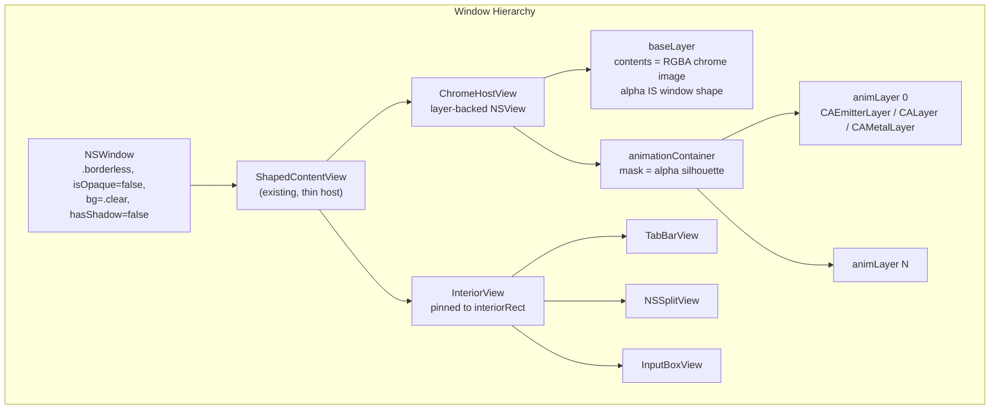
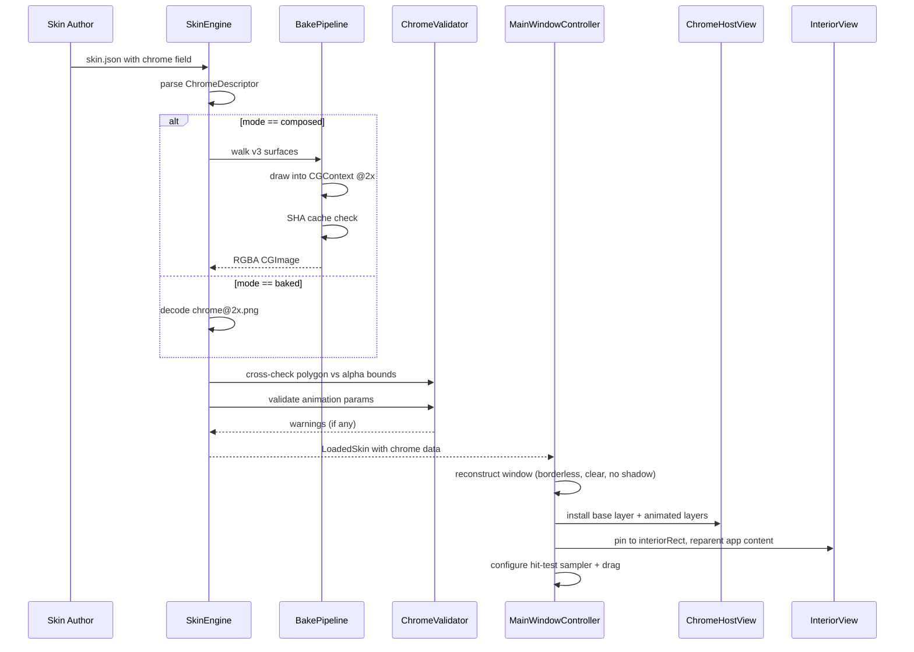

# Design Document: PNG Chrome — Winamp-class Skinning with Live Animated Chrome

## Overview

PNG Chrome replaces Amplify v1's `CALayer.mask` polygon-clipping approach with a single alpha-aware compositing host architecture. The core idea: one `ChromeHostView` owns every chrome pixel via an RGBA PNG (alpha IS the window shape), while a separate `InteriorView` pinned to `interiorRect` owns all app content. Four animated layer types (particle emitter, LED array, sprite animation, shader preset) composite on top of the static base within the chrome silhouette.

This design extends the existing `SkinEngine` → `SkinContext` → chrome-view pipeline with:

1. **Static chrome compositing** — `ChromeHostView` with a base layer whose alpha defines the window shape
2. **Interior content isolation** — `InteriorView` geometrically constrains app content inside the chrome
3. **Load-time bake pipeline** — composites v3 surfaces into a cached RGBA image for backward-compatible migration
4. **Four animated layer primitives** — particle, LED array, sprite animation, shader preset
5. **Silhouette clipping** — single shared mask prevents animations from painting outside the chrome shape
6. **Manifest validation** — cross-checks polygon vs alpha bounds, validates animation params, enforces size caps

### Key Design Decisions

- **Additive v4 extension.** All new manifest fields are optional with nil defaults. v1/v2/v3 skins load unchanged.
- **ChromeHostView + InteriorView split.** Correctness by construction — adding a new subview to InteriorView can never break the window shape because the shape is owned by a separate compositing host.
- **Single container mask for animation clipping.** Cheaper than per-layer masks, equivalent for convex/compound-polygon cases, simpler to reason about.
- **Declarative animation vocabulary.** Four bounded kinds (particle, LED, sprite-anim, shader preset) — no arbitrary scripting. Authors declare parameters in the manifest; the engine renders.
- **SHA-keyed bake cache.** Composed-mode skins bake once per input change; cache hits are free. Deterministic output enables reliable caching.
- **Top-left coordinate convention.** Manifest coordinates use top-left origin (matching image editors). Engine converts to AppKit's bottom-left internally.
- **SwiftCheck for property tests.** Consistent with the project's 25 existing property test files.

## Architecture



### Data Flow



## Components and Interfaces

### New View Classes

#### ChromeHostView

```swift
@MainActor
final class ChromeHostView: NSView {
    /// Static base layer — contents is the RGBA chrome image.
    /// Alpha channel IS the window shape.
    let baseLayer: CALayer
    
    /// Container for all animated layers. Has a single shared mask
    /// derived from baseLayer's alpha so animations can't paint
    /// outside the chrome silhouette.
    let animationContainer: CALayer
    
    /// Animated layer instances, keyed by their manifest id for
    /// hot-reload diffing.
    private var animatedLayers: [String: CALayer] = [:]
    
    /// Install the chrome image as the base layer contents.
    func installBaseImage(_ image: CGImage, scale: CGFloat)
    
    /// Install animated layers from parsed descriptors.
    /// Builds the appropriate CALayer subclass per kind.
    func installAnimations(_ layers: [ChromeAnimationLayer],
                           skinDir: URL,
                           images: [String: NSImage])
    
    /// Update animated layers on hot-reload. Diffs by id:
    /// new ids → add, removed ids → remove, changed params → update in place.
    func updateAnimations(_ layers: [ChromeAnimationLayer],
                          skinDir: URL,
                          images: [String: NSImage])
    
    /// Remove all animated layers (density mode .off).
    func removeAllAnimations()
    
    /// Pause all animated layers on starting frame (density mode .minimal).
    func pauseAllAnimations()
    
    /// Resume all animated layers (density mode .full).
    func resumeAllAnimations()
    
    /// Install debug overlay layers when HOLOSCAPE_PNG_CHROME_DEBUG=1.
    func installDebugOverlay(interiorRect: CGRect,
                             polygons: [Polygon],
                             animationRects: [(id: String, rect: CGRect)])
}
```

#### InteriorView

```swift
@MainActor
final class InteriorView: NSView {
    /// Install a concave interior mask from the declared interior path.
    /// No-op when interiorPath is nil (convex interior — frame IS the clip).
    func installInteriorMask(from path: [Polygon]?)
}
```

### New Model Types

#### ChromeDescriptor

```swift
struct ChromeDescriptor: Codable, Equatable, Sendable {
    let mode: Mode
    let image: String?              // required when mode == .baked
    let imageOpaque: String?        // optional Reduce Transparency variant
    let width: Int
    let height: Int
    let interiorRect: SkinRect
    let interiorPath: [Polygon]?    // optional; concave interiors only
    let animations: [ChromeAnimationLayer]?

    enum Mode: String, Codable, Sendable { case baked, composed }
}

struct SkinRect: Codable, Equatable, Sendable {
    let x: Double, y: Double, width: Double, height: Double
}
```

#### ChromeAnimationLayer + Per-Kind Params

```swift
struct ChromeAnimationLayer: Codable, Equatable, Sendable {
    let id: String
    let kind: Kind
    let rect: SkinRect
    let z: Int
    let phaseOffset: Double?
    let speedMultiplier: Double?
    let params: Params

    enum Kind: String, Codable, Sendable {
        case particle, ledArray, spriteAnim, shader
    }

    struct Params: Codable, Equatable, Sendable {
        let particle: ParticleParams?
        let ledArray: LedArrayParams?
        let spriteAnim: SpriteAnimParams?
        let shader: ShaderParams?
    }
}

struct ParticleParams: Codable, Equatable, Sendable {
    let birthRate: Double
    let lifetime: Double
    let lifetimeRange: Double?
    let velocity: Double
    let velocityRange: Double?
    let emissionAngle: Double       // radians, 0 = +x
    let emissionRange: Double       // radians
    let color: String               // hex "#rrggbbaa"
    let colorRange: String?
    let scale: Double
    let scaleRange: Double?
    let image: String?              // optional sprite; otherwise soft dot
    let blendMode: BlendMode?

    enum BlendMode: String, Codable, Sendable { case normal, additive, screen }
}

struct LedArrayParams: Codable, Equatable, Sendable {
    let cellSize: Double
    let cells: [LedCell]
    let palette: [String]           // hex colors indexed by cell.state
    let pattern: Pattern

    struct LedCell: Codable, Equatable, Sendable {
        let x: Double, y: Double
        let defaultState: Int
    }

    enum Pattern: Codable, Equatable, Sendable {
        case steady
        case blink(hz: Double, duty: Double)
        case phased(hz: Double)
        case random(hz: Double, density: Double)
        case marquee(cellsPerSecond: Double, windowSize: Int)
    }
}

struct SpriteAnimParams: Codable, Equatable, Sendable {
    let sheet: String
    let gridRows: Int
    let gridCols: Int
    let frameCount: Int
    let fps: Double
    let loop: Loop

    enum Loop: String, Codable, Sendable { case loop, pingPong, once }
}

struct ShaderParams: Codable, Equatable, Sendable {
    let preset: Preset
    let color: String?
    let intensity: Double?
    let hz: Double?

    enum Preset: String, Codable, Sendable { case glow, scanlines, noise }
}
```

#### SkinDefinition v4 Extension

```swift
extension SkinDefinition {
    // NEW v4 field — optional, nil default for backward compatibility
    var chrome: ChromeDescriptor?
}
```

### New Service Components

#### ChromeValidator

Validates chrome descriptors at load time. Pure functions, no side effects.

```swift
struct ChromeValidator {
    /// Cross-check polygon bounding box vs chrome image alpha bounds.
    /// Returns a warning message if mismatch exceeds 2px tolerance.
    static func crossCheckPolygonVsAlpha(
        polygonBBox: CGRect,
        alphaBBox: CGRect,
        tolerance: CGFloat = 2.0
    ) -> String?
    
    /// Validate all animated layers in a chrome descriptor.
    /// Returns per-layer validation results (valid or error message).
    static func validateAnimations(
        _ animations: [ChromeAnimationLayer],
        chromeBounds: CGRect,
        skinDir: URL,
        images: [String: NSImage]
    ) -> [(id: String, result: Result<Void, String>)]
    
    /// Validate interiorRect is inside chrome bounds.
    static func validateInteriorRect(
        _ rect: SkinRect,
        chromeBounds: CGRect
    ) -> String?
    
    /// Validate chrome image dimensions against caps.
    static func validateImageSize(
        width: Int, height: Int,
        maxDimension: Int = 4096
    ) -> String?
    
    /// Validate sprite sheet dimensions and count per skin.
    static func validateSpriteSheets(
        sheets: [(path: String, width: Int, height: Int)],
        maxDimension: Int = 2048,
        maxSheets: Int = 4
    ) -> [String]
}
```

#### ChromeBakePipeline

Composites v3 surfaces into a single RGBA image for composed-mode skins.

```swift
@MainActor
struct ChromeBakePipeline {
    /// Bake v3 surfaces into a single RGBA CGImage.
    /// Runs on a background queue, hops back to main for install.
    static func bake(
        surfaces: [String: SurfaceDescriptor],
        images: [String: NSImage],
        width: Int, height: Int,
        scale: CGFloat
    ) -> CGImage?
    
    /// Compute SHA-256 of the bake inputs for cache keying.
    static func inputHash(
        surfaces: [String: SurfaceDescriptor],
        imageBytes: [String: Data]
    ) -> String
    
    /// Cache directory for baked images.
    static var cacheDirectory: URL
    
    /// Load a cached bake result by SHA, or nil on miss.
    static func loadCached(sha: String) -> CGImage?
    
    /// Save a bake result to cache.
    static func saveToCache(_ image: CGImage, sha: String) throws
}
```

#### SpriteAnimationClock

Pure computation for sprite animation frame selection.

```swift
struct SpriteAnimationClock {
    /// Compute the current frame index given elapsed time and animation params.
    /// Pure function — no side effects, fully deterministic.
    static func frameIndex(
        elapsedTime: Double,
        fps: Double,
        frameCount: Int,
        loop: SpriteAnimParams.Loop,
        phaseOffset: Double = 0,
        speedMultiplier: Double = 1.0
    ) -> Int
    
    /// Compute the contentsRect UV for a given frame index in a sprite sheet.
    static func contentsRect(
        frameIndex: Int,
        gridRows: Int,
        gridCols: Int,
        sheetWidth: CGFloat,
        sheetHeight: CGFloat,
        cellWidth: Int,
        cellHeight: Int
    ) -> CGRect
}
```

#### LedPatternClock

Pure computation for LED array state at a given time.

```swift
struct LedPatternClock {
    /// Compute the palette index for each cell at a given time.
    /// Pure function — deterministic for the same inputs.
    static func cellStates(
        cells: [LedArrayParams.LedCell],
        pattern: LedArrayParams.Pattern,
        elapsedTime: Double,
        phaseOffset: Double = 0,
        speedMultiplier: Double = 1.0
    ) -> [Int]
}
```

#### CoordinateConverter

Converts between manifest (top-left origin) and AppKit (bottom-left origin) coordinates.

```swift
struct CoordinateConverter {
    /// Convert a SkinRect from top-left origin to AppKit bottom-left origin.
    static func toAppKit(
        _ rect: SkinRect,
        chromeHeight: Double
    ) -> CGRect
    
    /// Convert a point from top-left origin to AppKit bottom-left origin.
    static func toAppKit(
        x: Double, y: Double,
        chromeHeight: Double
    ) -> CGPoint
}
```

### Modified Components

#### SkinDefinition

- Adds optional `chrome: ChromeDescriptor?` field with nil default
- Existing v1/v2/v3 fields unchanged

#### SkinEngine

- `loadComposite(named:)` — extended with chrome-mode branch: decode/bake chrome image, validate, build `LoadedSkin` with chrome data
- `resolveHiDPIImage(basePath:skinDir:backingScale:)` — new helper for @1x/@2x/@3x resolution selection
- Chrome image alpha bounds sampling for polygon cross-check
- Animated layer validation delegated to `ChromeValidator`
- Size cap enforcement for chrome images and sprite sheets

#### MainWindowController

- `applySkin(_:)` — extended to handle chrome-mode skins: install ChromeHostView + InteriorView, reparent subviews, configure window properties
- `applyChrome(_:)` — new method for chrome-specific setup (borderless, clear bg, no shadow, fixed size)
- `teardownChrome()` — reverse chrome setup when switching to non-chrome skin
- Density mode observer extended to manage animated layer lifecycle

#### LoadedSkin

```swift
extension LoadedSkin {
    // NEW v4 fields
    let chrome: ChromeDescriptor?
    let chromeImage: CGImage?           // decoded/baked chrome image
    let chromeImageOpaque: CGImage?     // optional Reduce Transparency variant
}
```

### Density Mode Interaction

| Feature | `.full` | `.minimal` | `.off` |
|---------|---------|------------|--------|
| Chrome base image | ✅ Rendered | ✅ Rendered | ❌ Rectangular fallback |
| Animated layers | ✅ Running | ⏸ Frozen on frame 0 | ❌ Removed from tree |
| Interior content | ✅ Inside InteriorView | ✅ Inside InteriorView | ✅ Default layout |
| Hit-test polygon | ✅ Active | ✅ Active | ❌ Default rectangular |
| Drag regions | ✅ Active | ✅ Active | ❌ System title bar |
| Debug overlay | ✅ If env var set | ✅ If env var set | ❌ Not applicable |

## Data Models

### Manifest Schema (v4, backward compatible)

All new fields are optional. v1/v2/v3 manifests decode identically to before.

```json
{
  "version": "4.0",
  "name": "HoloscapeClassic-live",
  "author": "Erik",
  "chrome": {
    "mode": "baked",
    "image": "chrome@2x.png",
    "imageOpaque": "chrome-opaque@2x.png",
    "width": 1000,
    "height": 700,
    "interiorRect": { "x": 40, "y": 60, "width": 920, "height": 600 },
    "animations": [
      {
        "id": "porthole-particles",
        "kind": "particle",
        "rect": { "x": 50, "y": 70, "width": 200, "height": 200 },
        "z": 1,
        "phaseOffset": 0,
        "speedMultiplier": 1.0,
        "params": {
          "particle": {
            "birthRate": 5.0,
            "lifetime": 3.0,
            "velocity": 20.0,
            "emissionAngle": 1.57,
            "emissionRange": 6.28,
            "color": "#ffaa3388",
            "scale": 0.5,
            "blendMode": "additive"
          }
        }
      },
      {
        "id": "status-leds",
        "kind": "ledArray",
        "rect": { "x": 800, "y": 10, "width": 150, "height": 20 },
        "z": 2,
        "params": {
          "ledArray": {
            "cellSize": 6.0,
            "cells": [
              { "x": 0, "y": 0, "defaultState": 0 },
              { "x": 8, "y": 0, "defaultState": 1 },
              { "x": 16, "y": 0, "defaultState": 0 }
            ],
            "palette": ["#333333", "#00ff00", "#ff0000"],
            "pattern": { "phased": { "hz": 2.0 } }
          }
        }
      },
      {
        "id": "lcd-marquee",
        "kind": "spriteAnim",
        "rect": { "x": 300, "y": 10, "width": 400, "height": 24 },
        "z": 1,
        "params": {
          "spriteAnim": {
            "sheet": "assets/lcd-frames.png",
            "gridRows": 4,
            "gridCols": 8,
            "frameCount": 30,
            "fps": 12.0,
            "loop": "loop"
          }
        }
      },
      {
        "id": "ambient-glow",
        "kind": "shader",
        "rect": { "x": 0, "y": 650, "width": 1000, "height": 50 },
        "z": 1,
        "params": {
          "shader": {
            "preset": "glow",
            "color": "#4488ff",
            "intensity": 0.3,
            "hz": 0.5
          }
        }
      }
    ]
  },
  "windowShape": {
    "kind": "polygons",
    "polygons": [
      { "points": [{"x": 0, "y": 0}, {"x": 1000, "y": 0}, {"x": 1000, "y": 700}, {"x": 0, "y": 700}] }
    ]
  },
  "surfaces": {
    "tabBar.background": { "fill": { "kind": "color", "hex": "#1a1a2e" } }
  }
}
```

### Cache Directory Structure

```
~/Library/Caches/holoscape-skins/
├── <sha256-of-composed-inputs>/    (baked composed chrome image)
│   └── chrome-baked.png
├── <sha256-of-wamp-1>/            (extracted .wamp bundle)
│   ├── skin.json
│   ├── chrome@2x.png
│   └── assets/
└── <sha256-of-wamp-2>/
    └── ...
```

### Shader Preset Specifications

| Preset | Parameters | Default Values | Visual Effect |
|--------|-----------|----------------|---------------|
| `glow` | color, intensity, hz | `#ffffff`, 0.5, 1.0 | Soft pulsing luminance at the layer rect |
| `scanlines` | color, intensity, hz | `#000000`, 0.3, 0.0 | CRT horizontal line overlay (static when hz=0) |
| `noise` | color, intensity, hz | `#ffffff`, 0.1, 30.0 | Animated film-grain overlay |

Shader presets are shipped as Metal shader source compiled at app build time. Each preset is a fragment function that reads `iTime`, `iResolution`, and the declarative parameters from a small uniform buffer.


## Correctness Properties

*A property is a characteristic or behavior that should hold true across all valid executions of a system — essentially, a formal statement about what the system should do. Properties serve as the bridge between human-readable specifications and machine-verifiable correctness guarantees.*

### Property 1: ChromeDescriptor and SkinDefinition v4 Codable Round-Trip

*For any* valid `ChromeDescriptor` value (including all animation kinds — particle, LED array, sprite animation, shader preset — with all parameter variants), and *for any* valid `SkinDefinition` containing a `chrome` field alongside existing v1/v2/v3 fields, encoding to JSON and decoding back SHALL produce an equivalent object.

**Validates: Requirements 24.4, 24.5**

### Property 2: Polygon vs Chrome Alpha Bounds Cross-Check

*For any* polygon bounding box and chrome image alpha bounding box, the `ChromeValidator.crossCheckPolygonVsAlpha` function SHALL return a warning if and only if the two bounding boxes differ by more than 2 logical pixels on any edge. When the bounding boxes match within the 2-pixel tolerance, no warning SHALL be produced.

**Validates: Requirements 5.1, 5.2, 5.3**

### Property 3: Animated Layer Manifest Validation

*For any* array of `ChromeAnimationLayer` descriptors and chrome bounds, the `ChromeValidator.validateAnimations` function SHALL: (a) reject layers with duplicate `id` values, (b) reject layers whose `rect` extends outside chrome bounds, (c) reject layers with invalid kind-specific parameters (`gridRows * gridCols < frameCount`, `birthRate <= 0`, `palette.count == 0`, missing sprite sheet references), and (d) accept all layers that satisfy these constraints.

**Validates: Requirements 18.1, 18.2, 18.3**

### Property 4: Sprite Animation Frame Index Computation

*For any* valid sprite animation parameters (positive `fps`, positive `frameCount`, any `loop` mode) and any non-negative elapsed time, the `SpriteAnimationClock.frameIndex` function SHALL return an index in `[0, frameCount)`. For `loop` mode, the index SHALL cycle. For `pingPong` mode, the index SHALL reverse at sequence ends. For `once` mode, the index SHALL clamp to `frameCount - 1` after the first complete pass. The `contentsRect` computed from the frame index SHALL have origin and size within the unit square `[0, 1]`.

**Validates: Requirements 13.2, 13.3, 13.4**

### Property 5: LED Pattern State Determinism

*For any* valid LED array configuration (positive cell count, non-empty palette, any pattern mode) and any two calls to `LedPatternClock.cellStates` with identical inputs (same cells, pattern, elapsed time, phase offset, speed multiplier), the function SHALL return identical palette index arrays. All returned palette indices SHALL be valid indices into the palette array.

**Validates: Requirements 12.2**

### Property 6: Bake Pipeline Determinism and Cache Round-Trip

*For any* identical set of v3 surface descriptors and referenced image bytes, the `ChromeBakePipeline.bake` function SHALL produce byte-identical output images. The SHA hash of the inputs SHALL change if and only if any surface descriptor or referenced image byte changes. Baking then saving to cache then loading from cache SHALL produce a `CGImage` equivalent to the freshly-baked result.

**Validates: Requirements 29.1, 29.2, 29.3**

### Property 7: Coordinate Conversion Correctness

*For any* `SkinRect` with top-left origin coordinates and any positive chrome height, `CoordinateConverter.toAppKit` SHALL produce a `CGRect` where `y_appkit = chromeHeight - y_manifest - rect.height`. Converting to AppKit and then back to manifest coordinates SHALL produce the original `SkinRect` (round-trip).

**Validates: Requirements 30.1, 30.2**

### Property 8: Chrome Image and Sprite Sheet Size Cap Validation

*For any* chrome image dimensions, `ChromeValidator.validateImageSize` SHALL reject images exceeding 4096×4096 pixels and accept images within the cap. *For any* set of sprite sheets, `ChromeValidator.validateSpriteSheets` SHALL reject sheets exceeding 2048×2048 pixels and reject sets with more than 4 sheets.

**Validates: Requirements 26.1, 26.2**

### Property 9: Chrome Loading Robustness

*For any* `ChromeDescriptor` value (including malformed values with missing images, non-RGBA images, dimension mismatches, out-of-bounds interior rects, and invalid animation params), the chrome loading pipeline SHALL either produce a valid chrome configuration or fall back to rectangular rendering — it SHALL NOT throw an unhandled exception or crash.

**Validates: Requirements 19.2, 19.3**

### Property 10: HiDPI Image Resolution Selection

*For any* combination of available image variants (presence/absence of `chrome.png`, `chrome@2x.png`, `chrome@3x.png`) and any backing scale factor, the `SkinEngine.resolveHiDPIImage` function SHALL select the highest-resolution available variant that matches or is closest to the backing scale. When only `chrome.png` is available, it SHALL be selected regardless of scale. When no variant is available, the function SHALL return nil.

**Validates: Requirements 7.2, 22.1, 22.2, 22.3**

### Property 11: Chrome Asset Path Sandboxing

*For any* chrome-related asset path (chrome image, opaque variant, particle sprite images, sprite animation sheets), the `SkinEngine.validateAssetPath` function SHALL reject paths containing `..` traversal segments, absolute path prefixes (`/`), or URL schemes (`http://`, `https://`, `file://`). For any relative path without these patterns, the path SHALL be accepted at the string-validation stage.

**Validates: Requirements 27.1, 27.2**

## Error Handling

### Graceful Degradation Strategy

The core principle: **a broken chrome skin degrades to rectangular rendering, never crashes.** Every error path has a defined fallback.

| Error Condition | Fallback Behavior | User Notification |
|----------------|-------------------|-------------------|
| Chrome image missing | Rectangular rendering with v3 surface fills | SkinWarningBanner naming the missing file |
| Chrome image not RGBA | Rectangular rendering | SkinWarningBanner with format details |
| Chrome image dimensions mismatch | Rectangular rendering | SkinWarningBanner naming width/height |
| Chrome image exceeds 4096×4096 | Rectangular rendering | SkinWarningBanner with size |
| `interiorRect` outside chrome bounds | Rectangular rendering | SkinWarningBanner naming the field |
| Polygon vs alpha bounds mismatch >2px | Chrome loads normally | SkinWarningBanner with mismatch details |
| Animated layer invalid params | Layer skipped, rest load | SkinWarningBanner naming the layer `id` |
| Animated layer duplicate `id` | Layer skipped | SkinWarningBanner naming the duplicate |
| Animated layer `rect` outside bounds | Layer skipped | SkinWarningBanner naming the layer |
| Unknown shader preset | Layer skipped | SkinWarningBanner naming the preset |
| Sprite sheet missing/corrupt | Layer skipped | NSLog warning |
| Sprite sheet exceeds 2048×2048 | Layer skipped | SkinWarningBanner with size |
| GPU texture cap exceeded (64 MB) | Exceeding layers disabled | SkinWarningBanner |
| Chrome asset path traversal | Rectangular rendering | NSLog security warning |
| Composed bake failure | Rectangular rendering | SkinWarningBanner |
| Composed bake cache corrupt | Re-bake from scratch | NSLog warning |

### Error Propagation

- `SkinEngine.loadComposite(named:)` returns `LoadedSkin` with `validationBannerReason` set on partial failures — callers display the banner and proceed with whatever loaded successfully.
- Chrome loading errors are caught at the `SkinEngine` level and converted to fallback + banner. No `fatalError`, `preconditionFailure`, or force-unwrap in any chrome code path.
- Animated layer validation errors are per-layer — one bad layer doesn't sink the skin. The engine collects all validation failures and reports them in a single banner.
- The bake pipeline runs on a background queue; failures hop back to main and trigger the rectangular fallback.

## Testing Strategy

### Dual Testing Approach

PNG Chrome uses both property-based tests (via SwiftCheck) and example-based unit tests, consistent with the project's existing 25 property test files.

**Property-based tests** verify universal invariants across generated inputs:
- Minimum 100 iterations per property test (SwiftCheck default)
- Each test references its design document property number
- Tag format: `Feature: png-chrome, Property {N}: {title}`
- Reduced iteration count (15–25) for tests involving disk I/O (bake pipeline, cache operations)

**Example-based unit tests** verify specific scenarios, edge cases, and integration points:
- Window configuration under chrome mode (borderless, clear, no shadow, fixed size)
- InteriorView frame pinning and subview reparenting
- Density mode interaction with animated layers
- Reduce Transparency and Reduce Motion behavior
- Debug overlay presence/absence based on env var
- Backward compatibility with v2/v3 skins
- Hot reload for chrome images and animation params

### Property Test Plan

| Property | Test File | SwiftCheck Generators | Iterations |
|----------|-----------|----------------------|------------|
| P1: Codable round-trip | `ChromeDescriptorRoundTripPropertyTests.swift` | Random ChromeDescriptor with all animation kinds + random SkinDefinition v4 | 100 |
| P2: Polygon vs alpha cross-check | `ChromePolygonAlphaCrossCheckPropertyTests.swift` | Random CGRect pairs with varying offsets | 100 |
| P3: Animation validation | `ChromeAnimationValidationPropertyTests.swift` | Random ChromeAnimationLayer arrays with valid/invalid params | 100 |
| P4: Sprite frame index | `SpriteAnimationClockPropertyTests.swift` | Random fps, frameCount, loop mode, elapsed time | 100 |
| P5: LED pattern determinism | `LedPatternDeterminismPropertyTests.swift` | Random LED configs, patterns, time values | 100 |
| P6: Bake determinism | `ChromeBakeDeterminismPropertyTests.swift` | Random surface descriptor sets + image bytes | 25 (disk I/O) |
| P7: Coordinate conversion | `CoordinateConversionPropertyTests.swift` | Random SkinRect + chrome height values | 100 |
| P8: Size cap validation | `ChromeSizeCapPropertyTests.swift` | Random image dimensions | 100 |
| P9: Loading robustness | `ChromeLoadingRobustnessPropertyTests.swift` | Random/malformed ChromeDescriptor values | 100 |
| P10: HiDPI resolution selection | `ChromeHiDPISelectionPropertyTests.swift` | Random file availability + backing scale | 100 |
| P11: Asset path sandboxing | `ChromePathSandboxPropertyTests.swift` | Random paths with/without traversal patterns | 100 |

### Unit Test Plan

| Area | Test File | Key Scenarios |
|------|-----------|---------------|
| Window config | `ChromeWindowConfigTests.swift` | Borderless transition, fixed size, clear bg, no shadow, revert on non-chrome skin |
| InteriorView | `InteriorViewTests.swift` | Frame pinning to interiorRect, subview reparenting, concave mask, convex no-mask |
| ChromeHostView | `ChromeHostViewTests.swift` | Base layer install, animation container mask, z-ordering, debug overlay |
| Bake pipeline | `ChromeBakePipelineTests.swift` | Composed bake output, SHA cache hit/miss, cache invalidation, performance budget |
| Particle layer | `ParticleLayerTests.swift` | CAEmitterLayer params, image vs soft dot, phaseOffset, speedMultiplier |
| LED layer | `LedLayerTests.swift` | All five pattern modes, palette application, cell geometry build-once |
| Sprite anim layer | `SpriteAnimLayerTests.swift` | contentsRect UV, loop/pingPong/once modes, frame advancement |
| Shader preset layer | `ShaderPresetLayerTests.swift` | glow/scanlines/noise install, unknown preset fallback, param defaults |
| Density interaction | `ChromeDensityTests.swift` | .off removes layers, .minimal freezes, .full runs, transitions |
| Accessibility | `ChromeAccessibilityTests.swift` | accessibilityHidden on chrome layers, labels preserved on InteriorView |
| Reduce Transparency | `ChromeReduceTransparencyTests.swift` | Opaque variant selection, alpha multiplication fallback |
| Reduce Motion | `ChromeReduceMotionTests.swift` | Freeze on starting frame, skip chrome-swap animation |
| Hot reload | `ChromeHotReloadTests.swift` | Image change, surface change (re-bake), animation diff by id |
| Backward compat | `ChromeBackwardCompatTests.swift` | v2 skin unchanged, v3 skin unchanged, HoloscapeSynthwave regression |
| Validator | `ChromeValidatorTests.swift` | All error conditions from the error handling table |
| Drag | `ChromeDragTests.swift` | isMovableByWindowBackground, WindowDragOverlay removal, explicit dragRegions |

### Integration Tests

- **Mac Mini UI test**: screenshot over known-bright backdrop, sample cut-corner pixel for transparency
- **HoloscapeSynthwave backward-compat**: load before and after PNG Chrome, compare chrome output
- **Composed-with-animations round-trip**: v4 composed skin with all four animation kinds
- **Hot reload end-to-end**: edit chrome image on disk, verify reload within 200ms debounce
- **Dual Metal layer**: shader preset chrome animation running while terminal Metal shader is active
