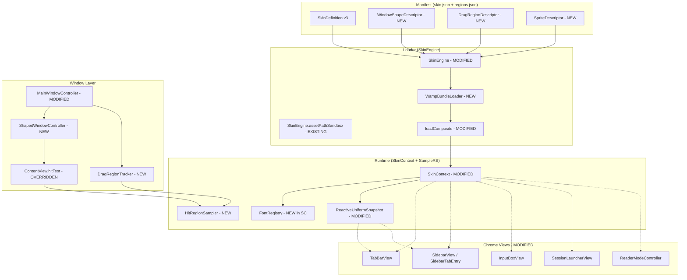
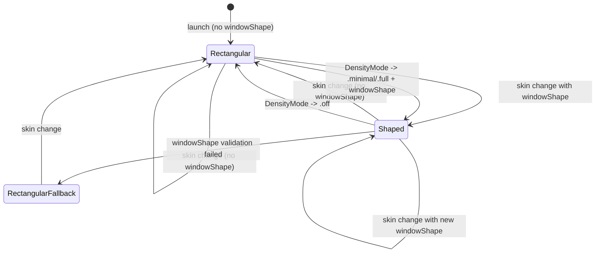

# Design Document: Amplify — Winamp-class Chrome Skinning

> **Reconciled 2026-04-19** against `.kiro/specs/amplify-skinning/design.md`. Merged from Kiro: mask-image shapes deferred to post-MVP (polygons-only MVP; `AlphaHitSampler` removed from the component list and documented as a Phase-2 hook), sprite rendering switched to `layer.contentsRect` UV offset, font registration process-scope invariant strengthened. Kept from Claude: window reconstruction (vs Kiro's style-mask mutation, which hits the flicker/focus-loss bug PRD Risk 1 calls out), Reader panel skinning, docs task, quantified performance budgets, `ReactiveUniformSnapshot.spriteState` to preserve SkinContext immutability.

## Overview

Amplify extends the existing chrome-skinning architecture (`SkinContext` / `SkinEngine` / `SurfaceDescriptor` / `SurfaceKey`) additively. No existing type is replaced; the v2 manifest format is a strict subset of the v3 "Amplify" format, and every new field is optional with a documented default that reproduces pre-Amplify behavior. The engine gains four new subsystems — `ShapedWindowController` (style-mask swap + `CAShapeLayer` mask), `HitRegionSampler` (point-in-polygon click-through), `DragRegionTracker` (`NSTrackingArea` over polygons driving `window.performDrag(with:)`), and `WampBundleLoader` (ZIP-backed source for `SkinEngine.loadComposite`) — plus a set of model extensions (`WindowShapeDescriptor`, `DragRegionDescriptor`, `SpriteDescriptor`, `SpriteCell`, `Polygon`, `Point`) and three new `SurfaceKey` cases (`window.shape`, `window.dragHandle`, `readerPanel.*`). Chrome views consume `font`, `border`, `corner`, and `shadow` descriptors in their existing `refreshFromSkin()` hooks; the `ReaderModeController` stops hardcoding SF Mono 14pt and reads from the skin context when surfaces are provided.

**MVP scope for shaped windows**: polygons only. Mask-image shapes (PNG alpha, `kind: mask`) are deferred to post-MVP per PRD §12. An `AlphaHitSampler` is a Phase-2 component and is not built in MVP.

The architectural posture is: extend the data model, extend `SkinEngine` with a bundle branch, extend `SkinContext` with sprite-aware `applyFill` and a new `applyShadow`, extend `MainWindowController` to own shaped-window reconstruction, and wire chrome views to consume the previously-parsed descriptors. Hot reload flips from "watch directory" to "watch file" when the active skin is a `.wamp`; the debounce and delegate protocol are unchanged.

## Key Design Decisions

1. **Style-mask swap via window reconstruction, not mutation.** AppKit allows setting `styleMask` on a live `NSWindow`, but the transition (titled → borderless) flickers, loses first-responder, and orphans `NSTrackingArea`s. Instead, `ShapedWindowController.reconstructWindow(for:)` builds a fresh `NSWindow(styleMask:)`, transfers the content view's subviews via `setContentView()`, copies frame and key-window state, and releases the old window. Cleaner and proven across AppKit apps (Sketch, OmniGraffle) that also use borderless shaped windows. Alternative rejected: mutate `styleMask` directly — rejected because of the flicker and focus-loss issues.

2. **Polygon sampling via Jordan curve theorem, not CAShapeLayer hit testing.** AppKit provides `CAShapeLayer.path.contains(point:)`, but it runs in layer coordinates and requires a round-trip through the layer tree. Running ray-casting directly on the raw polygon vertex arrays is O(vertices) per hit test, deterministic, and testable in pure Swift without AppKit. Alternative rejected: `CGPath.contains(_:)` — works but is slower (Core Graphics boundary cost per call) and harder to property-test.

3. **`.wamp` is a ZIP with `.wamp` extension, not a custom format.** Using `ZIPFoundation` (MIT-licensed, pure Swift, no native code) keeps the bundle readable by any ZIP utility for debugging and for future tooling. Alternative rejected: custom TAR-like format — rejected because of reinvention tax and loss of ecosystem tooling (`unzip`, Finder preview, Archive Utility).

4. **Bundle cache keyed by SHA-256 of bytes, not modification time.** Hash-keyed caching makes hot reload resilient to file timestamp noise (Finder touches, Git checkouts that rewrite mtime). SHA-256 of a 1 MB bundle runs in under 10 ms on Apple Silicon; the cost is absorbed by the 500 ms cold-load budget. Alternative rejected: `mtime` — rejected because Git checkouts and `rsync --times` produce spurious hits.

5. **Per-chrome-view sprite state publication via existing AppKit hooks.** `NSTrackingArea` already drives hover state for sidebar rows and tab buttons in the chrome-skinning build; Amplify extends these hooks to publish `Sprite_State` into the view's reactive snapshot and re-run `refreshFromSkin()` on transition. Alternative rejected: centralized `SpriteStateManager` — rejected because views already own their own hover/press state and centralization duplicates truth.

6. **`SkinContext` stays immutable; sprite state is carried in `ReactiveUniformSnapshot`.** The existing chrome-skinning invariant is that `SkinContext` is immutable after construction and all mutable state lives in `ReactiveUniformSnapshot`. Amplify preserves this by adding `spriteState` to the per-view snapshots and letting `currentState(for: key, with: snapshot)` evaluate which sprite cell to slice. Alternative rejected: mutable `SkinContext` with a state setter — rejected because it breaks the "SkinContext is immutable" property that `StateDeterminismPropertyTests` already verifies.

7. **`ShapedWindowController` owns the `HOLOSCAPE_AMPLIFY_SHAPED_WINDOWS` feature flag.** The flag is read once at `MainWindowController.init` and cached. Toggling the env var requires a restart, matching how Holoscape treats every other env var. Alternative rejected: runtime toggle via Appearance Settings — rejected because shape changes require window reconstruction anyway; a settings toggle would behave identically to a restart.

## Architecture



### Changes from Previous Architecture

- **New**: `WampBundleLoader` at `Sources/Holoscape/Services/WampBundleLoader.swift` — unzips `.wamp` into `Cache_Root` with `ZIPFoundation`, SHA-256-keyed cache, enforces 50 MB asset/total cap, applies `Zip_Sandbox`.
- **New**: `ShapedWindowController` at `Sources/Holoscape/Controllers/ShapedWindowController.swift` — builds a `CAShapeLayer` from a `WindowShapeDescriptor`'s polygons, installs on `contentView.layer.mask`, owns the style-mask swap.
- **New**: `HitRegionSampler` at `Sources/Holoscape/Services/HitRegionSampler.swift` — ray-cast point-in-polygon; pure value type; property-testable.
- **Deferred (post-MVP)**: `AlphaHitSampler` for `kind: mask` shapes. PRD §12 places mask-image shapes in the post-MVP phase; the MVP ships polygon shapes only. When mask support is added, `AlphaHitSampler` joins `Sources/Holoscape/Services/` and is injected alongside `HitRegionSampler`.
- **New**: `DragRegionTracker` at `Sources/Holoscape/Controllers/DragRegionTracker.swift` — installs `NSTrackingArea` per polygon, routes `mouseDown` into `window.performDrag(with:)`, manages cursor stack (`openHand` / `closedHand`).
- **New**: `WindowShapeDescriptor`, `DragRegionDescriptor`, `SpriteDescriptor`, `SpriteCell`, `Polygon`, `Point` types in `Sources/Holoscape/Models/AmplifyDescriptors.swift`.
- **Modified**: `SkinDefinition` gains `windowShape: WindowShapeDescriptor?`, `dragRegions: [DragRegionDescriptor]?` optional fields; `version` range extended to include `"3.0"`.
- **Modified**: `FillDescriptor.image` case gains an optional `sprite: SpriteDescriptor?` associated value; JSON coding uses `decodeIfPresent` so v2 manifests decode unchanged.
- **Modified**: `SurfaceKey` gains 11 new cases: `tabBarTabHover`, `tabBarTabPressed`, `sidebarRowPressed`, `sessionLauncherButtonNormal`, `sessionLauncherButtonHover`, `sessionLauncherButtonPressed`, `readerPanelTitleBar`, `readerPanelBackground`, `readerPanelCloseButtonNormal`, `readerPanelCloseButtonHover`, `readerPanelCloseButtonPressed`, `windowShape`, `windowDragHandle`. (`inputBoxField.focused` exists only if verified absent; see Data Models.)
- **Modified**: `SkinContext` gains `windowShape: ResolvedWindowShape?`, `dragRegions: [ResolvedDragRegion]`, and a new `applyShadow(to:from:)` method (thin wrapper extracted from `applyBorderAndCorner`). `applyFill` gains a `spriteState: SpriteState = .normal` parameter; existing call sites default to `.normal`.
- **Modified**: `SkinEngine.availableSkins()` enumerates `.wamp` files alongside directories. `SkinEngine.resolveSkinDir(named:)` checks for `<name>.wamp` before falling back to `<name>/`.
- **Modified**: `SkinEngine.loadComposite(named:)` delegates to `WampBundleLoader.unzipIfNeeded(bundleURL:)` when the resolved URL has extension `.wamp`.
- **Modified**: `SkinEngine.startWatching(skinName:)` watches the `.wamp` file's parent directory (filtered to bundle-path events) when the skin is a bundle.
- **Modified**: `MainWindowController` gains `shapedWindowController: ShapedWindowController?` and `dragRegionTracker: DragRegionTracker?` properties; `applySkin(_:)` invokes them conditionally on `loadedSkin.windowShape`.
- **Modified**: `TabBarView`, `SidebarView`, `SidebarTabEntry`, `InputBoxView`, `SessionLauncherView` each call `applyShadow` and apply `resolved.font` in `refreshFromSkin()`.
- **Modified**: `ReaderModeController` stops hardcoding SF Mono 14pt; its text view's font is resolved from `readerPanelBackground.font` when a surface is defined.
- **Modified**: `ReactiveUniformSnapshot` gains a `spriteState: Int32` field so state-variant evaluation can match on sprite state.

### Request Flow (Happy Path)

1. The user selects a `.wamp` skin in Appearance Settings (or the persisted skin name resolves to a `.wamp` at launch).
2. `MainWindowController` calls `SkinEngine.loadComposite(named:)` with the skin's display name.
3. `SkinEngine.resolveSkinDir(named:)` finds `<name>.wamp` under `~/.holoscape/skins/` (or the bundle). `SkinEngine` sees the `.wamp` extension and calls `WampBundleLoader.unzipIfNeeded(bundleURL:)`.
4. `WampBundleLoader` computes SHA-256 of the bundle's bytes, checks `Cache_Root/<hash>/` — on cache miss, opens the ZIP with `ZIPFoundation`, iterates entries, applies `Zip_Sandbox` (string gate + symlink resolve gate) per entry, enforces 50 MB per-asset and per-bundle caps, writes files, and returns the unzipped directory URL.
5. `SkinEngine.loadComposite` receives the unzipped URL and runs the standard v2 pipeline: `loadSkin(named:)` decodes `skin.json`, `loadImages(from:manifest:)` loads PNGs, `loadNinepatchSidecar(for:in:)` loads sidecars, `registerFonts(from:)` registers TTFs via `CTFontManagerRegisterFontsForURL(_, .process, _)` — **process scope only**. Skin fonts never appear in Font Book and never persist after Holoscape quits (Requirements 6.7, 6.8).
6. `SkinEngine` constructs a `LoadedSkin` with the converted surfaces, `Skin_Font_Bundle`, image cache, and `skinDir` pointing at the unzipped directory. If `skin.json` declares `windowShape` with `kind: polygons`, `SkinEngine` also constructs a `ResolvedWindowShape` from the polygon list and attaches it to `LoadedSkin`. A manifest declaring `kind: mask` is rejected at load time (post-MVP, per Requirement 2.9).
7. `MainWindowController.applySkin(_:)` receives the `LoadedSkin`, drains the previous `Skin_Font_Bundle` with `unregisterFonts(_:)`, swaps in the new `SkinContext`, and — if `loadedSkin.windowShape` is non-nil and `HOLOSCAPE_AMPLIFY_SHAPED_WINDOWS` is on — asks `ShapedWindowController.reconstructWindow(for:)` to rebuild the window with `styleMask: .borderless`.
8. The new window's content view installs `DragRegionTracker` trackers, overrides `hitTest(_:)` to delegate to `HitRegionSampler`, and sets `contentView.layer.mask` to the polygon-backed shape layer.
9. Each chrome view's `refreshFromSkin()` runs on the main thread, resolving its `SurfaceKey`, applying fill / border / corner / shadow / font, publishing sprite state to its `ReactiveUniformSnapshot`, and triggering a layout pass.
10. `SkinEngine.startWatching(skinName:)` installs an FSEventStream on the bundle file's parent directory so saves to the `.wamp` trigger a 200 ms debounced reload.

### State Machine — Shape Application



## Components and Interfaces

### 1. WampBundleLoader

Located at `Sources/Holoscape/Services/WampBundleLoader.swift`. New type. Owns bundle unzipping and cache management.

```swift
@MainActor
final class WampBundleLoader {
    enum LoadError: Error, Equatable {
        case ioFailure(String)
        case notAZip(String)
        case zipEntryEscapesSandbox(String)
        case assetTooLarge(path: String, bytes: Int)
        case bundleTooLarge(bytes: Int)
        case missingManifest
    }

    let cacheRoot: URL
    init(cacheRoot: URL)

    /// Returns the unzipped directory URL for the bundle, unzipping on
    /// cache miss. Applies Zip_Sandbox + 50 MB caps. Idempotent: a second
    /// call with an unchanged bundle hits the cache.
    func unzipIfNeeded(bundleURL: URL) throws -> URL

    /// SHA-256 of the bundle's bytes, hex-encoded.
    func contentHash(_ bundleURL: URL) throws -> String

    /// Purge Cache_Root LRU entries until the total on-disk size is
    /// <= 50 MB. Preserves `preserving` (the currently-active bundle's
    /// hash directory).
    func purgeLRU(preserving: String?) throws
}
```

### 2. ShapedWindowController

Located at `Sources/Holoscape/Controllers/ShapedWindowController.swift`. New type. Owns window reconstruction and mask-layer installation.

```swift
@MainActor
final class ShapedWindowController {
    let featureFlagEnabled: Bool  // reads HOLOSCAPE_AMPLIFY_SHAPED_WINDOWS once

    init(environment: [String: String] = ProcessInfo.processInfo.environment)

    /// Build a mask layer for the given shape descriptor. Caller installs
    /// on contentView.layer.mask.
    func buildMaskLayer(
        for shape: ResolvedWindowShape,
        in contentBounds: CGRect
    ) -> CALayer?

    /// Reconstruct the main window with the correct styleMask for the
    /// given shape. Transfers content view, preserves frame, restores
    /// key-window and first-responder.
    func reconstructWindow(
        currentWindow: NSWindow,
        contentView: NSView,
        targetShape: ResolvedWindowShape?
    ) -> NSWindow

    /// Validate polygons against the nominal content-view bounds.
    /// Rejects (logs + returns nil) per Requirement 2.4. Also returns nil
    /// with a logged "kind: mask is post-MVP" message for any descriptor
    /// whose kind is `.mask` (Requirement 2.9).
    static func validate(
        _ shape: WindowShapeDescriptor,
        against nominalBounds: CGRect
    ) -> ResolvedWindowShape?
}

struct ResolvedWindowShape {
    // MVP ships polygons only. The enum is kept as an enum — rather than a
    // plain `[Polygon]` array — so the Phase-2 mask-image path can add a
    // `.mask(NSImage)` case without touching consumers.
    enum Kind { case polygons([Polygon]) }
    let kind: Kind
}
```

### 3. HitRegionSampler

Located at `Sources/Holoscape/Services/HitRegionSampler.swift`. New type. Pure value type, no AppKit imports beyond `CoreGraphics`.

```swift
struct HitRegionSampler {
    let polygons: [Polygon]

    /// Ray-cast point-in-polygon. Point inside any polygon returns true.
    /// Deterministic on edges and vertices (Jordan curve theorem with
    /// half-open interval convention).
    func contains(_ point: CGPoint) -> Bool
}
```

### 4. DragRegionTracker

Located at `Sources/Holoscape/Controllers/DragRegionTracker.swift`. New type. Owns `NSTrackingArea`s and mouseDown routing.

```swift
@MainActor
final class DragRegionTracker {
    private weak var contentView: NSView?
    private var regions: [ResolvedDragRegion]
    private var trackingAreas: [NSTrackingArea]

    init(contentView: NSView, regions: [ResolvedDragRegion])

    /// Install NSTrackingArea for each polygon's bounding box.
    /// Routes mouseDown hits on content view through contains() test.
    func install()

    /// Remove all NSTrackingArea instances installed by this tracker.
    func teardown()

    /// Called by contentView's mouseDown override. Returns true if the
    /// event was consumed (drag initiated).
    func handleMouseDown(_ event: NSEvent) -> Bool

    /// Called by contentView's cursorUpdate to push openHand/closedHand.
    func cursorForPoint(_ point: CGPoint, mouseDown: Bool) -> NSCursor?
}

struct ResolvedDragRegion {
    let polygons: [Polygon]
    let modifier: Modifier
    enum Modifier { case none, command }
}
```

### 5. SkinEngine (modified)

Located at `Sources/Holoscape/Services/SkinEngine.swift`. Existing type. New methods.

```swift
@MainActor
class SkinEngine {
    // ... existing fields and methods ...

    let wampLoader: WampBundleLoader

    /// Extended: enumerate directories AND .wamp files. Dedup by base name
    /// (the .wamp extension is stripped for display).
    func availableSkins() -> [String]

    /// Extended: if name resolves to a .wamp, ask wampLoader.unzipIfNeeded
    /// and return the unzipped directory. Otherwise existing directory
    /// resolution.
    private func resolveSkinDir(named name: String) -> URL?

    /// Extended: detect the .wamp branch in resolveSkinDir. The rest of
    /// loadComposite is unchanged (all downstream types see a directory).
    func loadComposite(named name: String) throws -> LoadedSkin

    /// Extended: when the skin is a .wamp, watch the bundle file's parent
    /// directory filtered to the bundle path.
    func startWatching(skinName: String)

    /// EXISTING (chrome-skinning). Registers every .ttf/.otf under the
    /// skin's `assets/fonts/` (or `fonts/` in a .wamp bundle) via
    /// `CTFontManagerRegisterFontsForURL(_, .process, _)`. Process
    /// scope — skin fonts NEVER persist and NEVER appear in Font Book
    /// (Requirements 6.7, 6.8). Returns a `SkinFontBundle` whose
    /// `registeredURLs` the caller hands back to `unregisterFonts(_:)`
    /// on unload, preserving the font-registration symmetry invariant.
    func registerFonts(from skinDir: URL) -> SkinFontBundle

    /// EXISTING. Calls `CTFontManagerUnregisterFontsForURL(_, .process, _)`
    /// for every URL in the bundle. Idempotent.
    func unregisterFonts(_ bundle: SkinFontBundle)
}
```

### 6. SkinContext (modified)

Located at `Sources/Holoscape/Services/SkinContext.swift`. Existing type. New fields and methods.

```swift
@MainActor
final class SkinContext {
    // ... existing fields and methods ...

    let windowShape: ResolvedWindowShape?
    let dragRegions: [ResolvedDragRegion]
    let fontRegistry: [String: CGFont]  // EXISTING (chrome-skinning)

    /// Apply fill with sprite state. Existing call sites default to .normal.
    /// When resolved.fill is an image with a non-nil SpriteDescriptor,
    /// assign the FULL sprite sheet to `layer.contents` (once per load)
    /// and set `layer.contentsRect` to the normalized UV rectangle of the
    /// cell matching `spriteState`. State transitions mutate
    /// `contentsRect` only — no bitmap crop, no per-state NSImage. This
    /// is GPU-friendly, backingScale-correct, and avoids 7-state ×
    /// N-surface bitmap memory.
    func applyFill(
        to layer: CALayer,
        from resolved: ResolvedSurface,
        backingScale: CGFloat = 2.0,
        spriteState: SpriteState = .normal
    )

    /// Apply only shadow properties to the layer. Extracted from
    /// applyBorderAndCorner so callers can compose.
    func applyShadow(to layer: CALayer, from resolved: ResolvedSurface)

    /// Resolve NSFont from the surface's FontDescriptor, preferring
    /// skin-registered CGFont lookup before system font fallback.
    func resolvedFont(for key: SurfaceKey, spriteState: SpriteState = .normal) -> NSFont?
}

enum SpriteState: String, Codable, Sendable {
    case normal, hover, pressed, active, disabled, focused, selected
}
```

### 7. MainWindowController (modified)

Located at `Sources/Holoscape/Controllers/MainWindowController.swift`. Existing type. New fields and modified `applySkin`.

```swift
@MainActor
class MainWindowController {
    // ... existing fields ...

    private var shapedWindowController: ShapedWindowController
    private var dragRegionTracker: DragRegionTracker?

    /// Extended: when loaded.windowShape is non-nil and the feature flag
    /// is on, reconstruct the window via shapedWindowController. Install
    /// DragRegionTracker. Swap mask layer. Otherwise preserve existing
    /// titled/resizable window.
    func applySkin(_ surfaces: [SurfaceKey: SkinContext.ResolvedSurface]?)

    /// Extended: on `.wamp` active skin, forward FSEventStream events
    /// through the existing debounce path.
    func skinEngineDidDetectChange(in directory: URL)
}
```

### 8. TabBarView, SidebarView, InputBoxView, SessionLauncherView (modified)

Located at `Sources/Holoscape/Views/`. Each view's `refreshFromSkin()` method gains:

- Resolution of `resolved.font` and application to its label(s) / text field(s) / button title(s).
- Call to `skinContext.applyShadow(to:from:)` after `applyBorderAndCorner`.
- For interactive views (`TabBarView` tabs, `SidebarView` rows, `SessionLauncherView` rows): publication of `SpriteState` into the per-entry `ReactiveUniformSnapshot` on hover / press transitions, and `applyFill(..., spriteState:)` on re-render.

### 9. ReaderModeController (modified)

Located at `Sources/Holoscape/Controllers/ReaderModeController.swift`. Existing type.

- Gains a `skinContext: SkinContext?` property.
- `open()` resolves `readerPanelBackground` and applies fill / border / corner / shadow / font. If the surface carries a `Font_Descriptor`, resolved font replaces `NSFont.monospacedSystemFont(ofSize: 14, weight: .regular)` on the text view. If macOS Increase Contrast is enabled, the font override is skipped (Requirement 8.6).
- Close button resolves `readerPanelCloseButtonNormal` / `hover` / `pressed` surfaces and applies sprite-aware fills.

## Data Models

### WindowShapeDescriptor

Located at `Sources/Holoscape/Models/AmplifyDescriptors.swift` (new file).

```swift
struct WindowShapeDescriptor: Codable, Equatable, Sendable {
    // `mask` is accepted in the enum so v3 manifests declaring it round-
    // trip through Codable, but the loader rejects `kind == .mask` at
    // validate time (Requirement 2.9). Reserved for the Phase-2 PNG-alpha
    // mask path.
    enum Kind: String, Codable, Sendable { case polygons, mask }
    var kind: Kind
    var polygons: [Polygon]?   // required when kind == .polygons
    var maskPath: String?      // reserved; post-MVP (kind == .mask)
}

struct Polygon: Codable, Equatable, Sendable {
    var points: [Point]        // at least 3 required

    func isValid() -> Bool { points.count >= 3 }
}

struct Point: Codable, Equatable, Sendable {
    var x: Double
    var y: Double
}
```

### DragRegionDescriptor

```swift
struct DragRegionDescriptor: Codable, Equatable, Sendable {
    var polygons: [Polygon]
    var modifier: String?   // "none" | "command"; default "none"
}
```

### SpriteDescriptor

Adds an optional associated value on `FillDescriptor.image`. The Codable implementation uses `decodeIfPresent` so v2 manifests (no `sprite` key) decode unchanged.

```swift
struct SpriteDescriptor: Codable, Equatable, Sendable {
    var cellWidth: Int
    var cellHeight: Int
    var rows: Int
    var cols: Int
    var stateMap: [String: SpriteCell]  // keys from SpriteState.rawValue

    func isValid(imageSize: CGSize) -> Bool {
        cellWidth > 0 && cellHeight > 0 && rows > 0 && cols > 0 &&
        Double(cellWidth * cols) <= imageSize.width &&
        Double(cellHeight * rows) <= imageSize.height
    }
}

struct SpriteCell: Codable, Equatable, Sendable {
    var row: Int
    var col: Int
}
```

### Extended FillDescriptor.image

```swift
// Before (v2):
case image(path: String, tile: TileMode)

// After (Amplify v3):
case image(path: String, tile: TileMode, sprite: SpriteDescriptor?)
```

V2 manifests omitting `sprite` decode with `sprite: nil`; the encode round-trip preserves the absence of the field.

### SurfaceKey extensions

Added cases in `Sources/Holoscape/Models/SurfaceKey.swift`:

```swift
case tabBarTabHover                    = "tabBar.tab.hover"
case tabBarTabPressed                  = "tabBar.tab.pressed"
case sidebarRowPressed                 = "sidebar.row.pressed"
case sessionLauncherButtonNormal       = "sessionLauncher.button.normal"
case sessionLauncherButtonHover        = "sessionLauncher.button.hover"
case sessionLauncherButtonPressed      = "sessionLauncher.button.pressed"
case readerPanelTitleBar               = "readerPanel.titleBar"
case readerPanelBackground             = "readerPanel.background"
case readerPanelCloseButtonNormal      = "readerPanel.closeButton.normal"
case readerPanelCloseButtonHover       = "readerPanel.closeButton.hover"
case readerPanelCloseButtonPressed     = "readerPanel.closeButton.pressed"
case windowShape                       = "window.shape"
case windowDragHandle                  = "window.dragHandle"
```

### SkinDefinition extensions

```swift
struct SkinDefinition: Codable, Equatable, Sendable {
    // ... existing v1 + v2 fields ...
    var windowShape: WindowShapeDescriptor?
    var dragRegions: [DragRegionDescriptor]?
}
```

### ReactiveUniformSnapshot extension

Located at `Sources/Holoscape/Services/ReactiveUniformSnapshot.swift`. Adds:

```swift
/// Sprite state published by the hosting chrome view. Mirrors
/// SpriteState.rawValue: 0=normal, 1=hover, 2=pressed, 3=active,
/// 4=disabled, 5=focused, 6=selected.
var spriteState: Int32
```

## Correctness Properties

### Property 1: V2 manifest is decoded identically with or without Amplify-only fields

*For any* v2 manifest JSON without `windowShape`, `dragRegions`, or sprite descriptors, decoding through Amplify's `Codable` produces a `SkinDefinition` whose `surfaces` dictionary, v1 fields, and chrome-relevant state are byte-for-byte equal to the v2-era decode.

**Validates: Requirements 9.1, 9.4, 9.5**

### Property 2: Zip sandbox rejects every path-traversal attack

*For any* `.wamp` entry path containing `..`, a leading `/`, a symlink to outside the cache subdirectory, or a URL scheme prefix (`file://`, `http://`), `WampBundleLoader.unzipIfNeeded` throws `zipEntryEscapesSandbox` before writing any file-system bytes.

**Validates: Requirements 1.3, 12.1, 12.3**

### Property 3: Bundle size cap is enforced

*For any* `.wamp` bundle whose total uncompressed size exceeds 50 MB OR whose any single asset exceeds 50 MB, `WampBundleLoader.unzipIfNeeded` throws `bundleTooLarge` or `assetTooLarge` before the cap-breaching byte is written to disk.

**Validates: Requirements 1.4, 12.2**

### Property 4: Shape validation rejects out-of-bounds polygons

*For any* `WindowShapeDescriptor` with at least one polygon whose bounding box lies entirely outside the nominal content-view bounds, `ShapedWindowController.validate` returns nil and logs the offending polygon index; the window reverts to rectangular.

**Validates: Requirements 2.4, 12.7**

### Property 5: Hit region sampler is deterministic on vertices and edges

*For any* polygon and any point that lies on a polygon edge or vertex, `HitRegionSampler.contains(_:)` returns the same result across 1000 repeated calls; two samplers constructed from the same polygon list return identical results for every point in a 1024-point grid.

**Validates: Requirements 3.3, 3.4**

### Property 6: Sprite cell selection covers exactly the declared cell

*For any* valid `SpriteDescriptor` and any `SpriteState` mapped in `stateMap`, `SkinContext.applyFill` sets `layer.contentsRect` to the normalized UV rectangle `((col * cellWidth) / imageWidth, (row * cellHeight) / imageHeight, cellWidth / imageWidth, cellHeight / imageHeight)`, confines the rendered pixels to that cell, and never points at pixels outside the source image bounds. The full sheet image is assigned to `layer.contents` exactly once per skin load — subsequent state transitions update only `contentsRect`.

**Validates: Requirements 5.1, 5.4, 5.7**

### Property 7: Sprite state transitions reapply within 16 ms

*For any* chrome view with a sprite `Fill_Descriptor` and any transition between two `SpriteState` values reachable from that view, the time from state-change event dispatch to `layer.contentsRect` reflecting the new cell is at most 16 milliseconds on Apple Silicon. `contentsRect` updates avoid CGImage re-allocation on the hot path.

**Validates: Requirements 5.2**

### Property 8: Font fallback terminates

*For any* `Font_Descriptor` with an arbitrary `family` string, `SkinContext.resolvedFont(for:spriteState:)` returns a non-nil `NSFont` (skin registry → system font → `monospacedSystemFont` fallback) in at most three lookups.

**Validates: Requirements 6.4**

### Property 9: SHA-256 cache key determinism

*For any* `.wamp` bundle bytes, `WampBundleLoader.contentHash` returns the same hex string across repeated calls on the same process and across process restarts; identical byte content produces identical hashes and different byte content produces different hashes (with probability > 1 - 2^-256).

**Validates: Requirements 1.2, 10.3, 10.4**

### Property 10: Density .off bypasses every Amplify code path

*For any* `Skin_Context` constructed from an `Amplify_Manifest`, when `DensityModeManager.isSkinActive()` returns false, no FSEventStream watcher is running, no `CAShapeLayer` mask is installed, no `DragRegionTracker` is active, no sprite cache entry is populated, and the window retains its `.titled` style mask.

**Validates: Requirements 11.1, 14.4**

### Property 11: Font registration symmetry

*For any* sequence of `loadComposite(named:) → unregisterFonts(previous)` calls against `.wamp` bundles, the final process-scope `CTFontManager` registration state contains exactly the fonts of the currently-active skin — zero leaked registrations from prior bundles.

**Validates: Requirements 6.4** (inherited from chrome-skinning Property 9)

### Property 12: Feature-flag-off disables every shape code path

*For any* manifest containing a `WindowShapeDescriptor`, when `HOLOSCAPE_AMPLIFY_SHAPED_WINDOWS` is absent or `"0"`, the window's style mask at steady state is `.titled`, no `hitTest(_:)` override is installed on the content view, and no `DragRegionTracker` is installed.

**Validates: Requirements 2.8**

### Property 13: Graceful degradation preserves previous context

*For any* transition from a valid `Skin_Context` to a load that throws (malformed JSON, invalid shape, missing font, zip-sandbox rejection), the resulting active `Skin_Context` after `applySkin` is identical (object identity or deep equality) to the pre-transition context; no chrome view has been re-rendered; no font has been unregistered.

**Validates: Requirements 1.5, 13.1, 13.2, 13.3, 13.4, 13.5**

### Property 14: LRU cache purge preserves active skin

*For any* state of `Cache_Root` exceeding 50 MB, after `purgeLRU(preserving: activeHash)` runs, (a) the total on-disk size is at or below 50 MB, (b) the subdirectory at `Cache_Root/<activeHash>/` still exists, and (c) every surviving subdirectory's `mtime` is newer than every purged subdirectory's `mtime`.

**Validates: Requirements 1.8**

### Property 15: Accessibility preferences always override

*For any* skin with a Reader Mode font override, when `NSWorkspace.shared.accessibilityDisplayShouldIncreaseContrast` is true, the applied text-view font is `NSFont.monospacedSystemFont(ofSize: 14, weight: .regular)`. For any shape-swap transition, when `NSWorkspace.shared.accessibilityDisplayShouldReduceMotion` is true, no `NSAnimationContext` fade animation runs.

**Validates: Requirements 2.7, 8.6, 15.1, 15.3**

### Property 16: Drag region HIG warning fires on small bounds

*For any* `DragRegionDescriptor` with a polygon bounding box under 44 × 44 points, `SkinEngine.loadComposite` logs exactly one warning containing the polygon index at load time; for larger bounding boxes, no warning is logged.

**Validates: Requirements 4.5, 15.5**

## Error Handling

### Error Handling Principles

1. **A broken skin never bricks the app.** Every load path has a fallback to the previous `Skin_Context` or the built-in defaults. No Amplify error is terminal.
2. **Descriptive errors.** Every `SkinLoadError` / `WampBundleLoader.LoadError` case carries the offending path or bundle name; every log line includes the skin name and the component emitting the error.
3. **No partial state writes.** The font registration step runs last, after every fallible load step; any earlier throw returns without mutating `CTFontManager` state. A partial unzip is always followed by a `try? FileManager.default.removeItem(at: cacheSubdir)` cleanup.
4. **No PII or secrets in logs.** `Wamp_Bundle` paths are logged verbatim (they are skin paths, not secrets); manifest content is never logged.
5. **Graceful degradation is observable.** Every fallback logs exactly one line naming the feature that fell back (shape, sprite, font, drag region) so Console.app reveals the degradation.
6. **Accessibility always wins.** Reduce Motion, Reduce Transparency, and Increase Contrast overrides are applied before skin preferences in the conflict order.

### Error Categories

Amplify is a pure library component (no HTTP or RPC surface), so no HTTP status code table applies. Error propagation is typed-Swift `throws` through `SkinLoadError` and `WampBundleLoader.LoadError`; callers (`MainWindowController`, `AppearanceSettingsView`) convert to user-visible state (banner notifications, picker skips, log lines).

### WampBundleLoader Failures

- **Bundle bytes unreadable** (`ioFailure`): log, retain previous `Skin_Context`, banner "Skin <name>: could not read bundle."
- **Not a valid ZIP** (`notAZip`): log, retain previous `Skin_Context`, drop skin from picker.
- **Zip entry escapes sandbox** (`zipEntryEscapesSandbox`): log the offending path and bundle name, abort unzip, clean up partial cache subdirectory, retain previous `Skin_Context`.
- **Asset too large** (`assetTooLarge`): log the path and size, abort unzip, clean up, retain previous `Skin_Context`.
- **Bundle total exceeds 50 MB** (`bundleTooLarge`): log the total size, abort unzip, clean up, retain previous `Skin_Context`.
- **Missing `skin.json`** (`missingManifest`): log, retain previous `Skin_Context`, drop skin from picker.
- **Hash computation failure** (`ioFailure`): log, retain previous `Skin_Context`.

### ShapedWindowController Failures

- **Polygon bounding box entirely outside content bounds**: log the polygon index, return `ResolvedWindowShape` nil, revert to rectangular window, show banner "Skin <name>: invalid window shape, using rectangle" for 5 seconds.
- **`kind: mask` declared**: log `"kind: mask is post-MVP; ignoring shape"`, return `ResolvedWindowShape` nil, revert to rectangular window, banner (Requirement 2.9).
- **Polygon vertex count < 3**: log the polygon index, drop the single polygon, continue with remaining polygons; if zero valid polygons remain, revert to rectangular.
- **Feature flag off**: silently skip (no log) and retain rectangular window.
- **Window reconstruction fails (AppKit returns nil)**: log the failure, retain the previous window, revert to rectangular configuration.

### HitRegionSampler Failures

- **Polygon list empty**: `contains(_:)` returns false for all points; content-view `hitTest` returns nil for all points; user cannot click anything. Engineering invariant: empty polygon list is rejected upstream at `ShapedWindowController.validate` time; reaching the sampler with empty polygons is a logged bug.

### DragRegionTracker Failures

- **Content view deallocated before teardown**: `weak var contentView` releases; `teardown()` is a no-op.
- **`NSTrackingArea` install failure**: log, continue with partial trackers; `mouseDown` still works (trackers are for cursor updates, not hit testing).
- **`performDrag(with:)` called off main thread**: impossible by construction (`@MainActor`); compiler-enforced.

### SkinContext Sprite Slicing Failures

- **`SpriteDescriptor.stateMap` missing current state**: fall back to `normal` cell; if `normal` also missing, fall back to full-image stretch fill (Requirement 5.3).
- **Cell dimensions exceed image bounds**: rejected upstream at `SpriteDescriptor.isValid(imageSize:)`; load-time rejection falls back to stretch-mode fill (Requirement 5.4).
- **Sliced image fails to construct (`NSImage` nil)**: log, fall back to surface's color fill or built-in default.

### SkinEngine (Amplify-extended) Failures

- **`.wamp` and directory with same base name both exist at user path**: user `.wamp` wins (Requirement 1.7); log an info-level message.
- **Hot-reload watcher fires on a bundle whose hash matches the cache**: skip unzip and rebuild (Requirement 10.4); log nothing.
- **Hot-reload watcher fires on a bundle whose unzip fails**: retain previous `Skin_Context`, log the error, continue debouncing.

### ReaderModeController Failures

- **Skin font missing and Increase Contrast off**: fall back to `NSFont.monospacedSystemFont(ofSize: 14, weight: .regular)` (Requirement 8.6 default).
- **Skin font present but Increase Contrast on**: ignore skin font, apply system monospaced (Requirement 8.6).

### Feature Flag Failures

- **`HOLOSCAPE_AMPLIFY_SHAPED_WINDOWS=1` set but manifest lacks `windowShape`**: no-op (there is no shape to apply); window remains rectangular.
- **Flag absent and manifest has `windowShape`**: log one info-level message "Amplify shaped-windows disabled by env flag; ignoring windowShape for <skin>", window remains rectangular.

## Testing Strategy

### Unit Tests

- `Tests/HoloscapeTests/Unit/WampBundleLoaderTests.swift` — round-trip a fixture `.wamp` into the cache; verify hash-keyed path; verify size-cap rejection; verify sandbox rejection for `..`, absolute path, and symlink entries; verify LRU purge.
- `Tests/HoloscapeTests/Unit/ShapedWindowControllerTests.swift` — polygon validation; `CAShapeLayer` mask construction; feature-flag gating; window reconstruction preserves frame and first responder; `kind: mask` manifests are rejected with the post-MVP log line.
- `Tests/HoloscapeTests/Unit/HitRegionSamplerTests.swift` — inside / outside / on-edge / on-vertex classifications; nested polygons; concave polygons; degenerate triangles.
- `Tests/HoloscapeTests/Unit/DragRegionTrackerTests.swift` — mouseDown routing; cursor stack push / pop; modifier key gate.
- `Tests/HoloscapeTests/Unit/AmplifyDescriptorTests.swift` — Codable round-trips for `WindowShapeDescriptor`, `DragRegionDescriptor`, `SpriteDescriptor`; v2 manifests decode with nil Amplify fields; v3 manifests decode every Amplify field.
- `Tests/HoloscapeTests/Unit/SpriteContentsRectTests.swift` — UV math at pixel boundaries; off-by-one guards at edges; all state-map entries route to correct cells; verify `layer.contents` is the full sheet and `layer.contentsRect` is the per-state UV rect.
- `Tests/HoloscapeTests/Unit/SurfaceKeyAmplifyTests.swift` — new cases are present; total case count expanded by 13; no duplicate raw values.
- `Tests/HoloscapeTests/Unit/ReaderModeSkinningTests.swift` — font applied when surface exists; fallback when surface absent; Increase Contrast overrides.

### Property-Based Tests

All under `Tests/HoloscapePropertyTests/` (flat layout, matches chrome-skinning convention):

- `AmplifyV2CompatibilityPropertyTests.swift` — **Property 1**. Generates arbitrary v2 manifests; asserts byte-identical decode through Amplify.
- `ZipSandboxPropertyTests.swift` — **Properties 2, 3**. Generates arbitrary ZIP entries with various path patterns; asserts rejection of traversal, size-cap breach.
- `ShapeValidationPropertyTests.swift` — **Property 4**. Generates polygons at arbitrary coordinates; asserts rejection when bounding box is out of bounds.
- `HitRegionDeterminismPropertyTests.swift` — **Property 5**. Generates polygons + 1024-point grid; asserts determinism across repeated calls.
- `SpriteContentsRectPropertyTests.swift` — **Property 6**. Generates sprite descriptors; asserts the computed `contentsRect` UV is always within `[0, 1]` on each axis and resolves to the correct cell in pixel space.
- `SpriteLatencyPropertyTests.swift` — **Property 7** (optional, skip if flaky). Measures state-transition-to-layer-update time; asserts under 16 ms.
- `FontFallbackPropertyTests.swift` — **Property 8**. Generates arbitrary font family strings; asserts non-nil NSFont in ≤ 3 lookups.
- `WampCacheKeyPropertyTests.swift` — **Property 9**. Generates arbitrary bundle byte sequences; asserts SHA-256 determinism.
- `AmplifyDensityOffPropertyTests.swift` — **Property 10**. Generates arbitrary Amplify manifests; asserts Density `.off` produces the idle-chrome configuration.
- Existing `FontRegistrationSymmetryPropertyTests.swift` — **Property 11** (extend to cover `.wamp` path).
- `FeatureFlagPropertyTests.swift` — **Property 12**. Generates manifests; asserts flag-off path equals pre-Amplify path.
- `GracefulDegradationPropertyTests.swift` — **Property 13**. Injects faults at each load step; asserts previous context preserved.
- `LRUPurgePropertyTests.swift` — **Property 14**. Generates arbitrary cache states; asserts purge invariants.
- `AccessibilityOverridePropertyTests.swift` — **Property 15**. Generates skin configurations + accessibility preference combinations; asserts overrides win.
- `DragRegionHIGWarningPropertyTests.swift` — **Property 16**. Generates drag regions of arbitrary sizes; asserts warning fires iff bounding box under 44 × 44.

### Integration Tests

- `Tests/HoloscapeTests/Integration/WampLoadIntegrationTests.swift` — stage a fixture `.wamp` in a temp `HOLOSCAPE_CONFIG_DIR`; run `loadComposite`; assert cache populated, surfaces resolved, shape applied, drag regions installed.
- `Tests/HoloscapeTests/Integration/WampHotReloadTests.swift` — stage a `.wamp`; load; modify a zipped `skin.json` in place (via a separate write); assert chrome updates within 200 ms.
- `Tests/HoloscapeTests/Integration/ShapedWindowTransitionTests.swift` — stage two skins (rectangular + shaped); apply rectangular; apply shaped; apply rectangular again; assert frame preserved, first responder preserved, no leaked `NSTrackingArea`.
- `Tests/HoloscapeTests/Integration/BackwardCompatIntegrationTests.swift` — load `HoloscapeSynthwave` directory-layout; load `HoloscapeSynthwave.wamp`; assert identical resolved `Skin_Context` (equal surfaces map, equal fonts, equal images by hash).
- Extend existing `Tests/HoloscapeTests/Integration/HotReloadTests.swift` with `.wamp`-specific cases.

### Test Infrastructure

- **No docker-compose.** Holoscape is a local macOS app; tests run in-process against `HOLOSCAPE_CONFIG_DIR` temp directories. The "test infrastructure" is filesystem fixtures.
- **Fixture bundles.** `Tests/HoloscapeTests/Fixtures/Amplify/` holds hand-crafted `.wamp` files: `minimal.wamp` (one surface, no shape), `shaped.wamp` (polygons), `mask_rejected.wamp` (declares `kind: mask`; fixture proves the post-MVP rejection path), `oversize.wamp` (> 50 MB, rejected fixture), `traversal.wamp` (path-traversal attack fixture), `holoscape_classic.wamp` (full Amplify fixture), `holoscape_synthwave.wamp` (backward-compat fixture).
- **Temp cache root.** `WampBundleLoader` accepts an injected `cacheRoot`; tests pass `FileManager.default.temporaryDirectory.appendingPathComponent(UUID().uuidString)` and clean up in `tearDown()`.
- **Mac Mini dogfood loop.** Visual regressions (shape fidelity, sprite state rendering, typography) are validated on Mac Mini via screenshot comparison, per the project's "never test UI on laptop" rule. Unit and property tests run on any machine.
- **CI shape.** `swift test` runs all unit and property tests. Integration tests that require AppKit (shaped window reconstruction) are marked `@MainActor` and run in the same process. No gate blocks merge other than `swift test` passing, `swift build -c release` succeeding, and `./bundle.sh` producing a valid `.app`.
- **Fixture strategy.** Fixture `.wamp` bundles are hand-curated (not generated at test time) so their byte layout, SHA-256, and sandbox posture are stable across runs. A small helper `MakeFixtureWamp.swift` under `Tests/HoloscapeTests/Helpers/` regenerates fixtures on demand when the manifest schema changes.

### Test Organization

```
Tests/
├── HoloscapeTests/
│   ├── Unit/
│   │   ├── WampBundleLoaderTests.swift
│   │   ├── ShapedWindowControllerTests.swift
│   │   ├── HitRegionSamplerTests.swift
│   │   ├── DragRegionTrackerTests.swift
│   │   ├── AmplifyDescriptorTests.swift
│   │   ├── SpriteContentsRectTests.swift
│   │   ├── SurfaceKeyAmplifyTests.swift
│   │   └── ReaderModeSkinningTests.swift
│   ├── Integration/
│   │   ├── WampLoadIntegrationTests.swift
│   │   ├── WampHotReloadTests.swift
│   │   ├── ShapedWindowTransitionTests.swift
│   │   ├── BackwardCompatIntegrationTests.swift
│   │   └── HotReloadTests.swift            # existing, extended
│   ├── Fixtures/
│   │   └── Amplify/
│   │       ├── minimal.wamp
│   │       ├── shaped.wamp
│   │       ├── mask_rejected.wamp
│   │       ├── oversize.wamp
│   │       ├── traversal.wamp
│   │       ├── holoscape_classic.wamp
│   │       └── holoscape_synthwave.wamp
│   └── Helpers/
│       └── MakeFixtureWamp.swift
└── HoloscapePropertyTests/
    ├── AmplifyV2CompatibilityPropertyTests.swift
    ├── ZipSandboxPropertyTests.swift
    ├── ShapeValidationPropertyTests.swift
    ├── HitRegionDeterminismPropertyTests.swift
    ├── SpriteContentsRectPropertyTests.swift
    ├── SpriteLatencyPropertyTests.swift
    ├── FontFallbackPropertyTests.swift
    ├── WampCacheKeyPropertyTests.swift
    ├── AmplifyDensityOffPropertyTests.swift
    ├── FontRegistrationSymmetryPropertyTests.swift   # existing, extended
    ├── FeatureFlagPropertyTests.swift
    ├── GracefulDegradationPropertyTests.swift
    ├── LRUPurgePropertyTests.swift
    ├── AccessibilityOverridePropertyTests.swift
    └── DragRegionHIGWarningPropertyTests.swift
```
