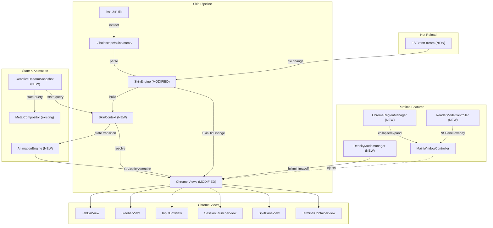
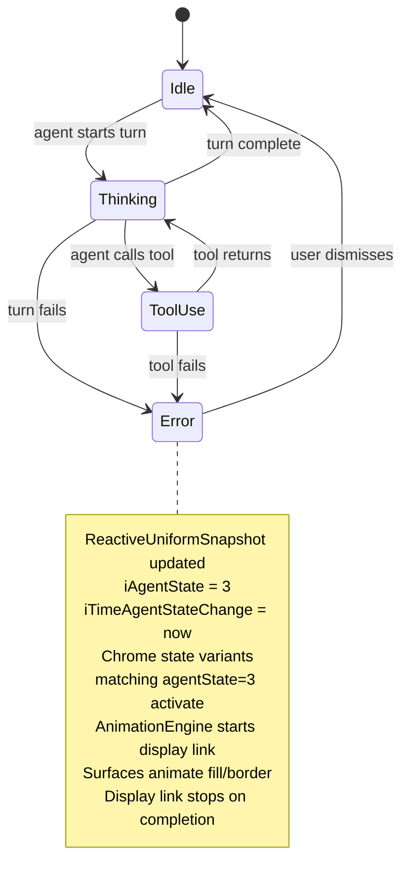

# Design Document: Chrome Skinning System

## Overview

The Chrome Skinning System replaces 32 hardcoded RGB color constants across 6 AppKit view files with a runtime-resolved `SkinContext` that reads from a v2 skin manifest. Chrome views query `SkinContext` by a compile-time `SurfaceKey` enum to resolve their appearance — fills (color/image/gradient), borders, corners, shadows, fonts, and state-reactive variants. Skins are distributed as `.hsk` ZIP archives containing `skin.json` + `assets/` + optional `shaders/`. The system adds four independently collapsible chrome regions (top/right/bottom/left), three density modes (full/minimal/off), a Reader Mode floating pane over a dimmed window, and hot reload via FSEventStream.

The system composes with the existing Metal shader pipeline as two non-overlapping layers: shaders process terminal content inside the viewport (Metal, per-frame); chrome renders outside the viewport (AppKit/CALayer, event-driven). Both share a single `ReactiveUniformSnapshot` as the state source for animations. Zero performance overhead when no skin is active.

## Key Design Decisions

1. **Two-layer architecture: chrome (CALayer) + shader (Metal), non-overlapping, sharing state snapshot.** Rejected alternative: unified Metal rendering for everything. Rejected because (a) AppKit views handle text selection, mouse input, and accessibility natively — replacing them with Metal loses these behaviors; (b) the 23 chrome surfaces already exist as NSView instances with established event handling; (c) Metal excels at per-frame pixel work (shaders) but is overkill for event-driven UI chrome.

2. **Declarative JSON manifest, not compiled scripting.** Rejected alternative: MAKI-style compiled bytecode (Winamp Modern). Rejected because MAKI was undocumented, Windows-only, and architecturally intractable to port — Jordan Eldredge's `webamp-modern` confirmed this. Declarative JSON is human-readable, AI-generable, and requires no compiler toolchain.

3. **Fixed surface keys with optional per-surface descriptors, not freeform layout.** Rejected alternative: Winamp Modern's XML layout (authors place elements at arbitrary x/y). Rejected because (a) fixed surfaces enable "repaint the template" workflow that produced 65k Winamp Classic skins, (b) layout freedom kills community scale, (c) Holoscape's view hierarchy is already fixed by AppKit — the skin can only change how surfaces render, not where they are.

4. **9-slice scaling via CALayer `contentsCenter`, not per-resolution asset variants.** Rejected alternative: ship @1x, @2x, @3x asset variants. Rejected because (a) 9-slice handles arbitrary window sizes from one asset set, (b) modern macOS scales @2x natively for Retina, (c) variants multiply skin archive size without visual benefit.

5. **Same `ReactiveUniformSnapshot` for shader + chrome, not separate event buses.** Rejected alternative: chrome observes AppKit notifications, shader reads Metal uniforms. Rejected because (a) a single state source prevents drift between "what the shader sees" and "what the chrome sees," (b) lock-free atomic snapshots already specified in `docs/skins/05-reactive-uniforms.md` §6.2, (c) chrome animation timestamps need to match shader animation timestamps for cohesive visual response.

6. **Reader Mode as separate NSPanel, not a skin feature.** Rejected alternative: skin manifest declares reader appearance. Rejected because reader mode must work identically regardless of skin — it's an accessibility escape hatch. Making it skinnable would defeat the purpose (a visually chaotic skin could produce an unreadable reader).

7. **Event-driven chrome redraws with display link only during active animations.** Rejected alternative: continuous 60Hz render loop. Rejected because idle chrome should draw zero frames per second. Display link starts on state transition, runs for the longest pending animation duration, stops when complete.

## Architecture



### Request Flow (Happy Path)

The canonical flow: user installs a skin, Holoscape loads it, views render with new appearance.

1. User drops `Holoscape Classic Winamp.hsk` into `~/.holoscape/skins/`. `SkinEngine` detects the new file via FSEventStream.
2. `SkinEngine` unzips the archive into `~/.holoscape/skins/Holoscape Classic Winamp/` and parses `skin.json`.
3. `SkinEngine` validates the manifest: rejects `..` paths, absolute paths, HTTP URLs. Loads v1 color fields and v2 `surfaces` dictionary.
4. `SkinEngine` registers skin fonts via `CTFontManagerRegisterFontsForURL` (process-scoped).
5. `SkinEngine` loads all image assets into memory, caches them per-skin.
6. `SkinEngine` builds a `SkinContext` — for each `SurfaceKey`, resolves the descriptor (merging defaults, v1 fallbacks, v2 overrides, state variants).
7. `SkinEngine` posts `SkinDidChange` notification.
8. `MainWindowController` receives the notification, injects the new `SkinContext` into every chrome view, and triggers a re-layout. Views call `skinContext.resolve(for:)` to get their appearance and apply it via CALayer property setters.

### State Transition Flow (Agent State Changes → Chrome Animation)



## Components and Interfaces

### 1. SkinContext

The runtime object that chrome views query for their appearance. Built once per skin load by `SkinEngine`, immutable after construction. Holds resolved values for every `SurfaceKey`.

**File:** `Sources/Holoscape/Services/SkinContext.swift` (NEW)

```swift
@MainActor
final class SkinContext {
    struct ResolvedSurface {
        let fill: ResolvedFill           // .color(NSColor) | .image(NSImage, TileMode) | .gradient([GradientStop])
        let border: ResolvedBorder?
        let corner: ResolvedCorner
        let padding: NSEdgeInsets
        let shadow: NSShadow?
        let font: NSFont?
        let text: ResolvedText
        let animation: ResolvedAnimation
        let states: [StateVariant]
    }

    let surfaces: [SurfaceKey: ResolvedSurface]
    let reactive: ReactiveUniformSnapshot
    let fontRegistry: [String: CGFont]  // custom fonts loaded from skin assets
    let imageCache: [String: NSImage]   // loaded images keyed by path

    func resolve(_ key: SurfaceKey) -> ResolvedSurface
    func currentState(for key: SurfaceKey) -> ResolvedSurface  // applies matching state variants
    func applyFill(to layer: CALayer, from resolved: ResolvedSurface)
    func applyBorderAndCorner(to layer: CALayer, from resolved: ResolvedSurface)
}
```

### 2. SurfaceKey

Compile-time enum with cases for all 23 chrome surfaces. Catches rename drift at compile time; views reference surfaces by enum case, not string.

**File:** `Sources/Holoscape/Models/SurfaceKey.swift` (NEW)

```swift
enum SurfaceKey: String, CaseIterable {
    case windowTitleBar = "window.titleBar"
    case windowBackground = "window.background"
    case tabBarContainer = "tabBar.container"
    case tabBarTabActive = "tabBar.tab.active"
    case tabBarTabIdle = "tabBar.tab.idle"
    case tabBarTabPermission = "tabBar.tab.permission"
    case tabBarTabNormal = "tabBar.tab.normal"
    case tabBarTabUnreadMarker = "tabBar.tab.unreadMarker"
    case sidebarContainer = "sidebar.container"
    case sidebarRowNormal = "sidebar.row.normal"
    case sidebarRowSelected = "sidebar.row.selected"
    case sidebarRowHover = "sidebar.row.hover"
    case sidebarRowIndicator = "sidebar.row.indicator"
    case sidebarSectionHeader = "sidebar.sectionHeader"
    case inputBoxContainer = "inputBox.container"
    case inputBoxField = "inputBox.field"
    case inputBoxPlaceholder = "inputBox.placeholder"
    case sessionLauncherContainer = "sessionLauncher.container"
    case sessionLauncherRow = "sessionLauncher.row"
    case splitPaneDivider = "splitPane.divider"
    case terminalContainerPadding = "terminalContainer.padding"
    case settingsPanel = "settings.panel"
    case dialogContainer = "dialog.container"
}
```

### 3. SkinEngine (MODIFIED)

Existing service at `Sources/Holoscape/Services/SkinEngine.swift`. Extended to parse v2 manifests, load assets, register fonts, watch the skin directory for hot reload, and build `SkinContext`.

```swift
@MainActor
final class SkinEngine {
    // Existing methods (unchanged):
    func availableSkins() -> [String]
    func loadSkin(named name: String) -> SkinDefinition?
    func apply(skin: SkinDefinition, to config: AppearanceConfig) -> AppearanceConfig

    // New methods:
    func buildSkinContext(from skin: SkinDefinition, skinDirectory: URL) -> SkinContext
    func installHSK(at url: URL) throws  // unzip, validate, register
    func startWatching(skinDirectory: URL)
    func stopWatching()
    private func registerFonts(from fontDirectory: URL) -> [String: CGFont]
    private func loadImages(from assetsDirectory: URL, manifest: SkinDefinition) -> [String: NSImage]
    private func validateAssetPath(_ path: String) throws  // rejects .., absolute, HTTP
}
```

### 4. SkinDefinition (MODIFIED)

Existing model at `Sources/Holoscape/Models/SkinDefinition.swift`. Extended with optional v2 fields.

```swift
struct SkinDefinition: Codable, Equatable, Sendable {
    // Existing v1 fields (unchanged):
    var windowBackground: String?
    var titleBarBackground: String?
    var sidebarBackground: String?
    var tabActiveColor: String?
    var tabInactiveColor: String?
    var textForeground: String?
    var ansiColors: [String]?
    var windowBackgroundImage: String?
    var sidebarBackgroundImage: String?
    var tabBarBackgroundImage: String?

    // New v2 fields:
    var version: String?              // "1.0" or "2.0", defaults to "1.0" when nil
    var name: String?
    var author: String?
    var description: String?
    var surfaces: [String: SurfaceDescriptor]?  // keyed by SurfaceKey raw value
}

struct SurfaceDescriptor: Codable, Equatable, Sendable {
    var fill: FillDescriptor?
    var border: BorderDescriptor?
    var corner: CornerDescriptor?
    var padding: PaddingDescriptor?
    var shadow: ShadowDescriptor?
    var font: FontDescriptor?
    var text: TextDescriptor?
    var animation: AnimationDescriptor?
    var states: [StateVariant]?
}
```

### 5. AnimationEngine

Translates surface animation descriptors into CABasicAnimation / CASpringAnimation instances. Manages a single CADisplayLink that runs only during active transitions.

**File:** `Sources/Holoscape/Services/AnimationEngine.swift` (NEW)

```swift
@MainActor
final class AnimationEngine {
    private var displayLink: CADisplayLink?
    private var activeAnimations: [AnimationID: AnimationState] = [:]

    func animateSurface(_ key: SurfaceKey, to resolved: ResolvedSurface, on layer: CALayer, with descriptor: AnimationDescriptor)
    func startDisplayLinkIfNeeded()
    func stopDisplayLinkIfIdle()
    func suppressAll()  // for Density_Mode.minimal and .off
}
```

### 6. ReactiveUniformSnapshot (NEW — shared with shader card #5945)

Lock-free atomic snapshot shared by chrome and shader layers. Interface defined in `docs/skins/05-reactive-uniforms.md` §6.2.

**File:** `Sources/Holoscape/Services/ReactiveUniformSnapshot.swift` (NEW)

```swift
final class ReactiveUniformSnapshot: @unchecked Sendable {
    // Each field backed by an atomic (lock-free reads from any thread)
    var agentState: Int32 { get set }           // 0=idle, 1=thinking, 2=toolUse, 3=error
    var previousAgentState: Int32 { get set }
    var commandState: Int32 { get set }         // 0=idle, 1=running, 2=completed
    var channelUnread: Int32 { get set }
    var notificationKind: Int32 { get set }
    var timeAgentStateChange: Double { get set } // CFAbsoluteTime bitcast
    var timeLastOutput: Double { get set }
    // ... per 05-reactive-uniforms.md §5

    func stampTransition(_ field: TimestampField)
}
```

### 7. ChromeRegionManager

Manages the four collapsible chrome regions. Animates collapse/expand with 200ms slide, updates terminal viewport size accordingly.

**File:** `Sources/Holoscape/Controllers/ChromeRegionManager.swift` (NEW)

```swift
@MainActor
final class ChromeRegionManager {
    enum Region: CaseIterable { case top, right, bottom, left }

    private(set) var collapsedRegions: Set<Region> = []
    weak var mainWindow: MainWindowController?

    func toggleRegion(_ region: Region)
    func collapseRegion(_ region: Region, animated: Bool = true)
    func expandRegion(_ region: Region, animated: Bool = true)
    func persistState()  // save to HoloscapeConfig
    func restoreState()  // load from HoloscapeConfig
}
```

### 8. DensityModeManager

Manages Full / Minimal / Off runtime modes. Switches affect animation suppression, image loading, and complete skin bypass.

**File:** `Sources/Holoscape/Services/DensityModeManager.swift` (NEW)

```swift
@MainActor
final class DensityModeManager {
    enum Mode: String, Codable { case full, minimal, off }

    private(set) var mode: Mode = .full
    weak var skinEngine: SkinEngine?
    weak var animationEngine: AnimationEngine?

    func setMode(_ newMode: Mode)  // triggers transition under 200ms
    func isSkinActive() -> Bool    // false when mode == .off
    func shouldRenderImages() -> Bool  // false when mode == .minimal (color fills only)
    func shouldAnimate() -> Bool   // false when mode in [.minimal, .off]
}
```

### 9. ReaderModeController

Manages the Reader Mode floating NSPanel. Handles dim/restore of main window, scrollback capture, ANSI stripping.

**File:** `Sources/Holoscape/Controllers/ReaderModeController.swift` (NEW)

```swift
@MainActor
final class ReaderModeController {
    private var panel: NSPanel?
    private weak var mainWindow: NSWindow?
    private var savedAlpha: CGFloat = 1.0
    private var animationsSuppressed: Bool = false

    func activate(for channel: Channel)   // dims main window, shows panel
    func dismiss()                         // restores main window, hides panel
    var isActive: Bool { get }

    private func captureScrollback(from channel: Channel) -> String  // ANSI stripped
    private func dimMainWindow()
    private func restoreMainWindow()
}
```

### 10. Chrome View Modifications

Existing views at `Sources/Holoscape/Views/` are modified to accept `SkinContext` at construction time and resolve colors via `skinContext.currentState(for: .surfaceKey)` instead of static color constants. All 32 hardcoded `NSColor(red:green:blue:alpha:)` literals are removed.

Modified files:
- `Sources/Holoscape/Views/TabBarView.swift` — 9 hardcoded colors → SkinContext resolution
- `Sources/Holoscape/Views/SidebarView.swift` — 18 hardcoded colors → SkinContext resolution
- `Sources/Holoscape/Views/InputBoxView.swift` — 3 hardcoded colors → SkinContext resolution
- `Sources/Holoscape/Views/SessionLauncherView.swift` — 1 hardcoded color → SkinContext resolution
- `Sources/Holoscape/Views/TerminalContainerView.swift` — 1 hardcoded color → SkinContext resolution
- `Sources/Holoscape/Views/SplitPaneView.swift` — 2 hardcoded colors → SkinContext resolution

Each view gains a constructor parameter `skinContext: SkinContext` and observes `SkinDidChange` notification to re-layout.

## Data Models

### SurfaceDescriptor

```swift
struct SurfaceDescriptor: Codable, Equatable, Sendable {
    var fill: FillDescriptor?
    var border: BorderDescriptor?
    var corner: CornerDescriptor?
    var padding: PaddingDescriptor?
    var shadow: ShadowDescriptor?
    var font: FontDescriptor?
    var text: TextDescriptor?
    var animation: AnimationDescriptor?
    var states: [StateVariant]?
}
```

### FillDescriptor

```swift
enum FillDescriptor: Codable, Equatable, Sendable {
    case color(String)                              // "#1a1a2e"
    case image(path: String, tile: TileMode)        // "assets/tab-bg.png", .stretch
    case gradient(direction: GradientDirection, stops: [GradientStop])

    enum TileMode: String, Codable, Sendable { case stretch, tile, ninepatch }
    enum GradientDirection: String, Codable, Sendable { case vertical, horizontal }
}

struct GradientStop: Codable, Equatable, Sendable {
    var offset: Double   // 0.0 to 1.0
    var color: String    // hex
}
```

### BorderDescriptor, CornerDescriptor, PaddingDescriptor, ShadowDescriptor

```swift
struct BorderDescriptor: Codable, Equatable, Sendable {
    var color: String
    var width: Double
}

enum CornerDescriptor: Codable, Equatable, Sendable {
    case uniform(Double)
    case asymmetric(topLeft: Double, topRight: Double, bottomRight: Double, bottomLeft: Double)
}

struct PaddingDescriptor: Codable, Equatable, Sendable {
    var top: Double
    var right: Double
    var bottom: Double
    var left: Double
}

struct ShadowDescriptor: Codable, Equatable, Sendable {
    var color: String
    var opacity: Double
    var blur: Double
    var offsetX: Double
    var offsetY: Double
}
```

### FontDescriptor, TextDescriptor

```swift
struct FontDescriptor: Codable, Equatable, Sendable {
    var family: String
    var size: Double
    var weight: String?   // "regular", "bold", "medium", etc.
}

struct TextDescriptor: Codable, Equatable, Sendable {
    var color: String
    var shadow: ShadowDescriptor?
}
```

### AnimationDescriptor

```swift
struct AnimationDescriptor: Codable, Equatable, Sendable {
    var `default`: CurveDescriptor?
    var fill: CurveDescriptor?
    var corner: CurveDescriptor?
    // other per-property overrides
}

struct CurveDescriptor: Codable, Equatable, Sendable {
    var duration: Double
    var curve: String    // "linear", "easeIn", "easeOut", "easeInOut", "spring"
}
```

### StateVariant

```swift
struct StateVariant: Codable, Equatable, Sendable {
    var name: String
    var match: MatchExpression
    // Any subset of SurfaceDescriptor fields for override:
    var fill: FillDescriptor?
    var border: BorderDescriptor?
    var corner: CornerDescriptor?
    var animation: AnimationDescriptor?
    var text: TextDescriptor?
}

struct MatchExpression: Codable, Equatable, Sendable {
    // Keyed by match key (e.g., "agentState"); value is scalar or operator dict
    var conditions: [String: MatchValue]

    enum MatchValue: Codable, Equatable, Sendable {
        case scalar(Double)              // bare value = $eq shorthand
        case operators([String: Double]) // {"$gte": 1, "$lt": 5}
        case timeSince([String: MatchValue])
    }
}
```

### NinepatchSidecar

```swift
struct NinepatchSidecar: Codable, Equatable, Sendable {
    var stretchX: [Int]   // [startPixel, endPixel]
    var stretchY: [Int]   // [startPixel, endPixel]
}
```

### ChromeRegionState (persisted in HoloscapeConfig)

```swift
struct ChromeRegionState: Codable, Equatable, Sendable {
    var topCollapsed: Bool = false
    var rightCollapsed: Bool = false
    var bottomCollapsed: Bool = false
    var leftCollapsed: Bool = false
    var densityMode: DensityModeManager.Mode = .full
}
```

### State Match Key Mapping

The `State_Match_Expression` evaluates JSON keys from the skin manifest against `ReactiveUniformSnapshot` fields. The GLSL `i` prefix is dropped because JSON has no use for the GLSL naming convention.

| JSON match key | ReactiveUniformSnapshot field | Type | Notes |
|---|---|---|---|
| `agentState` | `iAgentState` | Int | 0=idle, 1=thinking, 2=toolUse, 3=error |
| `previousAgentState` | `iPreviousAgentState` | Int | Same enum as above |
| `commandState` | `iCommandState` | Int | 0=idle, 1=running, 2=completed |
| `previousCommandState` | `iPreviousCommandState` | Int | Same enum as above |
| `lastCommandExitCode` | `iLastCommandExitCode` | Int | Meaningful only when `commandState == 2` |
| `channelId` | `iChannelId` | Int | Stable hash of channel identity |
| `channelIsActive` | `iChannelIsActive` | Int | 0 or 1 |
| `channelUnread` | `iChannelUnread` | Int | Unread count |
| `notificationKind` | `iNotificationKind` | Int | 0=none, 1=info, 2=warn, 3=error |
| `outputEventCount` | `iOutputEventCount` | Int | Monotonic counter |
| `timeSince` | *computed* | Object | Elapsed seconds since a named timestamp uniform (`iTimeAgentStateChange`, `iTimeLastOutput`, `iTimeLastNotification`, `iTimeCommandStart`, `iTimeCommandEnd`) |

## Correctness Properties

### Property 1: V1 skin backward compatibility

*For any* valid `SkinDefinition v1` JSON (containing only the 10 color/image fields, no `version` field, no `surfaces` dictionary), the SkinEngine produces an AppearanceConfig identical to the current v1 behavior.

**Validates: Requirements 1.1, 1.2, 1.3, 1.4**

### Property 2: Asset path sandboxing

*For any* skin manifest, no asset path resolved by SkinEngine escapes the skin's own directory. Specifically: paths containing `..`, absolute paths starting with `/`, and URLs starting with `http://` or `https://` are rejected before any file system access.

**Validates: Requirements 1.5, 1.6**

### Property 3: SurfaceKey exhaustiveness

*For any* chrome view that queries SkinContext, there exists exactly one `SurfaceKey` enum case corresponding to the view's surface. The enum covers all 23 cataloged surfaces with no duplicates and no omissions.

**Validates: Requirement 3.4**

### Property 4: Default fallback

*For any* `SurfaceKey` that has no entry in the active skin's manifest, `SkinContext.resolve(key)` returns the built-in default `ResolvedSurface` (matching the pre-skinning hardcoded values), never nil and never crashing.

**Validates: Requirements 1.7, 3.3**

### Property 5: State variant determinism

*For any* `SurfaceDescriptor` with a `states` array and *any* `ReactiveUniformSnapshot` value, evaluating the state variants produces the same `ResolvedSurface` every time (deterministic given inputs). Last-match-wins (array order) is stable.

**Validates: Requirement 12.4**

### Property 6: Match operator totality

*For any* match expression using only the allowed operators (`$eq`, `$ne`, `$gt`, `$gte`, `$lt`, `$lte`) against valid snapshot values, evaluation produces a boolean result — never throws, never returns nil.

**Validates: Requirement 12.3**

### Property 7: Zero overhead when off

*For any* session where `DensityModeManager.mode == .off` and no skin is loaded, no code path allocates `SkinContext`, no FSEventStream watcher runs, no `CADisplayLink` is created for chrome, and no CALayer image compositing is performed for chrome surfaces.

**Validates: Requirements 10.1, 10.3, 15.1**

### Property 8: Display link idleness

*For any* session where `DensityModeManager.mode ∈ {.full, .minimal}` and no animation is active, the chrome `CADisplayLink` is not running (0 frames per second).

**Validates: Requirements 13.3, 15.4**

### Property 9: Font registration symmetry

*For any* skin that registers fonts via `CTFontManagerRegisterFontsForURL`, unloading the skin deregisters exactly those fonts. No leaked font registrations persist after skin unload.

**Validates: Requirement 8.3**

### Property 10: Ninepatch corner invariance

*For any* image rendered with `tile: ninepatch` and a valid sidecar, the pixel regions outside both `stretchX` and `stretchY` ranges render at 1:1 pixel scale regardless of surface bounds.

**Validates: Requirement 2.3**

### Property 11: Collapsed region layout

*For any* set of collapsed chrome regions, the terminal viewport expands to fill all freed space. Expanding a region shrinks the terminal by exactly the region's content size.

**Validates: Requirements 9.2, 9.3**

### Property 12: Density mode transition time

*For any* transition between density modes (full ↔ minimal ↔ off), the transition completes within 200ms and no intermediate visual state is visible. When Density_Mode is Minimal, only `color` fills are applied — image and gradient fills are suppressed and all animation descriptors are disabled. The current Density_Mode persists across app restarts.

**Validates: Requirements 10.2, 10.4, 10.5**

### Property 13: Hot reload on manifest change

*For any* change to `skin.json` in the active skin directory that produces valid JSON, the SkinContext is rebuilt and `SkinDidChange` is posted within 500ms (200ms debounce + reload). FSEventStream watches the active skin directory from the moment a skin is applied. When `SkinDidChange` fires, all chrome views re-layout and pick up new surface values. On hot reload, cached images from the previous version are released and new images loaded from the updated manifest.

**Validates: Requirements 14.1, 14.2, 14.3, 14.5**

### Property 14: Reader Mode activation latency

*For any* Reader Mode activation, the floating panel is visible and the main window dimmed within 100ms. The panel displays the current channel's scrollback as plain text with ANSI codes stripped. The panel is draggable, resizable, and scrollable with no toolbar or navigation. Console input focus is maintained in the main window while Reader Mode is active.

**Validates: Requirements 11.1, 11.2, 11.3, 11.4**

### Property 15: State snapshot consistency

*For any* state transition triggering chrome animation, the `ReactiveUniformSnapshot` value read by the chrome layer equals the value read by the shader layer at the same timestamp. State_Match_Expressions are evaluated against the current snapshot on every state transition, supporting all specified match keys (`agentState`, `previousAgentState`, `commandState`, `previousCommandState`, `lastCommandExitCode`, `channelId`, `channelIsActive`, `channelUnread`, `notificationKind`, `timeSince`). When multiple states match, they are applied in array order — last matching state wins for each property. When a state transition fires, all affected surfaces animate simultaneously from the same timestamp.

**Validates: Requirements 12.1, 12.2, 12.5, 12.6**

### Property 16: No animation suppression leakage

*For any* transition from Density_Mode Minimal or Off to Full, previously-suppressed animations do not replay — animations only fire on subsequent state transitions.

**Validates: Requirements 13.5, 13.1, 13.2, 13.4**

### Property 17: SkinContext injection and view migration

*For any* chrome view in the 6 modified view files, the view receives a `SkinContext` at construction time via `MainWindowController`. All 32 previously hardcoded `NSColor(red:green:blue:alpha:)` literals are absent from the modified files. When the active skin changes, `SkinContext` is rebuilt within 200ms and all chrome views re-layout with new surface values.

**Validates: Requirements 3.1, 3.2, 3.5, 3.6**

### Property 18: Surface fill and compositing coverage

*For any* chrome surface that declares a `color`, `image`, or `gradient` fill in the manifest, `SkinContext` resolves it to the correct `ResolvedFill` variant and `SkinContext.applyFill(to:from:)` renders it via the correct CALayer property — `backgroundColor` for color fills, `contents` + `contentsCenter` for ninepatch/stretch image fills, and a `CAGradientLayer` for gradient fills. Borders, corners, shadows, and padding are rendered via `borderColor`/`borderWidth`, `cornerRadius`, `shadowColor`/`shadowRadius`/`shadowOffset`, and layout margins respectively.

**Validates: Requirements 2.1, 2.2, 2.4, 2.5, 2.6**

### Property 19: Tab bar, sidebar, and utility surface coverage

*For any* active skin, every `tabBar.*`, `sidebar.*`, `inputBox.*`, `sessionLauncher.*`, `splitPane.*`, `terminalContainer.*`, `window.*`, `settings.*`, and `dialog.*` surface key resolves to a non-nil `ResolvedSurface`. The corresponding AppKit views apply the resolved appearance — font, text color, fill, border, and animation — as declared. Custom fonts shipped in skin assets are applied to tab labels, sidebar entries, and input box placeholder text.

**Validates: Requirements 4.1, 4.2, 4.3, 4.4, 4.5, 5.1, 5.2, 5.3, 5.4, 5.5, 5.6, 5.7, 6.1, 6.2, 6.3, 6.4, 6.5, 6.6, 6.7, 8.5**

### Property 20: Image and font asset pipeline

*For any* skin with image assets, `SkinEngine` loads all PNGs at skin-apply time, caches them in `SkinContext.imageCache`, and releases them on skin unload. `CALayer.contentsScale` is set to `window.backingScaleFactor` for all image layers. Skin fonts are registered process-scoped via `CTFontManagerRegisterFontsForURL` on skin load, searched in `assets/fonts/` when the family is not installed system-wide, and deregistered on unload. Missing or corrupt files fall back to color fill or SF Mono and do not prevent the skin from loading.

**Validates: Requirements 7.1, 7.2, 7.3, 7.4, 7.5, 8.1, 8.2, 8.4**

### Property 21: Chrome region collapse and persistence

*For any* set of collapsed Chrome_Regions, each region animates out with a 200ms ease-out slide, the terminal viewport expands to fill freed space, and the collapsed/expanded state is persisted in `HoloscapeConfig` and restored across app restarts. Skins that declare no assets for a region treat that region as collapsed by default. View menu items exist for toggling each region's visibility.

**Validates: Requirements 9.1, 9.4, 9.5, 9.6**

### Property 22: Performance constraints under active skin

*For any* active skin with Density_Mode Full, chrome redraws occur only on state transitions (not per-frame), all skin assets are loaded synchronously at skin-apply time and total under 10MB, and full skin switching (SkinContext rebuild + view re-layout) completes within 200ms.

**Validates: Requirements 15.2, 15.3, 15.5**

### Property 23: Reference skin completeness

*For any* build of Holoscape, the "Holoscape Classic Winamp" skin is selectable from Appearance Settings without manual installation, renders correctly at 1x and 2x display scales, exercises every v2 `SurfaceDescriptor` feature at least once (image/ninepatch fill, gradient fill, custom font, state-reactive surfaces, animation), and its `skin.json` serves as a usable template for hand-building new skins.

**Validates: Requirements 16.1, 16.2, 16.3, 16.4, 16.5**

### Property 24: Reader Mode dismissal and skin restoration

*For any* Reader Mode dismissal, the main window restores to full brightness, colors re-saturate, and skin animations resume within 100ms. The Reader Mode panel renders the system default monospace font at 14pt minimum regardless of the active skin's font settings. A menu item and keyboard shortcut exist for toggling Reader Mode.

**Validates: Requirements 11.5, 11.6, 11.7**

### Property 25: Hot reload error resilience

*For any* hot reload that produces invalid JSON, the previous valid `SkinContext` remains active — no revert to bare defaults, no crash. The error is logged; no error is surfaced to the user.

**Validates: Requirements 14.4, 10.6**

## Error Handling

### Error Handling Principles

1. **Never crash on skin errors.** A malformed skin produces warnings and falls back to defaults. Holoscape remains usable.
2. **Log every failure, surface none to the user.** Skin errors are developer-facing, not user-facing. The user sees "the skin didn't load," not a stack trace.
3. **Preserve previous state on reload failure.** If a hot reload produces invalid JSON, the previous valid SkinContext stays active.
4. **Reject unsafe assets deterministically.** Path traversal, absolute paths, and URLs are rejected before any file system access — no time-of-check/time-of-use races.
5. **Fail fast at skin load, not at render time.** Missing images and fonts are detected at skin-apply time; at render time, we know every resource is cached and valid.

### SkinEngine Failures

- **Invalid JSON in `skin.json`**: log the parse error with line/column, skip the skin, continue with previously loaded skin or built-in defaults. The skin is not added to the picker list.
- **Missing required fields (e.g., `version` with no matching schema)**: log the missing field, attempt best-effort load as v1, mark the skin as "partial."
- **Path traversal in asset reference (`..`)**: log security warning with the offending path, reject the skin entirely. Do not attempt partial load.
- **Absolute path in asset reference**: log security warning, reject the skin entirely.
- **HTTP/HTTPS URL in asset reference**: log security warning, reject the skin entirely.
- **Skin directory disappeared (deleted while loaded)**: log warning, unload the skin, revert to defaults. FSEventStream handles this case.

### Image Loading Failures

- **Referenced image file missing**: log warning with path, fall back to the surface's color fill (or built-in default color if no color fill defined).
- **Corrupt PNG (fails NSImage init)**: log error with path, fall back to color fill.
- **Ninepatch sidecar missing for `tile: "ninepatch"` fill**: log warning, fall back to `tile: "stretch"` rendering.
- **Ninepatch sidecar has invalid ranges (stretchX[0] >= stretchX[1])**: log error, fall back to `tile: "stretch"`.

### Font Loading Failures

- **Referenced font file missing**: log warning, fall back to system default monospace font (SF Mono).
- **CTFontManagerRegisterFontsForURL fails**: log the CT error code, fall back to system default.
- **Font file corrupt**: log error, fall back to system default. The skin remains loadable.

### State Evaluation Failures

- **Unknown match key (not in the allowed set)**: log warning, skip that state variant, continue evaluating remaining states.
- **Unknown match operator (not in `$eq`, `$ne`, `$gt`, `$gte`, `$lt`, `$lte`)**: log warning, skip that match condition, continue.
- **Type mismatch (match value wrong type for key)**: log warning, skip that match condition, continue.

### Reader Mode Failures

- **Scrollback capture fails (channel disconnected)**: log warning, display "Reader Mode unavailable — channel disconnected" in the panel.
- **Main window dim animation fails**: log warning, apply final alpha instantly without animation.

### Hot Reload Failures

- **FSEventStream initialization fails**: log error, disable hot reload for the session. Skin can still be changed via Appearance Settings.
- **Debounce timer fires but file changed back to invalid**: log warning, keep previous SkinContext active, no error shown to user.

## Testing Strategy

### Unit Tests

Unit tests at `Tests/HoloscapeTests/Unit/` cover:

- `SkinDefinitionV2Tests.swift` — v1/v2 codable round-trip, missing fields, unknown fields (ignored for forward compat)
- `SurfaceDescriptorTests.swift` — all descriptor fields, enum encoding/decoding, nested state variants
- `SurfaceKeyTests.swift` — enum exhaustiveness (all 23 cases), raw value stability, CaseIterable coverage
- `SkinContextResolutionTests.swift` — default fallback, v1→v2 merge semantics, state variant evaluation
- `FillDescriptorTests.swift` — color/image/gradient variants, TileMode values
- `MatchExpressionTests.swift` — all operators, bare scalar shorthand, multi-key AND semantics, timeSince
- `NinepatchSidecarTests.swift` — load from JSON, invalid ranges rejected
- `AnimationEngineTests.swift` — display link start/stop, animation completion callbacks, suppression in minimal mode
- `ChromeRegionManagerTests.swift` — collapse/expand, persistence round-trip
- `DensityModeManagerTests.swift` — mode transitions, animation suppression, skin bypass
- `ReaderModeControllerTests.swift` — activation/dismissal, ANSI stripping, scrollback capture
- `ReactiveUniformSnapshotTests.swift` — atomic reads from multiple threads, timestamp stamping

### Property-Based Tests

Property tests at `Tests/HoloscapePropertyTests/` using SwiftCheck:

- **Property 1 (V1 compat):** Generate 100 random v1 manifests, decode, verify AppearanceConfig output matches legacy SkinEngine.apply output byte-for-byte.
- **Property 2 (path sandboxing):** Generate random path strings including `..`, absolute, HTTP URLs; verify validator rejects every unsafe pattern.
- **Property 5 (state determinism):** Generate random (surface, snapshot) pairs, evaluate state variants 10 times each, verify identical results.
- **Property 6 (operator totality):** Generate match expressions with all valid operators and random operand types; verify no crashes, no nils.
- **Property 7 (zero overhead):** Start Holoscape with `densityMode == .off`, verify zero SkinContext allocations and zero FSEventStream watchers via memory graph inspection.

### Integration Tests

Integration tests at `Tests/HoloscapeTests/Integration/`:

- **End-to-end skin load:** Place a test `.hsk` file in a temp directory, invoke SkinEngine.installHSK, verify the skin appears in availableSkins(), load it, verify SkinContext has all expected surfaces resolved.
- **Hot reload flow:** Load a test skin, modify its `skin.json`, verify SkinContext is rebuilt within 500ms via FSEventStream.
- **Chrome view migration:** Load a skin that overrides every chrome surface, verify each of the 6 chrome view files renders with the overridden appearance (no hardcoded colors bleeding through).
- **Density mode transitions:** Cycle through full → minimal → off → full, verify transition completes under 200ms each direction and views render correctly.
- **Reader Mode with active skin:** Load a skin, activate reader mode, verify main window dims within 100ms and scrollback appears in panel; dismiss and verify restoration.

### Test Infrastructure

Tests run via `swift test` against the HoloscapeTests target. No external services required — all tests run in-process against the macOS SDK.

- **Test fixtures:** `Tests/HoloscapeTests/Fixtures/skins/` contains hand-authored test skins (`v1-minimal.hsk`, `v2-complete.hsk`, `v2-with-ninepatch.hsk`, `v2-with-states.hsk`, `invalid-traversal.hsk`) used by unit and integration tests.
- **Temporary directories:** Tests requiring filesystem operations use `FileManager.default.temporaryDirectory` with per-test UUID subdirectories, cleaned up in tearDown.
- **Offscreen rendering:** Chrome view rendering tests use `NSView.cacheDisplay(in:to:)` to render offscreen and sample pixel colors via `NSBitmapImageRep`. No window required.
- **CI shape:** Tests run on every PR via GitHub Actions. Unit and property tests run in parallel; integration tests run serially due to shared filesystem fixtures. All tests must pass to merge. No network access in CI — all tests are hermetic.
- **SwiftCheck fixture generators:** `Tests/HoloscapePropertyTests/Generators/` contains Gen<SkinDefinition>, Gen<SurfaceDescriptor>, Gen<MatchExpression> generators for property tests.

### Test Organization

```
Tests/
├── HoloscapeTests/
│   ├── Unit/
│   │   ├── SkinDefinitionV2Tests.swift
│   │   ├── SurfaceDescriptorTests.swift
│   │   ├── SurfaceKeyTests.swift
│   │   ├── SkinContextResolutionTests.swift
│   │   ├── FillDescriptorTests.swift
│   │   ├── MatchExpressionTests.swift
│   │   ├── NinepatchSidecarTests.swift
│   │   ├── AnimationEngineTests.swift
│   │   ├── ChromeRegionManagerTests.swift
│   │   ├── DensityModeManagerTests.swift
│   │   ├── ReaderModeControllerTests.swift
│   │   └── ReactiveUniformSnapshotTests.swift
│   ├── Integration/
│   │   ├── SkinLoadE2ETests.swift
│   │   ├── HotReloadTests.swift
│   │   ├── ChromeViewMigrationTests.swift
│   │   ├── DensityModeTransitionTests.swift
│   │   └── ReaderModeIntegrationTests.swift
│   └── Fixtures/
│       └── skins/
│           ├── v1-minimal.hsk
│           ├── v2-complete.hsk
│           ├── v2-with-ninepatch.hsk
│           ├── v2-with-states.hsk
│           └── invalid-traversal.hsk
└── HoloscapePropertyTests/
    ├── Generators/
    │   ├── SkinDefinitionGen.swift
    │   ├── SurfaceDescriptorGen.swift
    │   └── MatchExpressionGen.swift
    └── Tests/
        ├── V1CompatibilityPropertyTests.swift
        ├── PathSandboxingPropertyTests.swift
        ├── StateDeterminismPropertyTests.swift
        ├── OperatorTotalityPropertyTests.swift
        └── ZeroOverheadPropertyTests.swift
```
