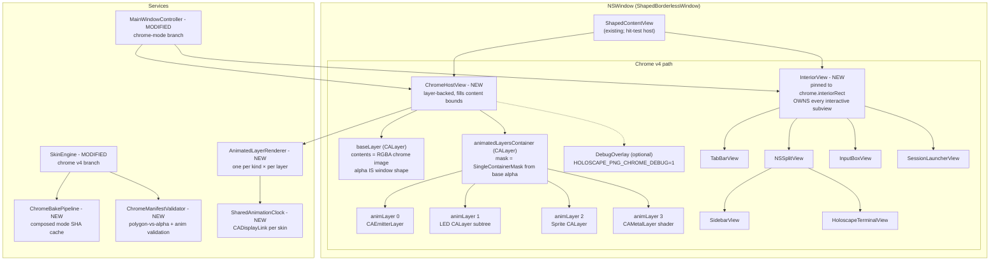
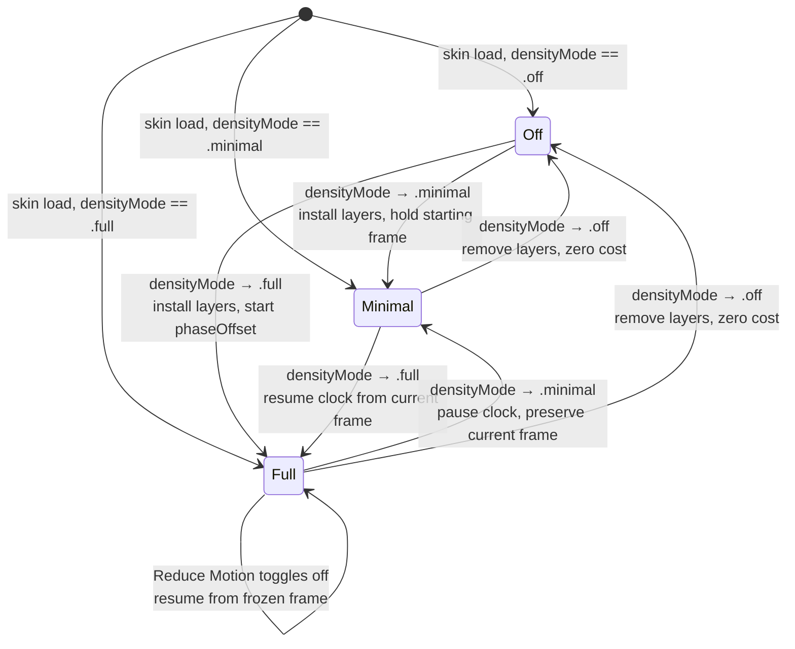

# Design Document: PNG-Alpha Chrome with Animated Compositing Host

## Overview

This design replaces Amplify v1's `CALayer.mask` shape path with a **single alpha-aware compositing host** — `ChromeHostView` — that owns every visible pixel of a shaped Holoscape window via a static RGBA base image's alpha channel, plus zero-to-many `CALayer`-based animated sublayers composited on top and clipped to the base alpha. A sibling `InteriorView`, pinned to `chrome.interiorRect`, owns every piece of app content; app content lives inside the chrome silhouette by construction, not by masking. The architecture extends to a live compositor vocabulary of four declarative animated-layer kinds (particle emitter, LED array, sprite animation, shader preset) so the chrome is first-class animated, not just statically shaped. Everything the Amplify v1 pipeline ships (`.wamp` bundles, sprite engine, font pipeline, polygon hit testing, drag regions, warning banner, skin picker, hot reload) is preserved; only the window-shape rendering path is replaced, with the old `CA-mask` code deleted in the final PR after every in-tree shaped skin has migrated.

## Key Design Decisions

1. **One alpha-aware compositing host owns every chrome pixel.** `ChromeHostView.layer` carries the static `baseLayer` (alpha IS the window silhouette) plus z-ordered animated sublayers. Nothing else writes chrome pixels. Rejected: per-view chrome fragments (Amplify v1's approach), because every new interactive subview's `layer.backgroundColor` can bypass an ancestor mask per `docs/research/shaped-window-transparency-findings.md`. Single renderer makes the correctness invariant mechanical.
2. **InteriorView is the sole parent of app content.** Adding a new subview (status bar, new pane) goes inside InteriorView by convention; the view's frame equals `chrome.interiorRect`, so content is inside the silhouette by construction. Rejected: subclass `NSView` for every chrome piece and make them shape-aware, because that makes every future feature pay the shape tax.
3. **Single container mask over all animated layers.** Rejected per-layer masking because the convex / compound-polygon case can be clipped by one shared `CAShapeLayer` (or alpha-derived mask) on the animated-layer parent, which is cheaper, simpler, and deterministic. FR-21 in the PRD resolves this decision.
4. **Composed-mode bake at load time, not build time.** Walk v3 surfaces + sprites + ninepatches, draw into a `CGContext`, SHA the inputs, cache the RGBA PNG at `~/Library/Caches/holoscape-skins/<sha>.png`. Load time matches authoring ergonomics (edit, reload, see); build time would require a build-graph step per skin and break hot reload. Cache keeps warm reloads free.
5. **windowShape.polygons stays as the hit-test + drag-region source of truth.** Polygon point-in-polygon is fast, already works, and is much simpler than alpha sampling. The `ChromeManifestValidator` cross-checks polygon bounds against base image alpha bounds with ±2px tolerance; mismatch shows Skin_Warning_Banner.
6. **Animated-layer vocabulary is bounded and declarative.** Four kinds (particle / LED / sprite-anim / shader) with kind-discriminated params. No Lua, no JS, no Maki. Adding a fifth kind requires PRD amendment + spec update. Authors, reviewers, and future Claudes all keep the vocabulary in their head.
7. **Shared animation clock.** One `CADisplayLink` per skin, driving phase time for LED arrays and sprite animations. Keeps layers mutually in phase and avoids N `CADisplayLink` instances per skin.
8. **Shader presets are built-ins, not author-shipped code.** `glow`, `scanlines`, `noise` ship as `.metal` sources in the app bundle, compiled at build time. Sandboxes the shader surface; arbitrary user shaders are post-MVP (PRD Post-MVP §13).
9. **Old-path deletion is the last PR.** `ShapedWindowController.buildMaskLayer`, `WindowDragOverlay`, polygon scaling + `windowDidResizeForShape`, and `writeShapeDiagnostic` delete in PR #20 only, after every in-tree shaped skin migrates and animations are verified live.
10. **First PR is a transparency prototype.** Before writing any of the machinery above, PR #1 installs a known-good alpha PNG on a borderless window to prove AppKit honors per-pixel alpha. Risk #1 mitigation; gates everything else.

## Architecture



### Changes from Previous Architecture

- **New**: `ChromeHostView` at `Sources/Holoscape/Views/ChromeHostView.swift` — layer-backed NSView owning Base_Layer + animated-layer subtree.
- **New**: `InteriorView` at `Sources/Holoscape/Views/InteriorView.swift` — pinned to `chrome.interiorRect`, sole parent of app content.
- **New**: `ChromeBakePipeline` at `Sources/Holoscape/Services/ChromeBakePipeline.swift` — walks v3 surfaces, draws into `CGContext`, writes SHA-keyed cache at `~/Library/Caches/holoscape-skins/<sha>.png`.
- **New**: `ChromeManifestValidator` at `Sources/Holoscape/Services/ChromeManifestValidator.swift` — polygon-vs-alpha cross-check + animated-layer manifest validation.
- **New**: `AnimatedLayerRenderer` at `Sources/Holoscape/Services/AnimatedLayerRenderer.swift` — protocol + four concrete renderers (particle, LED, sprite, shader).
- **New**: `SharedAnimationClock` at `Sources/Holoscape/Services/SharedAnimationClock.swift` — single `CADisplayLink` per active skin feeding phase time to every LED + sprite layer.
- **New**: `ChromeDebugOverlay` at `Sources/Holoscape/Views/ChromeDebugOverlay.swift` — opt-in debug renderer behind `HOLOSCAPE_PNG_CHROME_DEBUG=1`.
- **Modified**: `SkinEngine.swift` — adds Chrome_Mode_Branch to `loadComposite`, resolves `chrome` field, delegates to `ChromeBakePipeline` for composed-mode skins.
- **Modified**: `MainWindowController.swift` — `applySkin` branches on `manifest.chrome`; when present, installs `ChromeHostView` + `InteriorView` and skips old `applyWindowShape` CA-mask path.
- **Modified**: `AmplifyDescriptors.swift` — adds `ChromeDescriptor`, `SkinRect`, `ChromeAnimationLayer`, `ParticleParams`, `LedArrayParams`, `SpriteAnimParams`, `ShaderParams`.
- **Modified**: `SkinDefinition.swift` — adds `chrome: ChromeDescriptor?` v4 field.
- **Modified**: `ShapedContentView.swift` — accepts either `ChromeHostView` + `InteriorView` children (v4) or legacy subview tree (pre-v4); `hitTest(_:)` continues to delegate to `HitRegionSampler`.
- **Preserved verbatim**: `HitRegionSampler`, `DragRegionTracker`, `ShapedBorderlessWindow`, `WampBundleLoader`, `SkinContext`, sprite engine, font pipeline, bundle cache, skin picker, hot reload debouncer, `SkinWarningBanner`, `isReleasedWhenClosed = false` fix.
- **Deleted in PR #20**: `ShapedWindowController.buildMaskLayer`, `WindowDragOverlay`, polygon scaling helpers, `windowDidResizeForShape` observer, `writeShapeDiagnostic`.

### Request Flow (Happy Path — v4 Composed Mode with Animations)

1. The user picks `HoloscapeClassic` from the Appearance Settings skin picker.
2. `MainWindowController.reloadSkin(named:)` calls `SkinEngine.loadComposite(named:)`.
3. `SkinEngine` reads `skin.json`, decodes it as `SkinDefinition` v4, sees `chrome.mode == .composed`, and invokes `ChromeBakePipeline.bake(manifest:, skinDir:)`.
4. `ChromeBakePipeline` computes the SHA-256 over `{skin.json bytes + every referenced surface/sprite/ninepatch asset's bytes}`, checks `~/Library/Caches/holoscape-skins/<sha>.png`; on miss, composites a `CGContext` at `(width * 2, height * 2)` pixels, writes the PNG, reads it back as a `CGImage`.
5. `SkinEngine` invokes `ChromeManifestValidator.validate(manifest:baseImage:)`; the validator cross-checks `windowShape.polygons` bounds vs base image alpha bounds (±2px tolerance), validates every Chrome_Animation_Layer_Descriptor, and returns a `ChromeValidationResult` with optional warning reason.
6. `SkinEngine` returns a `LoadedSkin` carrying the base image, validated `ChromeDescriptor`, every other v3-era piece (fonts, sprites, ninepatches), and optional `validationBannerReason`.
7. `MainWindowController.applySkin(_:)` sees `loaded.chrome` is non-nil, enters the Chrome_Mode_Branch: tears down any existing CA-mask state, configures the window as `.borderless` + `isOpaque = false` + `.clear` background + `hasShadow = false`, installs `ChromeHostView` as the sole child of `ShapedContentView`.
8. `MainWindowController` creates `InteriorView` pinned to `chrome.interiorRect`, re-parents the entire app-content subtree (TabBar, SplitView, Sidebar, Terminal, InputBox, SessionLauncher) from `ShapedContentView` to `InteriorView`.
9. `ChromeHostView` assigns the base image to `baseLayer.contents` and iterates `chrome.animations`, instantiating one `AnimatedLayerRenderer` per layer, installed as sublayers of `animatedLayersContainer` in ascending z order.
10. `ChromeHostView` derives a `SingleContainerMask` from base image alpha and assigns it as `animatedLayersContainer.mask`.
11. `SharedAnimationClock` starts a `CADisplayLink` and feeds vsync-paced phase time to every LED + sprite renderer; `CAEmitterLayer` and `CAMetalLayer` drive themselves.
12. `HitRegionSampler` is rebuilt from `windowShape.polygons` and injected into `ShapedContentView`; `DragRegionTracker` is rebuilt from `dragRegions` and `NSWindow.isMovableByWindowBackground = true` covers the bare-Base_Layer drag case.
13. If `validationBannerReason` is non-nil, `SkinWarningBanner` fades in with the reason string.
14. First paint completes within the 500 ms cold-bake budget or 30 ms warm-cache budget (Requirement 5.7, 5.8).

### State Machine — Density Mode Transitions for Animated Layers



## Components and Interfaces

### 1. ChromeHostView

```swift
@MainActor
final class ChromeHostView: NSView {
    private let baseLayer: CALayer
    private let animatedLayersContainer: CALayer
    private(set) var renderers: [AnimatedLayerRenderer]
    private var containerMask: CAShapeLayer?
    private weak var clock: SharedAnimationClock?

    init(chrome: ChromeDescriptor, baseImage: CGImage, clock: SharedAnimationClock)
    func installAnimatedLayers(_ descriptors: [ChromeAnimationLayer])
    func updateBaseImage(_ image: CGImage)
    func diffAnimatedLayers(_ next: [ChromeAnimationLayer])   // hot reload by id
    func setDensityMode(_ mode: DensityMode)
    func freezeForReduceMotion()
    func resumeFromReduceMotion()
    override var isFlipped: Bool { true }  // top-left coords to match chrome image
    override var acceptsFirstResponder: Bool { false }
    override func hitTest(_ point: NSPoint) -> NSView? { nil }  // never receive events
}
```

### 2. InteriorView

```swift
@MainActor
final class InteriorView: NSView {
    let interiorRect: SkinRect              // in chrome-image top-left coords
    private var interiorMask: CAShapeLayer? // non-nil only when chrome.interiorPath != nil

    init(rect: SkinRect, interiorPath: [Polygon]?)
    func updateInteriorPath(_ path: [Polygon]?)
    override func layout()   // asserts self.frame == computedFrameFromInteriorRect
}
```

### 3. ChromeBakePipeline

```swift
@MainActor
final class ChromeBakePipeline {
    let cacheRoot: URL           // ~/Library/Caches/holoscape-skins/

    init(cacheRoot: URL = FileManager.default.cachesDirectory.appendingPathComponent("holoscape-skins"))
    func bake(manifest: SkinDefinition, skinDir: URL) async throws -> (image: CGImage, sha: String)
    func cachedImage(for sha: String) -> CGImage?
    func purgeLRU(preservingSHAs: Set<String>) throws   // honors 50 MB cap with .wamp cache

    enum BakeError: Error {
        case compositingFailed(String)
        case cacheWriteFailed(URL)
        case cacheReadFailed(URL, Error)
    }
}
```

### 4. ChromeManifestValidator

```swift
struct ChromeValidationResult {
    let valid: Bool
    let warningReason: String?                 // feeds SkinWarningBanner
    let disabledAnimationIDs: Set<String>      // layers that failed validation and are dropped
    let polygonAlphaDeltaPixels: Int           // 0 = perfect agreement
}

@MainActor
enum ChromeManifestValidator {
    static func validate(
        manifest: SkinDefinition,
        baseImage: CGImage,
        windowShape: WindowShapeDescriptor?
    ) -> ChromeValidationResult
}
```

### 5. AnimatedLayerRenderer

```swift
@MainActor
protocol AnimatedLayerRenderer: AnyObject {
    var id: String { get }
    var z: Int { get }
    var layer: CALayer { get }
    func install(in parent: CALayer)
    func updateParams(_ params: ChromeAnimationLayer.Params)
    func tick(phaseSeconds: Double)            // called from SharedAnimationClock
    func pause()
    func resume()
    func uninstall()
}

@MainActor final class ParticleLayerRenderer: AnimatedLayerRenderer { /* CAEmitterLayer-backed */ }
@MainActor final class LEDArrayLayerRenderer: AnimatedLayerRenderer { /* CALayer subtree */ }
@MainActor final class SpriteAnimLayerRenderer: AnimatedLayerRenderer { /* contentsRect UV */ }
@MainActor final class ShaderPresetLayerRenderer: AnimatedLayerRenderer { /* CAMetalLayer */ }
```

### 6. SharedAnimationClock

```swift
@MainActor
final class SharedAnimationClock {
    private var displayLink: CADisplayLink?
    private var subscribers: [WeakRenderer] = []
    private var paused: Bool = false

    func subscribe(_ renderer: AnimatedLayerRenderer)
    func unsubscribe(_ renderer: AnimatedLayerRenderer)
    func start()
    func stop()
    func pause()     // Reduce Motion / density .minimal
    func resume()
    var phaseSeconds: Double { CACurrentMediaTime() }   // used for tick delivery
}
```

### 7. ChromeDebugOverlay

```swift
@MainActor
final class ChromeDebugOverlay: NSView {
    init(chrome: ChromeDescriptor, windowShape: WindowShapeDescriptor?, renderers: [AnimatedLayerRenderer])
    func refresh(phaseSeconds: Double)
    override func draw(_ dirtyRect: NSRect)
    static var isEnabled: Bool { ProcessInfo.processInfo.environment["HOLOSCAPE_PNG_CHROME_DEBUG"] == "1" }
}
```

### 8. SkinEngine (Modified)

```swift
// Existing class extended with chrome v4 branch. New/changed surface only:
@MainActor
final class SkinEngine {
    let bakePipeline: ChromeBakePipeline

    // loadComposite gains:
    // - decode manifest.chrome
    // - on .composed: invoke bakePipeline.bake
    // - on .baked: decode chrome.image (or chrome.imageOpaque under Reduce Transparency)
    // - invoke ChromeManifestValidator.validate
    // - pack ChromeDescriptor + baseImage + validation warning into LoadedSkin
}
```

### 9. MainWindowController (Modified — Chrome_Mode_Branch)

```swift
// Existing class extended. New/changed methods:
extension MainWindowController {
    fileprivate func applyChromeSkin(_ loaded: LoadedSkin)
    fileprivate func tearDownOldCAMaskPath()       // removed in PR #20
    fileprivate func installChromeHostView(chrome: ChromeDescriptor, baseImage: CGImage) -> ChromeHostView
    fileprivate func installInteriorView(interiorRect: SkinRect, interiorPath: [Polygon]?) -> InteriorView
    fileprivate func reparentAppContent(into: InteriorView)
    fileprivate func updateDensityModeOnChrome(_ mode: DensityMode)
    fileprivate func handleReduceMotionChange()
}
```

### 10. ChromeDescriptor + Animation Descriptors (Data Model Additions)

See `AmplifyDescriptors.swift` extensions below — full definitions in "Data Models" section.

### 11. ShapedContentView (Modified)

```swift
// Hit-test path unchanged — continues to consult HitRegionSampler.
// New behavior: `hitTest(_:)` returns ChromeHostView.hitTest() == nil and delegates
// into InteriorView's subtree for inside-silhouette points.
@MainActor
final class ShapedContentView: NSView {
    var sampler: HitRegionSampler?
    var dragRegionTracker: DragRegionTracker?
    var chromeHostView: ChromeHostView?       // NEW
    var interiorView: InteriorView?           // NEW
    override func hitTest(_ point: NSPoint) -> NSView?
    override func layout()                    // pins chromeHostView to bounds, interiorView to interiorRect
}
```

## Data Models

### ChromeDescriptor (new, additive to AmplifyDescriptors.swift)

```swift
struct ChromeDescriptor: Codable, Equatable, Sendable {
    enum Mode: String, Codable, Sendable { case baked, composed }

    let mode: Mode
    let image: String?                 // required when mode == .baked; bundle-relative
    let imageOpaque: String?           // Reduce Transparency variant; optional
    let width: Int                     // logical points; equals nominal window width
    let height: Int                    // logical points
    let interiorRect: SkinRect         // top-left origin in chrome-image coords
    let interiorPath: [Polygon]?       // concave interiors only
    let animations: [ChromeAnimationLayer]?
}

struct SkinRect: Codable, Equatable, Sendable {
    let x: Double
    let y: Double
    let width: Double
    let height: Double
}
```

### ChromeAnimationLayer (new)

```swift
struct ChromeAnimationLayer: Codable, Equatable, Sendable {
    enum Kind: String, Codable, Sendable {
        case particle, ledArray, spriteAnim, shader
    }

    let id: String                     // unique within chrome.animations
    let kind: Kind
    let rect: SkinRect                 // bounds in chrome-image coords
    let z: Int                         // z-order; base layer has implicit z = 0; must be > 0
    let phaseOffset: Double?           // seconds, default 0
    let speedMultiplier: Double?       // default 1.0
    let params: Params

    struct Params: Codable, Equatable, Sendable {
        let particle: ParticleParams?
        let ledArray: LedArrayParams?
        let spriteAnim: SpriteAnimParams?
        let shader: ShaderParams?
    }
}
```

### ParticleParams / LedArrayParams / SpriteAnimParams / ShaderParams (new)

```swift
struct ParticleParams: Codable, Equatable, Sendable {
    let birthRate: Double
    let lifetime: Double
    let lifetimeRange: Double?
    let velocity: Double
    let velocityRange: Double?
    let emissionAngle: Double          // radians
    let emissionRange: Double          // radians
    let color: String                  // "#rrggbbaa"
    let colorRange: String?
    let scale: Double
    let scaleRange: Double?
    let image: String?                 // bundle-relative sprite
    let blendMode: BlendMode?

    enum BlendMode: String, Codable, Sendable { case normal, additive, screen }
}

struct LedArrayParams: Codable, Equatable, Sendable {
    let cellSize: Double
    let cells: [LedCell]
    let palette: [String]              // hex colors
    let pattern: Pattern

    struct LedCell: Codable, Equatable, Sendable {
        let x: Double
        let y: Double
        let defaultState: Int
    }

    enum Pattern: Codable, Equatable, Sendable {
        case steady
        case blink(hz: Double, duty: Double)
        case phased(hz: Double)
        case random(hz: Double, density: Double)
        case marquee(cellsPerSecond: Double, windowSize: Int)
    }
}

struct SpriteAnimParams: Codable, Equatable, Sendable {
    let sheet: String
    let gridRows: Int
    let gridCols: Int
    let frameCount: Int
    let fps: Double
    let loop: Loop

    enum Loop: String, Codable, Sendable { case loop, pingPong, once }
}

struct ShaderParams: Codable, Equatable, Sendable {
    enum Preset: String, Codable, Sendable { case glow, scanlines, noise }

    let preset: Preset
    let color: String?
    let intensity: Double?
    let hz: Double?
}
```

### SkinDefinition v4 extension

```swift
// Existing SkinDefinition struct gains:
var chrome: ChromeDescriptor?   // present: v4 chrome path; absent: pre-v4 path
```

### LoadedSkin extension

```swift
// Existing LoadedSkin struct gains:
let chrome: ChromeDescriptor?
let baseImage: CGImage?          // non-nil when chrome != nil; cached/baked
let baseImageOpaque: CGImage?    // non-nil when Reduce Transparency active + imageOpaque declared
let chromeValidation: ChromeValidationResult?
```

## Correctness Properties

### Property 1: Subview Addition Cannot Break Window Shape

*For any* NSView subtree added by a future feature (status bar, new pane, inspector), if the subtree is parented under `InteriorView`, the window silhouette rendered via `baseLayer.alpha` is unchanged.

**Validates: Requirements 2.4, 2.5**

### Property 2: Chrome Base Image Alpha Equals Window Alpha

*For any* pixel `(x, y)` in the window's content rect where a v4 chrome skin is active, the window's composited alpha at `(x, y)` equals `baseLayer.alpha(x, y)` within rendering tolerance (`|window.alpha - base.alpha| < 1/255`), ignoring optional animated-layer contributions inside the silhouette.

**Validates: Requirements 3.2, 3.3, 3.4**

### Property 3: InteriorView Frame Tracks interiorRect Exactly

*For any* layout pass (initial, resize, skin swap, hot reload), `InteriorView.frame` in `ShapedContentView` coordinates is equal to `chrome.interiorRect` converted from top-left to AppKit bottom-left, with zero pixel drift.

**Validates: Requirements 2.3, 2.8**

### Property 4: Polygon vs Alpha Bounds Agree Within ±2 Logical Pixels

*For any* loaded v4 chrome skin, the bounding box of `windowShape.polygons` and the non-zero-alpha bounding box of `baseLayer` differ by at most 2 logical pixels in each of `(minX, minY, maxX, maxY)`.

**Validates: Requirements 4.1, 4.2, 12.1, 12.2**

### Property 5: SHA Cache Is Deterministic

*For any* two composed-mode skins with byte-identical manifest JSON and byte-identical asset bytes, `ChromeBakePipeline.bake` produces byte-identical output PNGs, with identical SHA-256 hashes, independent of system clock, randomness, or thread scheduling.

**Validates: Requirements 5.2, 5.3, 5.4, 5.5**

### Property 6: Backward Compatibility Matrix Holds Across Six Lanes

*For any* of {v2 directory, v2 .wamp, v3 directory, v3 .wamp, v4 composed directory (no anim), v4 composed .wamp (no anim), v4 baked directory (no anim), v4 baked .wamp (no anim), v4 composed with every MVP animation kind, v4 baked with every MVP animation kind}, `SkinEngine.loadComposite` produces a `LoadedSkin` that renders without throwing and passes every `BackwardCompatIntegrationTests` assertion appropriate to the lane.

**Validates: Requirements 16.1, 16.2, 16.3, 16.4, 16.5**

### Property 7: Animated Layer Clip Invariant

*For any* Animated_Chrome_Layer at any phase time and any density mode != `.off`, no pixel is rendered in the window's composited output where `baseLayer.alpha(x, y) == 0`.

**Validates: Requirements 10.1, 10.2, 15.4**

### Property 8: Animation Frame Budget Held

*For any* 30-second window of normal Holoscape use (typing, scrolling, pane switches) on an Apple Silicon M1 or later, the aggregate wall-clock time spent inside the `os_signpost` region wrapping the compositor commit phase for animated chrome layers does not exceed 8 ms per 16.6 ms frame for more than 1% of frames.

**Validates: Requirements 11.1, 11.2, 11.3**

### Property 9: Phase Offset + Speed Multiplier Are Deterministic

*For any* Animated_Chrome_Layer of kind `.ledArray` or `.spriteAnim` with declared `phaseOffset` `P` and `speedMultiplier` `S`, the layer's state at wall-clock time `t` is determined exactly by `phase(t) = (CACurrentMediaTime() - skinLoadTime + P) * S`; replaying the same phase value after a force-reset reproduces the identical cell states / sprite frame.

**Validates: Requirements 7.10, 8.7**

### Property 10: Reduce Motion Freezes But Does Not Hide

*For any* Animated_Chrome_Layer active under a v4 chrome skin, when `NSWorkspace.shared.accessibilityDisplayShouldReduceMotion` transitions from false to true, the layer remains in Chrome_Host_View's sublayer tree and its visible pixel contents at the transition instant remain visible indefinitely; when the preference toggles back to false, the layer resumes from that frozen frame.

**Validates: Requirements 15.3**

### Property 11: Density Mode Transitions Preserve Visible State Correctly

*For any* Density_Mode transition sequence, the following invariants hold: `.full` → `.minimal` preserves the currently-rendered frame of every active Animated_Chrome_Layer; `.minimal` → `.off` removes every Animated_Chrome_Layer cleanly with zero orphaned `CALayer` instances in Chrome_Host_View's sublayer tree; `.off` → `.full` restarts every Animated_Chrome_Layer from its declared `phaseOffset` with no stale state carried from a prior `.full` session.

**Validates: Requirements 15.4, 15.5, 15.6, 15.7, 15.8, 15.9**

### Property 12: Chrome Mode Branch Skips Old CA-Mask Path

*For any* loaded skin with `manifest.chrome != nil`, `MainWindowController.applySkin` does not invoke `ShapedWindowController.buildMaskLayer`, does not install `WindowDragOverlay`, does not write to `contentView.layer.mask`, and does not call `writeShapeDiagnostic`. Observable via a feature-flag-guarded assertion in tests until PR #20 removes those surfaces entirely.

**Validates: Requirements 16.3, 16.6**

## Error Handling

### Error Handling Principles

1. **The window shape is load-bearing for user trust — fail open to rectangular, never crash.** Every error in the chrome pipeline must degrade to a still-usable rectangular window with a visible Skin_Warning_Banner reason string.
2. **Every validator failure is a named failure with an author-actionable reason.** The banner names the mismatched field, the offending `id`, or the failing constraint. Never "something went wrong."
3. **Descendant layer backgroundColor bypasses are regression bait — assert, don't guess.** The old path's failure mode (descendant `backgroundColor` bypassing an ancestor mask) is prevented by construction (no ancestor mask). Tests assert the invariant with a forced-opaque descendant in an integration fixture.
4. **Animation budget overruns never block the main thread.** Frame drops are acceptable; blocking typing is not. `os_signpost` traces observe; they don't gate.
5. **Asset decode errors log one line naming the path or id and degrade the affected layer only.** One bad sprite sheet doesn't kill the skin.
6. **Cache I/O errors never block skin load.** A write failure falls back to in-memory bake; a read failure re-bakes. The cache is an optimization, not a dependency.

### ChromeBakePipeline Failures

- **`CGContext` creation fails**: log `"ChromeBakePipeline: CGContext init failed for <skinName> at size <W>x<H>"`, surface Skin_Warning_Banner with reason `"Bake failed — unable to allocate <W>×<H> context; skin falls back to rectangular"`, return a `LoadedSkin` with `chrome = nil` (rectangular fallback) and `validationBannerReason` set.
- **Cache write failure (disk full, permission denied)**: log `"ChromeBakePipeline: cache write to <path> failed — <Error>"`, serve the in-memory `CGImage` for this load, omit the cache entry. Next load re-bakes.
- **Cache read failure (corrupted PNG)**: log `"ChromeBakePipeline: cache read from <path> failed — re-baking"`, delete the bad entry, re-bake from inputs.
- **Input asset missing during bake**: log `"ChromeBakePipeline: referenced asset <path> missing — skipping surface"`, continue with remaining surfaces. A later validator step surfaces the banner.

### ChromeManifestValidator Failures

- **Polygon_Alpha_Agreement fails (delta > 2px)**: populate `ChromeValidationResult.warningReason = "Shape drift: windowShape.polygons bounding box disagrees with chrome image alpha bounds by <N>px in <dimension>. Either update the polygons or repaint the chrome."` — skin continues to load and render.
- **Duplicate animation `id`**: `warningReason = "Duplicate animation id '<id>' in chrome.animations — second occurrence ignored"`, drop the duplicate from `disabledAnimationIDs`, continue.
- **Animation `rect` outside chrome bounds**: `warningReason = "Animation '<id>' rect <rect> extends outside chrome bounds (<width>×<height>) — layer disabled"`, add to `disabledAnimationIDs`.
- **Param validation failure (e.g., `gridRows * gridCols < frameCount`)**: `warningReason = "Animation '<id>' param validation failed: <specific reason>"`, add to `disabledAnimationIDs`.
- **Referenced sprite or particle image missing**: `warningReason = "Animation '<id>' references missing asset <path> — layer disabled"`, add to `disabledAnimationIDs`.
- **Unknown shader preset**: `warningReason = "Animation '<id>' uses unknown shader preset '<preset>' — layer disabled"`, add to `disabledAnimationIDs`.
- **Chrome image not RGBA**: `warningReason = "chrome.image is not RGBA PNG — falling back to rectangular rendering"`, `LoadedSkin.chrome = nil`.
- **Chrome image dimension mismatch**: `warningReason = "chrome.image dimensions <actual> don't match declared <width>×<height> — falling back to rectangular rendering"`, `LoadedSkin.chrome = nil`.
- **`interiorRect` outside image bounds**: `warningReason = "chrome.interiorRect <rect> falls outside chrome image bounds (<width>×<height>) — falling back to rectangular rendering"`, `LoadedSkin.chrome = nil`.
- **Sub-minimum size (`width < 200` or `height < 100`)**: `warningReason = "chrome dimensions <W>×<H> are smaller than the recommended minimum 200×100 — rendering proceeds but layout may clip"`, skin continues to load.

### AnimatedLayerRenderer Failures

- **`CAEmitterLayer` install fails (Core Animation returns nil)**: log `"ParticleLayerRenderer: install failed for id '<id>'"`, omit the layer, add to `disabledAnimationIDs`.
- **`CAMetalLayer` device init fails (no Metal support on machine)**: log `"ShaderPresetLayerRenderer: Metal device unavailable on this machine — layer disabled"`, omit the layer, add to `disabledAnimationIDs`.
- **Metal shader compile failure at app build time**: build breaks (not a runtime concern). At runtime, `MTLLibrary.makeFunction` failure for the named shader logs `"ShaderPresetLayerRenderer: shader function '<name>' not in compiled library — layer disabled"` and disables the layer.
- **Sprite sheet decode fails**: log `"SpriteAnimLayerRenderer: decode failed for <path>"`, omit the layer.
- **LED cell index out of palette range**: logged by validator at load time; renderer clamps to `(index % palette.count)` at runtime as belt-and-suspenders.

### ChromeHostView Failures

- **Base image nil at install time**: assert-fatal in debug builds; in release, log `"ChromeHostView: baseImage nil — chrome cannot install; rectangular fallback"` and signal `MainWindowController` to drop back to the pre-v4 path.
- **Animated-layer container mask derivation returns empty path**: log `"ChromeHostView: mask derivation yielded empty path — animated layers will render unclipped; this is a bug"`; install Animated_Chrome_Layers without a mask so they remain visible inside the silhouette but may paint slightly outside. This keeps the skin usable for debugging while the root cause is found.

### InteriorView Failures

- **`interiorRect` computes to a zero-or-negative size after AppKit coordinate conversion**: log `"InteriorView: computed frame <frame> has zero or negative dimension — interior content hidden"`, set frame to a 1×1 degenerate rect (so subviews have a valid parent but nothing renders) and surface Skin_Warning_Banner.
- **`interiorPath` is non-nil but every polygon fails `isValid()`**: log `"InteriorView: interiorPath contains no valid polygons — clipping disabled"`, leave `layer.mask` as nil.

### SharedAnimationClock Failures

- **`CADisplayLink` creation fails**: log `"SharedAnimationClock: CADisplayLink init failed — animated layers will not tick"`, emit a single banner reason, and leave every Animated_Chrome_Layer in its starting frame (effectively Reduce Motion behavior).

### Hot Reload Failures

- **FSEventStream fires but base image hash unchanged**: skip the re-bake and the layer diff; idempotent no-op.
- **Hot-reload bake fails mid-swap**: retain the currently-installed `baseImage` and `renderers`, log the failure, surface Skin_Warning_Banner with the failure reason. The user sees the prior skin until the next successful reload.

## Testing Strategy

### Unit Tests

Unit tests follow the project convention in `Tests/HoloscapeTests/Unit/`.

- `ChromeDescriptorCodableTests.swift` — v4 `ChromeDescriptor` round-trips with every mode + every animation kind; v2/v3 manifests decode with `chrome == nil`; unknown keys ignored for forward compatibility.
- `ChromeBakePipelineTests.swift` — cold bake produces a non-empty `CGImage`; cache hit path skips `CGContext`; SHA determinism across two independent bakes; LRU purge preserves active SHAs.
- `ChromeManifestValidatorTests.swift` — polygon-vs-alpha agreement at 0px, 1px, 2px, 3px drift (boundary pinning); duplicate animation id detection; animation rect out-of-bounds; every kind's param validation; missing asset detection; unknown shader preset rejection; sub-minimum size warning.
- `ChromeHostViewTests.swift` — base layer contents set to passed image; animated-layer container z-order matches descriptor order; `SingleContainerMask` installed with correct path; hit test returns nil unconditionally.
- `InteriorViewTests.swift` — frame equals `interiorRect` after layout; `interiorPath` non-nil installs `CAShapeLayer` mask; nil path leaves mask nil.
- `ParticleLayerRendererTests.swift` — every `ParticleParams` field maps to a `CAEmitterCell` property; procedurally-generated soft dot when image nil.
- `LEDArrayLayerRendererTests.swift` — cell geometry built once at install; every pattern produces deterministic state at known times with known phaseOffsets.
- `SpriteAnimLayerRendererTests.swift` — `contentsRect` advances through `frameCount` at declared fps; loop / pingPong / once modes; frame count < grid capacity handled.
- `ShaderPresetLayerRendererTests.swift` — each preset's uniform buffer matches documented schema; unknown preset returns nil.
- `SharedAnimationClockTests.swift` — subscribe / unsubscribe; pause / resume; tick delivery to all subscribers per frame.
- `MainWindowControllerChromeBranchTests.swift` — `applySkin` with `chrome != nil` installs `ChromeHostView` + `InteriorView` and skips `applyWindowShape`; `applySkin` with `chrome == nil` preserves the pre-v4 path.

### Property-Based Tests

Property-based tests live in `Tests/HoloscapePropertyTests/` using SwiftCheck.

- `ChromeDescriptorCodablePropertyTests.swift` — **Property 5 (partial — Codable round-trip sub-property)**. Generate arbitrary `ChromeDescriptor` values, encode+decode, assert byte-identical re-encoding. Validates Requirements 1.1, 1.4, 1.5.
- `ChromeSubviewInvariantPropertyTests.swift` — **Property 1**. Generate arbitrary `InteriorView` subview additions; assert `baseLayer` composited alpha is unchanged across every addition. Validates Requirements 2.4, 2.5.
- `ChromeAlphaEqualityPropertyTests.swift` — **Property 2**. Generate arbitrary chrome images; assert window composited alpha equals base layer alpha at every pixel within rendering tolerance. Validates Requirements 3.2, 3.3, 3.4.
- `ChromeInteriorRectFramePropertyTests.swift` — **Property 3**. Generate arbitrary `interiorRect` values + window sizes; assert `InteriorView.frame` matches exactly after layout. Validates Requirements 2.3, 2.8.
- `PolygonAlphaAgreementPropertyTests.swift` — **Property 4**. Generate arbitrary polygon + base image pairs; assert bounding-box delta ≤ 2px for in-spec inputs, > 2px for out-of-spec. Validates Requirements 4.1, 4.2, 12.1, 12.2.
- `ChromeBakeDeterminismPropertyTests.swift` — **Property 5**. Generate arbitrary composed-mode manifests; assert two independent bakes produce byte-identical PNGs and SHAs. Validates Requirements 5.2, 5.3, 5.4, 5.5.
- `ChromeBackwardCompatPropertyTests.swift` — **Property 6**. Generate arbitrary skin-manifest versions (v2, v3, v4 composed, v4 baked, with/without animations); assert load succeeds and renders for every case. Validates Requirements 16.1, 16.2, 16.3, 16.4, 16.5.
- `AnimatedLayerClipPropertyTests.swift` — **Property 7**. Generate arbitrary animated-layer descriptors + base image alpha masks; rasterize a frame of the animated layer and assert zero pixels outside the Chrome_Silhouette. Validates Requirements 10.1, 10.2, 15.4.
- `AnimationFrameBudgetPropertyTests.swift` — **Property 8**. Optional, marked flaky-tolerated — samples `os_signpost` durations over 30s of simulated animation; asserts 99% of frames ≤ 8ms. Validates Requirements 11.1, 11.2, 11.3.
- `AnimationPhaseDeterminismPropertyTests.swift` — **Property 9**. Generate arbitrary LED / sprite descriptors with random `phaseOffset` and `speedMultiplier`; assert layer state at any `t` is reproducible. Validates Requirements 7.10, 8.7.
- `ReduceMotionFreezePropertyTests.swift` — **Property 10**. Generate arbitrary Animated_Chrome_Layer sequences + reduce-motion toggle transitions; assert layers remain in tree and their frames freeze. Validates Requirements 15.3.
- `DensityModeTransitionPropertyTests.swift` — **Property 11**. Generate arbitrary density-mode transition sequences; assert tree invariants hold. Validates Requirements 15.4, 15.5, 15.6, 15.7, 15.8, 15.9.
- `ChromeModeBranchPropertyTests.swift` — **Property 12**. Generate arbitrary skins; assert chrome-mode skins never invoke old-path methods. Validates Requirements 16.3, 16.6.

### Integration Tests

Integration tests live in `Tests/HoloscapeTests/Integration/`.

- Extend `BackwardCompatIntegrationTests.swift` with six new scenarios: v4 composed directory (no anim), v4 composed `.wamp` (no anim), v4 baked directory (no anim), v4 baked `.wamp` (no anim), v4 composed with every MVP animation kind, v4 baked with every MVP animation kind.
- `ChromeHotReloadIntegrationTests.swift` — edit `chrome@2x.png` on disk; assert `baseLayer.contents` swaps within the 200 ms debounce. Edit an animation descriptor; assert animation diff by id swaps params in place.
- `ChromeTransparencyUITests.swift` (Mac Mini only) — screenshot HoloscapeClassic-live over a known-bright backdrop, sample cut-corner pixels, assert backdrop color shows through.
- `ChromeAnimationSmokeUITests.swift` (Mac Mini only) — record a 5-second capture of HoloscapeClassic-live, assert particle / LED / marquee / glow all render.

### Test Infrastructure

- **docker-compose services**: N/A — this is a native macOS app; no external services.
- **Test DB bootstrap**: N/A — no database in the chrome path.
- **Fixture strategy**:
  - `Tests/Fixtures/Chrome/` (new directory) — ships `classic-live.wamp` (all four animation kinds), `synthwave-composed.wamp` (composed + ambient particles), `amplify-demo-composed.wamp` (single glow shader), and per-kind minimal fixtures (`only-particle.wamp`, `only-led.wamp`, `only-sprite.wamp`, `only-shader.wamp`).
  - Fixtures generated by `Tools/build_chrome_fixtures.sh` so they regenerate deterministically from source.
- **CI shape**: `swift test` runs on laptop (headless — excludes `ChromeTransparencyUITests` and `ChromeAnimationSmokeUITests`). UI tests run on Mac Mini via XCUITest; blocking for PR #19 and PR #20.
- **Animation frame budget instrumentation**: `os_signpost` categories `"chrome.commit"` and `"chrome.animation.tick"`. Xcode Instruments profile template at `Tools/chrome-budget.tracetemplate` for manual performance passes.
- **Debug overlay toggle**: `HOLOSCAPE_PNG_CHROME_DEBUG=1` honored by both the app and the fixture-driven integration tests.

### Test Organization

```
Tests/
├── HoloscapeTests/
│   ├── Unit/
│   │   ├── ChromeDescriptorCodableTests.swift            (new)
│   │   ├── ChromeBakePipelineTests.swift                 (new)
│   │   ├── ChromeManifestValidatorTests.swift            (new)
│   │   ├── ChromeHostViewTests.swift                     (new)
│   │   ├── InteriorViewTests.swift                       (new)
│   │   ├── ParticleLayerRendererTests.swift              (new)
│   │   ├── LEDArrayLayerRendererTests.swift              (new)
│   │   ├── SpriteAnimLayerRendererTests.swift            (new)
│   │   ├── ShaderPresetLayerRendererTests.swift          (new)
│   │   ├── SharedAnimationClockTests.swift               (new)
│   │   └── MainWindowControllerChromeBranchTests.swift   (new)
│   └── Integration/
│       ├── BackwardCompatIntegrationTests.swift          (extended)
│       ├── ChromeHotReloadIntegrationTests.swift         (new)
│       ├── ChromeTransparencyUITests.swift               (new — Mac Mini)
│       └── ChromeAnimationSmokeUITests.swift             (new — Mac Mini)
├── HoloscapePropertyTests/
│   ├── ChromeDescriptorCodablePropertyTests.swift        (new)
│   ├── ChromeSubviewInvariantPropertyTests.swift         (new)
│   ├── ChromeAlphaEqualityPropertyTests.swift            (new)
│   ├── ChromeInteriorRectFramePropertyTests.swift        (new)
│   ├── PolygonAlphaAgreementPropertyTests.swift          (new)
│   ├── ChromeBakeDeterminismPropertyTests.swift          (new)
│   ├── ChromeBackwardCompatPropertyTests.swift           (new)
│   ├── AnimatedLayerClipPropertyTests.swift              (new)
│   ├── AnimationFrameBudgetPropertyTests.swift           (new, flaky-tolerated)
│   ├── AnimationPhaseDeterminismPropertyTests.swift      (new)
│   ├── ReduceMotionFreezePropertyTests.swift             (new)
│   ├── DensityModeTransitionPropertyTests.swift          (new)
│   └── ChromeModeBranchPropertyTests.swift               (new)
└── Fixtures/
    └── Chrome/                                           (new)
        ├── classic-live.wamp
        ├── synthwave-composed.wamp
        ├── amplify-demo-composed.wamp
        ├── only-particle.wamp
        ├── only-led.wamp
        ├── only-sprite.wamp
        └── only-shader.wamp
```

## Open Items / Deferred Decisions

The PRD identifies 13 Open Items (§17). Decisions resolved inline here; deferrals called out.

1. **Coordinate origin (§17.1)** — resolved: `ChromeDescriptor.interiorRect`, `SkinRect`, and every animation `rect` use top-left origin to match image-editor convention. Conversion to AppKit bottom-left happens inside `ChromeHostView.layout()` and `InteriorView.layout()`; tests assert both paths. Requirement 1.7 pins this.
2. **Shadow quality (§17.2)** — resolved: `hasShadow = false` for MVP. Baked shadow in chrome PNG transparent region deferred to post-MVP.
3. **Per-density animation behavior (§17.3)** — resolved as spec'd (FR-23 / Requirement 15.4-15.9): `.off` removes, `.minimal` freezes, `.full` animates. Revisit after dogfooding if `.minimal` feels dead.
4. **Bake location (§17.4)** — resolved: load time with SHA cache. Requirement 5.1-5.8.
5. **Vector chrome source format (§17.5)** — post-MVP only. Not in spec.
6. **AmplifyDemo migration mode (§17.6)** — resolved: composed for MVP. PR #16 in tasks.md handles this. Baked tutorial variant post-MVP.
7. **windowShape deprecation timeline (§17.7)** — resolved: keep indefinitely. Load-bearing for hit test + drag. No spec requirement to deprecate.
8. **Transparency UI test harness (§17.8)** — resolved: PR #19 ships `ChromeTransparencyUITests` on Mac Mini that screenshots the app over a known-bright backdrop and samples cut-corner pixels.
9. **dragRegions under v4 (§17.9)** — resolved: keep as-is. `isMovableByWindowBackground = true` handles default case; explicit `dragRegions` still allow author-restricted drag strips. Requirement 4.4, 4.5, 4.6.
10. **Minimum chrome image size (§17.10)** — resolved: warn below 200×100. Requirement 12.9.
11. **Shader preset surface area (§17.11)** — resolved: three presets in MVP (`glow`, `scanlines`, `noise`). A fourth preset requires PRD amendment + spec amendment. Requirement 9.2.
12. **Animation hot-reload granularity (§17.12)** — resolved for MVP: restart layer on any param change (simpler). Smart-diff deferred to post-MVP. Noted at `ChromeHostView.diffAnimatedLayers` comment.
13. **Data-source bindings (§17.13)** — deferred: MVP does NOT ship a stubbed data-source descriptor. The animated-layer vocabulary is bounded; adding a `dataSource` field requires PRD amendment. If post-MVP adds bindings, the descriptor is additive and a `dataSource: .none | .time` default can be introduced then without breaking v4 manifests.

**Deferred explicitly to post-MVP (not in this spec)**: `.wsz` import, data-source bindings, VU meter kind, per-skin custom shaders, vector chrome, multiple chrome states, video chrome, per-skin shadows, skin gallery, dynamic mask-image skins, per-monitor DPI variants, runtime polygon morphing, audio-reactive animations.
